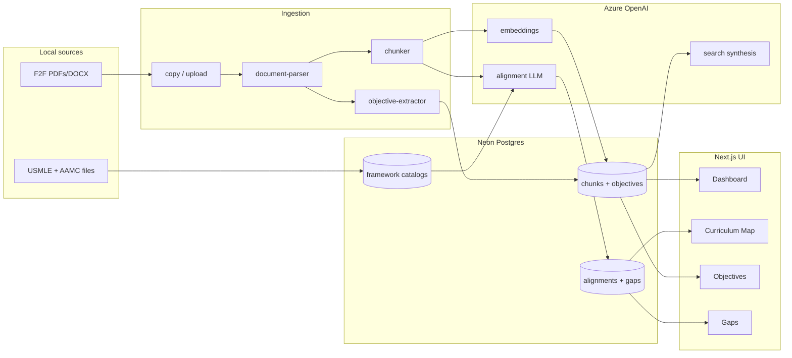

# Architecture

RushMap AI is a **Next.js 14 monolith**: UI routes under `app/`, API route handlers under `app/api/`, and all server logic in `lib/` plus CLI scripts in `scripts/`. There is no separate backend service.

---

## High-level data flow

---

## Document processing pipeline

Triggered by `npm run db:process` or `POST /api/upload` + `POST /api/upload/{jobId}/advance`.

Defined in [`lib/pipeline.ts`](../lib/pipeline.ts):

| Stage | Progress | What happens |
|-------|----------|--------------|
| `parsing` | 10% | PDF/DOCX/PPTX → plain text via [`lib/document-parser.ts`](../lib/document-parser.ts) |
| `extracting_objectives` | 18–22% | Regex-first objective extraction; optional LLM cleanup ([`lib/objective-extractor.ts`](../lib/objective-extractor.ts), [`lib/objective-cleanup.ts`](../lib/objective-cleanup.ts)) |
| `chunking` | 25% | Semantic section detection (self-study + faculty-guide heading vocabulary, ToC stripping) then recursive sentence/paragraph-aware packing to ~500 tokens; each chunk is embedded with a `{caseTitle} › {section}` breadcrumb ([`lib/chunker.ts`](../lib/chunker.ts)). Quality gated by [`scripts/audit-chunks.ts`](../scripts/audit-chunks.ts) |
| `embedding` | 40–65% | Azure embeddings for each chunk's breadcrumbed text |
| `aligning` | 70–85% | RAG top-K framework candidates (optional cosine-distance floor via `RETRIEVAL_MAX_DISTANCE`) → constrained LLM JSON ([`lib/azure-ai.ts`](../lib/azure-ai.ts), [`lib/framework-rag.ts`](../lib/framework-rag.ts)) |
| `tagging` | 90% | AAMC keyword tags via vector similarity (same optional distance floor) |
| `recomputing_gaps` | 95% | Roll up `gap_summary` per document + course ([`lib/gap-analyzer.ts`](../lib/gap-analyzer.ts)) |
| `complete` | 100% | Job status finalized |

Upload flow uses **Server-Sent Events** on `GET /api/upload/{jobId}/stream` while the client polls job rows from `processing_jobs`.

Job claiming is atomic: `advanceJob` updates `status` from `queued` → `running` only when still queued, preventing double pipeline runs.

---

## Objective extraction (regex-first)

Design principle: **never invent objectives**.

1. **Regex** locates sections (`Learning Objectives`, `Case Specific Objectives`, etc.) and splits bullet/verb-led lines.
2. **LLM cleanup** runs only when regex finds a section but no objectives, or when >50% of regex hits are low-confidence / run-on text.
3. **Validation** requires every LLM-returned string to appear verbatim in the source excerpt.
4. **Merge** keeps high-confidence regex + EO-coded objectives; LLM adds or splits — never wholesale replace.

Batch report: `npm run db:extract-objectives` (no DB write; JSON report only).

---

## Framework alignment (fail-closed)

1. Embed chunk text (or reuse stored embedding).
2. Retrieve top-K catalog candidates by vector similarity ([`lib/framework-rag.ts`](../lib/framework-rag.ts)).
3. Send chunk + **authoritative candidate list** to chat model with temperature 0.
4. Parse JSON alignments; strip any `framework_id` not in the candidate set ([`lib/framework-catalog.ts`](../lib/framework-catalog.ts)).
5. Drop alignments with confidence &lt; 0.60.

Framework parsers ([`lib/framework-parsers.ts`](../lib/framework-parsers.ts)) are **deterministic** — LLM is not used to parse USMLE/AAMC authority PDFs.

---

## API routes

| Method | Path | Purpose |
|--------|------|---------|
| `GET` | `/api/courses/{courseId}/summary` | Dashboard metrics |
| `GET` | `/api/courses/{courseId}/map` | Chunks, alignments, framework trees |
| `GET` | `/api/courses/{courseId}/objectives` | Objectives grouped by document/case |
| `GET` | `/api/courses/{courseId}/export` | Gap report CSV |
| `POST` | `/api/search` | Vector search + cited AI answer (rate limited) |
| `POST` | `/api/upload` | Save file to `data/curriculum/`, create job |
| `POST` | `/api/upload/{jobId}/advance` | Start pipeline (300s max duration) |
| `GET` | `/api/upload/{jobId}/stream` | SSE job progress |
| `POST` | `/api/align` | Manual alignment trigger |
| `PATCH` | `/api/alignments/{alignmentId}` | Approve / reject alignment |

### Security

- Optional `API_SECRET`: when set in env, [`middleware.ts`](../middleware.ts) requires a valid credential on **all** `/api/*` routes — reads and writes alike (there is no GET exemption). Accepted credentials: a `Authorization: Bearer {API_SECRET}` header (server-to-server), or the short-lived HMAC-signed httpOnly session cookie the middleware issues on page navigations (so browser `fetch` and EventSource authenticate automatically same-origin — see [`lib/api-auth.ts`](../lib/api-auth.ts)). Tokens are HMAC-SHA256 signed with `API_SECRET`, TTL-limited, verified with a timing-safe comparison, and never equal to `API_SECRET`. **Threat-model note:** the session cookie is minted for any page visitor, so `API_SECRET` blocks direct API access but not page-mediated access — private deployments need a page-level gate (e.g. Vercel Deployment Protection) in front of the app. Unset = fully open (dev default).
- In-memory rate limits on search (30/min) and upload advance (10/min) via [`lib/rate-limit.ts`](../lib/rate-limit.ts).
- Security headers configured in [`next.config.mjs`](../next.config.mjs).

---

## UI routes

| Path | Component area | Data source |
|------|----------------|-------------|
| `/courses/{id}` | Dashboard metrics, heatmap | `getCourseSummary` |
| `/courses/{id}/map` | Curriculum + framework trees | `GET .../map` |
| `/courses/{id}/objectives` | Filterable objectives table | `getCourseObjectivesSummary` |
| `/courses/{id}/gaps` | Gap cards + coverage table | `getCourseSummary`, `getGapExportRows` |
| `/courses/{id}/search` | NL Q&A | `POST /api/search` |
| `/upload` | Drop zone + SSE status | Upload API |

Pages require a seeded database — empty DB shows bootstrap instructions instead of fabricated demo metrics.

---

## Key modules

| Module | Role |
|--------|------|
| `lib/db.ts` | Neon + Drizzle client |
| `lib/queries.ts` | Read paths for UI and API |
| `lib/pipeline.ts` | Full document processing orchestration |
| `lib/document-parser.ts` | pdf-parse, mammoth, officeparser |
| `lib/chunker.ts` | Semantic section detection + recursive sentence-aware chunking + heading breadcrumb |
| `lib/retrieval-config.ts` | Optional relevance thresholds for retrieval/search (default off) |
| `lib/api-auth.ts` | HMAC session-token mint/verify for API auth |
| `lib/figure-registry.ts` | Parse figure/answer-image/video references from document text |
| `lib/media-pipeline.ts` | Upsert media assets + link them to chunks during processing |
| `lib/media-storage.ts` | Extracted-media paths + safe path containment for serving |
| `lib/media-linker.ts` | Registry/storage merge helpers |
| `lib/media-types.ts` | Media asset type definitions and guards |
| `lib/objective-extractor.ts` | Regex objective parsing |
| `lib/objective-cleanup.ts` | Optional LLM cleanup + merge |
| `lib/azure-ai.ts` | Embeddings, alignment, search synthesis |
| `lib/framework-parsers.ts` | USMLE PDF + AAMC xlsx → JSON |
| `lib/gap-analyzer.ts` | Coverage status derivation |

---

## Local vs production

| Concern | Local | Vercel |
|---------|-------|--------|
| Curriculum files | `data/curriculum/` (copied from F2F folder) | Not on server — seed/process locally before demo |
| Long pipeline | `db:process` CLI | Upload advance route (300s limit) |
| Database | Neon `DATABASE_URL` | Same env var in Vercel project settings |
| Azure | VPN may be required for Rush Foundry endpoint | Same credentials |

Recommended demo prep: run full bootstrap locally against Neon, then deploy UI-only to Vercel pointing at the populated database.
