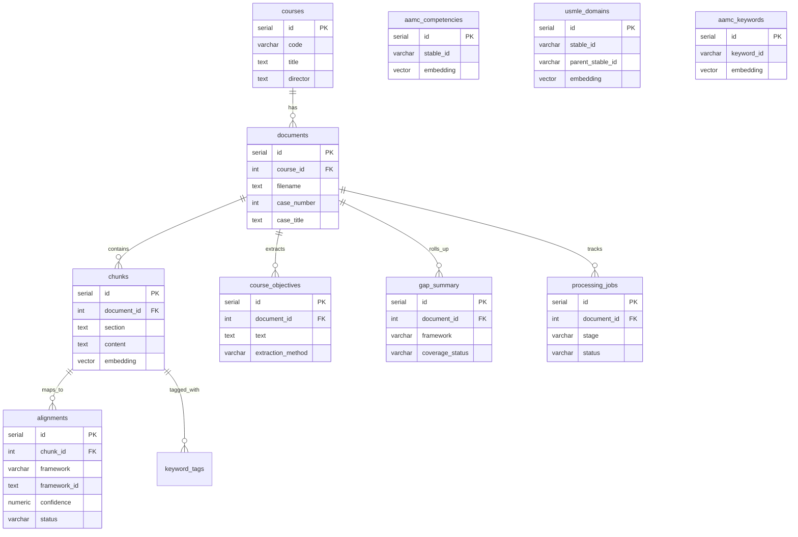

# Database Schema

RushMap AI uses **Neon Postgres** with the **pgvector** extension. All tables are defined in [`drizzle/schema.ts`](../drizzle/schema.ts) and applied via `npm run db:push` ([`scripts/db-init.ts`](../scripts/db-init.ts)).

Embeddings are stored as `vector(1536)` to match Azure `text-embedding-3-large` with `AZURE_OPENAI_EMBEDDING_DIMENSIONS=1536`.

---

## Entity relationship overview



---

## Table reference

### Course content (curriculum side)

| Table | Purpose | Key columns |
|-------|---------|-------------|
| `courses` | Top-level course record (demo: RMD 563) | `code`, `title`, `director` |
| `documents` | One row per faculty guide or self-study guide | `course_id`, `filename`, `case_number`, `case_title`, `diagnosis` |
| `chunks` | ~500-token segments of parsed document text | `document_id`, `section`, `content`, `embedding` |
| `course_objectives` | Learning objectives extracted regex-first during pipeline | `document_id`, `text`, `section_heading`, `eo_code`, `extraction_method`, `source_excerpt` |
| `processing_jobs` | Upload/pipeline progress for SSE UI | `document_id`, `stage`, `progress`, `status` |
| `media_assets` | Figure/video registry per document | `document_id`, `label`, `reference_kind`, `text_for_embed`, `storage_path`, `extraction_scope` |
| `chunk_media` | Join table linking chunks to figures | `chunk_id`, `media_asset_id` |

### Framework catalogs (authority side)

These are seeded from USMLE 2025 PDF and AAMC keyword/competency files — not from faculty guides.

| Table | Source | Purpose |
|-------|--------|---------|
| `usmle_domains` | USMLE Content Outline PDF | Hierarchical Step 1 systems/subdomains; `parent_stable_id` links children |
| `aamc_competencies` | `data/frameworks/aamc-pcrs-2013.json` + `aamc-core-epas.json` | Official 2013 PCRS (8 domains / 58 competencies) + 13 Core EPAs, with `stable_id` |
| `aamc_keywords` | AAMC keywords xlsx | Keyword definitions for tagging |

All three catalog tables include optional `embedding` vectors for RAG retrieval during alignment.

### Alignment artifacts

| Table | Purpose | Key columns |
|-------|---------|-------------|
| `alignments` | LLM mapping from chunk → framework node | `chunk_id`, `framework` (`AAMC_PCRS`, `AAMC_EPA`, `USMLE`), `framework_id`, `confidence`, `status` (`pending` / `approved` / `rejected`) |
| `keyword_tags` | Vector-retrieved AAMC keywords per chunk | `chunk_id`, `keyword`, `category` |
| `gap_summary` | Per-document rollup of framework coverage | `document_id`, `framework_id`, `coverage_status` (`covered` / `partial` / `gap`), `chunk_count`, `avg_confidence` |

---

## Framework ID conventions

| `alignments.framework` | `framework_id` refers to |
|----------------------|--------------------------|
| `AAMC_PCRS` | `aamc_competencies.stable_id` or `sub_id` |
| `AAMC_EPA` | EPA-related stable IDs (detected when ID contains `epa`) |
| `USMLE` | `usmle_domains.stable_id` |

Gap analysis and heatmaps aggregate from `gap_summary` and `alignments` grouped by course via `documents.course_id`.

---

## Objectives extraction fields

| Column | Values | Meaning |
|--------|--------|---------|
| `extraction_method` | `regex`, `llm_cleanup` | Regex is primary; LLM only when regex misses or output is garbled |
| `confidence` | `high`, `medium`, `low` | Regex quality score; LLM-cleaned rows are always `high` after validation |
| `eo_code` | e.g. `EO-0052` | Rush endocrine/anatomy objective codes when present in source |
| `source_excerpt` | Truncated section text | Audit trail — verbatim section heading + body used for extraction |

---

## Delete / reprocess behavior

When a document is reprocessed (`runFullPipeline`), `clearDocumentArtifacts` removes in order:

1. `alignments` and `keyword_tags` for all chunks of the document
2. `chunk_media` and `media_assets` for the document
3. `chunks`
4. `gap_summary`
5. `course_objectives`

Framework catalog tables are **not** wiped on document reprocess — only on `db:seed-frameworks`.

---

## Bootstrap order

```
db:push  →  db:seed-frameworks  →  db:seed  →  db:extract-media  →  db:process
   │              │                    │            │
 schema      USMLE/AAMC           course +      parse, objectives,
             catalogs             14 docs       embed, align, gaps
```

See [ARCHITECTURE.md](./ARCHITECTURE.md) for the processing pipeline stages.
