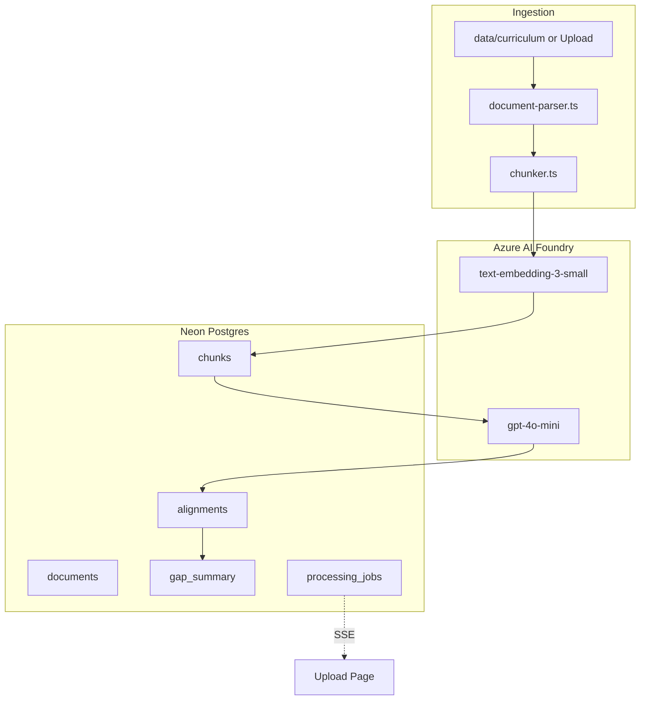
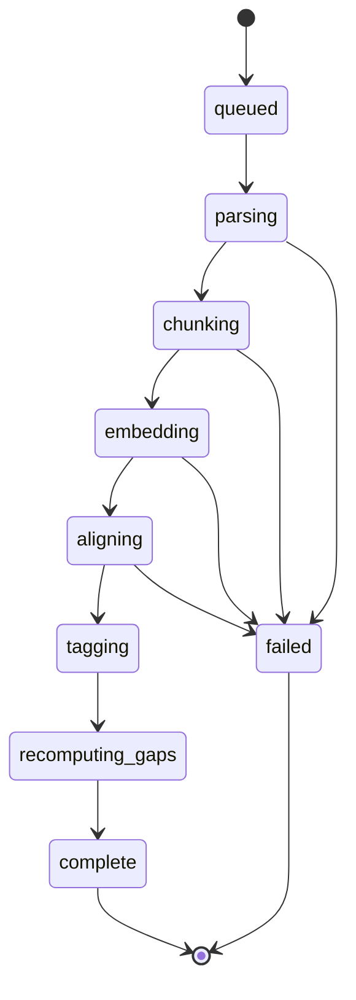
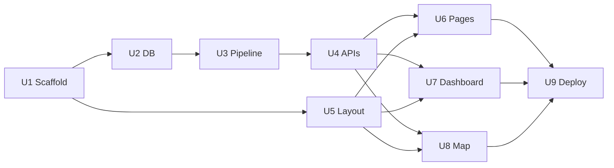

# feat: RushMap AI MVP — Curriculum Mapping Demo

## Goal Capsule

**Objective:** Ship a public, no-auth Next.js 14 demo that ingests Rush Medical College faculty guides (RMD 563), maps content to AAMC PCRS/Core EPAs and USMLE 2025 via Azure AI Foundry, and surfaces alignment, gaps, and natural-language search for a stakeholder presentation.

**Authority:** This plan supersedes ad-hoc implementation choices. The inline PRD (July 3, 2026) is the product source. Where the plan adds `processing_jobs` or staged upload routes, those are planning extensions for Vercel constraints — not product scope changes.

**Stop when:** Definition of Done is satisfied and the PRD Section 14 five-minute demo script passes end-to-end with pre-processed data.

---

## Product Contract

Product Contract unchanged from inline PRD intent; planning added KTD-2 (`processing_jobs`) and staged upload API routes only for serverless viability.

### Problem Frame

Rush Medical College needs to demonstrate that faculty guide documents can be automatically mapped to national competency frameworks (AAMC PCRS/EPAs, USMLE 2025) with gap analysis and faculty-facing search — without login, using real RMD 563 case documents.

### Actors

- A1. **Dean / curriculum committee** — views demo dashboards, gap reports, and curriculum map during presentation
- A2. **Course director (Dr. Kathryn Solka)** — implied owner of RMD 563 metadata; no login in MVP
- A3. **Faculty reviewer** — approves or rejects AI-generated alignments in the map drawer (human-in-the-loop)

### Key Flows

- F1. **Explore demo** — Landing → Course dashboard → Map → Gaps → Search (PRD demo script)
- F2. **Upload and process** — Drop file → staged pipeline → SSE status → document appears in lists
- F3. **Review alignment** — Select curriculum node → view rationale → Approve/Reject
- F4. **Export gaps** — Gap dashboard → CSV download
- F5. **Ask curriculum question** — NL search → AI answer + cited chunks

### Requirements

- R1. Landing page (`/`) with hero, stats, Venn diagram, Rush branding
- R2. Upload page (`/upload`) with drag-drop and SSE processing status
- R3. Course dashboard (`/courses/[courseId]`) with metrics, AAMC bar chart, USMLE heatmap, recent alignments
- R4. Curriculum map (`/courses/[courseId]/map`) — tri-directional trees, filters, connection highlights, detail drawer
- R5. Gap analysis (`/courses/[courseId]/gaps`) with gap cards, coverage table, CSV export
- R6. Natural language search (`/courses/[courseId]/search`) with AI answer and ranked chunks
- R7. About page (`/about`) — product explainer per PRD Section 5.1
- R8. Neon Postgres schema with pgvector; Drizzle ORM
- R9. Azure AI Foundry: gpt-4o-mini (align + search answer), text-embedding-3-small (chunks + query)
- R10. Document parsing: PDF, DOCX, PPTX (server-side)
- R11. Seed script for course, frameworks, documents metadata, and demo gap_summary
- R12. CLI `process-documents.ts` to populate chunks, embeddings, alignments before deploy
- R13. API routes per PRD Section 6 plus staged upload orchestration (planning extension)
- R14. Human-in-the-loop: alignment status pending | approved | rejected
- R15. Rush design system: colors, Sora/Inter/JetBrains Mono, shadcn/ui components

### Acceptance Examples

- AE1. Landing CTA navigates to `/courses/1` with live stats (4 guides, 87% AAMC, 3 USMLE gaps)
- AE2. Dashboard heatmap shows Renal, Cardiovascular, Dermatology as gap/partial cells; GI domains green
- AE3. Map: selecting "Activity 4: USMLE Vignettes" highlights USMLE GI and AAMC MK2; drawer shows rationale
- AE4. Gaps: three gap cards with suggested actions; CSV export downloads
- AE5. Search: "What content covers USMLE GI objectives?" returns AI answer citing document sections

### Scope Boundaries

**In scope:** All routes in PRD Section 5.1 (including `/about`), full API surface, seed + process scripts, Rush branding.

**Deferred for later:** Auth, multi-tenant courses, Vercel Blob persistence, full AAMC 105-keyword taxonomy seed, polished SVG line animations, PPTX demo files, rate limiting on public APIs, HIPAA production hardening, LMS integration.

**Outside this product's identity:** Student-facing LMS, gradebook, exam authoring.

---

## Planning Contract

### Summary

Greenfield Next.js 14 app in repo root. Use a **shared staged processing pipeline** for CLI and upload API. Pre-run `scripts/process-documents.ts` before stakeholder demo; upload uses multi-step job orchestration with SSE from `processing_jobs` — not one long serverless request.

### Key Technical Decisions

| ID | Decision | Rationale |
|----|----------|-----------|
| KTD-1 | Staged pipeline shared by CLI + upload | Vercel Hobby ~10s limit cannot process 40-page PDF + embeddings + alignments in one request |
| KTD-2 | Add `processing_jobs` table | `document_id`, `stage`, `progress`, `message`, `status` — SSE progress and retry |
| KTD-3 | Demo path: seed → process-documents before deploy | Reliable stakeholder demo; seed `gap_summary` backs UI if Azure is slow |
| KTD-4 | Case 3: process DOCX only; skip duplicate PDF | Avoid double embeddings |
| KTD-5 | Azure via OpenAI SDK + deployment baseURL | PRD pattern; `temperature: 0`, `json_object` for alignments |
| KTD-6 | Section-first chunking, ~500 tokens, 50 overlap | PRD Section 6; token estimate via `gpt-tokenizer` |
| KTD-7 | IVFFlat index after seed when rows ≥ 100 | Empty-table index creation is low value |
| KTD-8 | shadcn/ui (CLI init, not npm `@shadcn/ui`) | PRD component list; Drawer, Slider, Table, Progress, Badge |
| KTD-9 | `maxDuration = 60` on upload stage routes; batch 5 chunks per advance call | Pro tier; Hobby relies on CLI pre-processing |
| KTD-10 | Azure `baseURL`: `${AZURE_OPENAI_ENDPOINT}/openai/deployments` with trailing-slash normalization | PRD omits slash; SDK concatenation breaks without it |
| KTD-11 | Vitest + MSW for API route unit tests | Greenfield needs explicit test harness; no existing pattern |
| KTD-12 | `gap_summary`: seed for instant UI; recompute after `process-documents` | Seed gives demo metrics before AI run; pipeline overwrites with computed values |

### Alternative Approaches Considered

| Alternative | Why not chosen |
|-------------|----------------|
| Single long POST /api/upload runs full pipeline | Exceeds Vercel serverless timeout; fails on Case 1 (40 pp PDF) |
| Seed-only demo (no real AI processing) | Misrepresents product; search and map rationale require real chunks |
| Inngest/Trigger.dev background jobs | Extra infra/cost for MVP; staged client-driven advance is sufficient |
| Vercel Blob for all storage | PRD allows local/`/tmp`; Blob deferred to follow-up |
| Next.js 15 | PRD specifies Next.js 14 App Router |

### High-Level Technical Design



**Processing job state machine:**



Each `POST /api/upload/[jobId]/advance` executes one bounded batch within the current stage, updates `processing_jobs`, and returns. Client opens `EventSource` on `/api/upload/[jobId]/stream` for messages. On complete, client triggers final `advance` or pipeline self-completes on last batch.

**Alignment per chunk:** Parallel AAMC + USMLE GPT calls → `alignments` rows with `framework` ∈ `AAMC_PCRS`, `AAMC_EPA`, `USMLE`. **Search:** embed query → top-5 cosine → GPT answer with citations.

### Assumptions

- **Demo subset:** PRD specifies 4 cases (Tilo, Donner, Hernandez, Jackson) for stakeholder demo; repo also contains 7 faculty guides in `2026 Curriculum Inventory Project F2F materials/` (cases 01–07). MVP processes the PRD four-case subset; pipeline supports adding cases 5–7 post-demo without schema changes.
- **Source location:** Copy or symlink PRD-named files from F2F materials into `data/curriculum/` during U9 setup (e.g., `Faculty Guide 01 David Tilo.pdf` → `RMD563_FacultyGuide_Case1_DavidTilo.pdf`). Actual filenames differ from PRD — mapping table belongs in README.
- **Git remote:** `https://github.com/sajor2000/rmcdemocur` (empty repo; no commits yet locally)
- Azure deployments and Neon pgvector project exist
- Stakeholder demo uses pre-processed data; live upload best-effort per Vercel tier
- Rush logo embedded as `public/rush-logo.svg`

### System-Wide Impact

| Surface | Impact |
|---------|--------|
| Neon DB | All pages and APIs read/write; migrations via drizzle-kit |
| Azure OpenAI | Cost per chunk (embed + 2 align calls); search adds embed + chat per query |
| Vercel serverless | pdf-parse needs `serverExternalPackages`; upload routes need `maxDuration` |
| Public internet | No auth — upload and search are abuse vectors; document file size cap (50 MB) in U4 |
| Demo narrative | Metrics on landing may be static until summary API wired; must match processed data post-seed |

### Open Questions

| ID | Question | Status |
|----|----------|--------|
| OQ-1 | Commit curriculum PDFs to repo or document manual copy only? | **Resolved for MVP** — F2F materials already in workspace; copy 4-case subset to `data/curriculum/`; gitignore large binaries if repo size is a concern |
| OQ-4 | PRD 4 cases vs repo 7 faculty guides | **Resolved** — demo uses PRD subset; seed/documents table holds 4 rows; extend later |
| OQ-2 | Vercel Hobby vs Pro for demo day? | Deferred — plan supports Hobby via CLI pre-process |
| OQ-3 | Exact AAMC/USMLE seed row counts from official outlines | Resolved at implementation — seed from PRD Section 8 lists |

### Risks and Mitigations

| Risk | Mitigation |
|------|------------|
| Vercel timeout | KTD-1 staged pipeline; CLI pre-process |
| Azure cost/latency at demo | Run process-documents beforehand |
| pdf-parse bundling | `serverExternalPackages`; deploy smoke in U9 |
| Alignment hallucination | confidence ≥ 0.60 filter; approve/reject drawer |
| Public upload abuse | 50 MB cap, MIME allowlist, optional simple rate limit in follow-up |
| pgvector recall on small corpus | Acceptable for demo; HNSW optional follow-up |

### Output Structure

```text
├── app/
│   ├── layout.tsx, page.tsx, globals.css, about/page.tsx
│   ├── upload/page.tsx
│   ├── courses/[courseId]/{page,map,gaps,search}/page.tsx
│   └── api/...
├── components/{layout,dashboard,map,gaps,search,upload}/
├── lib/{db,azure-ai,document-parser,chunker,alignment-prompts,pipeline,gap-analyzer}.ts
├── drizzle/{schema.ts,migrations/}
├── scripts/{seed.ts,process-documents.ts}
├── __tests__/api/, __tests__/lib/
├── data/curriculum/
└── public/rush-logo.svg
```

### Requirements Traceability

| R-ID | Units |
|------|-------|
| R1 | U6 |
| R2 | U4, U6 |
| R3 | U7 |
| R4 | U8 |
| R5 | U7, U4 |
| R6 | U7, U4 |
| R7 | U6 |
| R8–R12 | U2, U3 |
| R13 | U4 |
| R14 | U4, U8 |
| R15 | U1, U5 |

---

## Implementation Units

### U1. Project Scaffolding and Design System

**Goal:** Next.js 14 App Router with Tailwind, shadcn/ui, fonts, Rush tokens, Vitest.

**Requirements:** R15

**Dependencies:** none

**Files:** `package.json`, `next.config.ts`, `tailwind.config.ts`, `app/globals.css`, `app/layout.tsx`, `components.json`, `tsconfig.json`, `vitest.config.ts`, `public/rush-logo.svg`

**Approach:**
- `create-next-app@14` — App Router, Tailwind, TypeScript, `src` dir **off** (match PRD tree)
- `npx shadcn@latest init`; add Drawer, Slider, Table, Progress, Badge, Button, Card, Sonner
- CSS variables per PRD Section 7; fonts via `next/font/google`
- Dependencies: PRD Section 10 plus `gpt-tokenizer`, `jszip` + slide XML parse for PPTX (avoid unmaintained `pptx-parser`; use `officeparser` or minimal `jszip` extractor — verify at install)
- Vitest + `@vitejs/plugin-react` for unit tests
- **Not** `@shadcn/ui` npm package — shadcn copies components into `components/ui/`

**Execution note:** Prefer install/runtime smoke over unit tests for scaffold.

**Test expectation:** none — smoke via `npm run dev` and `npm run build`

**Verification:** Dev server starts; green header renders

---

### U2. Database Schema, Migrations, and Seed Script

**Goal:** Drizzle schema mirroring PRD Section 4 plus `processing_jobs`; full seed.

**Requirements:** R8, R11

**Dependencies:** U1

**Files:** `drizzle/schema.ts`, `drizzle.config.ts`, `lib/db.ts`, `scripts/seed.ts`, `drizzle/migrations/*`, `__tests__/lib/seed.test.ts`

**Approach:**
- Tables: `courses`, `documents`, `chunks` (vector 1536), `aamc_competencies`, `usmle_domains`, `alignments`, `gap_summary`, `keyword_tags`, `processing_jobs`
- `processing_jobs`: `id`, `document_id`, `stage`, `progress` (0–100), `message`, `status` (queued|running|complete|failed), `updated_at`
- First migration: `CREATE EXTENSION IF NOT EXISTS vector`
- Seed: RMD 563, 4 document rows (cases 1–4), AAMC PCRS subs + EPAs 1–13, USMLE 18 domains, gap_summary per PRD Section 8
- Idempotent seed: truncate framework tables + re-insert, or upsert on natural keys

**Test scenarios:**
- Seed twice without duplicate course code rows
- Course `id=1` has 4 documents with correct case titles/diagnoses
- `aamc_competencies` includes 6 domain groups and EPAs 1–13
- `usmle_domains` has 18 rows
- `gap_summary` includes Renal gap, Cardiovascular partial, Dermatology gap

**Verification:** `drizzle-kit push` + `tsx scripts/seed.ts` succeed on Neon

---

### U3. Document Processing Libraries and CLI Script

**Goal:** Parse, chunk, embed, align, recompute gaps — shared `lib/pipeline.ts`.

**Requirements:** R9, R10, R12

**Dependencies:** U2

**Files:** `lib/document-parser.ts`, `lib/chunker.ts`, `lib/azure-ai.ts`, `lib/alignment-prompts.ts`, `lib/pipeline.ts`, `lib/gap-analyzer.ts`, `scripts/process-documents.ts`, `__tests__/lib/chunker.test.ts`, `__tests__/lib/gap-analyzer.test.ts`

**Approach:**
- Parser: pdf-parse, mammoth (headings → sections), PPTX text via officeparser/jszip
- Chunker: regex section splits; sub-chunk >500 tokens, 50 overlap
- `azure-ai.ts`: KTD-10 URL normalization; `generateEmbedding`, `alignToFramework`
- `alignment-prompts.ts`: PRD Section 12 verbatim
- Pipeline stages match state machine; updates `processing_jobs`
- `gap-analyzer.ts`: per document + course rollup; covered ≥80%, partial 50–79%, gap otherwise
- `process-documents.ts`: glob `data/curriculum/*` (populated from `2026 Curriculum Inventory Project F2F materials/` per README mapping); skip duplicate Case 3 PDF if both docx/pdf present; link `course_id=1`

**Execution note:** Run locally before demo; budget ~47 chunks × (1 embed + 2 align calls).

**Test scenarios:**
- Chunker splits sample markdown with "Activity 1" and "Take-Home Points" into named sections
- Gap analyzer: 0 alignments → gap; avg confidence 0.61 → partial
- Pipeline re-run deletes prior chunks/alignments for same `document_id` before insert
- Embedding mock returns 1536-dim vector stored in chunk row

**Verification:** After CLI run, `chunks` and `alignments` populated; dashboard metrics non-zero

---

### U4. API Route Handlers

**Goal:** PRD Section 6 routes + staged upload orchestration.

**Requirements:** R13, R14

**Dependencies:** U3

**Files:**
- `app/api/upload/route.ts`
- `app/api/upload/[jobId]/advance/route.ts`
- `app/api/upload/[jobId]/stream/route.ts`
- `app/api/align/route.ts`
- `app/api/search/route.ts`
- `app/api/courses/[courseId]/summary/route.ts`
- `app/api/courses/[courseId]/export/route.ts`
- `app/api/alignments/[alignmentId]/route.ts`
- `__tests__/api/search.test.ts`, `__tests__/api/summary.test.ts`, `__tests__/api/alignments.test.ts`

**Approach:**
- Upload: validate MIME + 50 MB cap; save `/tmp` or `data/uploads/`; create `documents` + `processing_jobs`; return `{ jobId }`
- Advance: call `pipeline.advance(jobId)` one batch; idempotent if already complete
- Stream: SSE polling `processing_jobs.message` every 1s until complete/failed
- Search: embed query, cosine top 5, GPT synthesis JSON `{ answer, citations[] }`
- Summary: AAMC domain %, heatmap `{ caseId, domainId, status }[]`, gaps, recent 10 alignments
- Export: CSV `framework,framework_id,label,coverage_status,chunk_count,avg_confidence`
- PATCH alignment: `{ status: "approved" | "rejected" }`
- Zod on all bodies; `export const maxDuration = 60` on upload routes

**Test scenarios:**
- Upload rejects `.exe` with 400
- Advance transitions `stage` monotonically
- Search returns results ordered by similarity descending
- PATCH alignment returns updated row; invalid status 400
- Export `Content-Type: text/csv`

**Verification:** API integration tests pass with test DB or mocked db layer

---

### U5. Shared Layout and Course Shell

**Goal:** Rush header/footer; course sidebar shell.

**Requirements:** R15

**Dependencies:** U1

**Files:** `components/layout/Header.tsx`, `Footer.tsx`, `Sidebar.tsx`, `app/courses/[courseId]/layout.tsx`

**Approach:** PRD Section 7 layout specs; server component fetches course + documents for sidebar case list.

**Test expectation:** none — visual smoke

**Verification:** Active nav highlight; metadata displays for course 1

---

### U6. Landing, About, and Upload Pages

**Goal:** PRD Sections 5.2, 5.3, and `/about`.

**Requirements:** R1, R2, R7

**Dependencies:** U4, U5

**Files:** `app/page.tsx`, `app/about/page.tsx`, `app/upload/page.tsx`, `components/upload/DropZone.tsx`, `ProcessingStatus.tsx`

**Approach:**
- Landing: hero, 3-step flow, stats (from `GET /api/courses/1/summary` with static fallback), Venn SVG, CTA → `/courses/1`
- About: product explainer, frameworks described, no login note
- Upload: drop zone, course selector, POST upload + EventSource + periodic `advance` calls until complete

**Test scenarios:**
- Covers AE1. Landing CTA links to `/courses/1`
- Upload accepts pdf/docx/pptx; sonner error on invalid type
- ProcessingStatus lists PRD stage messages in order ending "Processing complete"

**Verification:** Manual upload of small DOCX completes pipeline

---

### U7. Course Dashboard, Gaps, and Search Pages

**Goal:** PRD Sections 5.4, 5.6, 5.7.

**Requirements:** R3, R5, R6

**Dependencies:** U4, U5

**Files:** `app/courses/[courseId]/page.tsx`, `gaps/page.tsx`, `search/page.tsx`, `components/dashboard/*`, `components/gaps/*`, `components/search/*`

**Approach:** recharts for bar + heatmap; gap cards link to search with query param; CSV via export API.

**Test scenarios:**
- Covers AE2. Heatmap colors for Renal red, Cardiovascular yellow, GI green
- Covers AE4. Export button downloads CSV
- Covers AE5. Search returns AI answer box + result cards
- Example chips populate search input on click

**Verification:** Demo script steps 2, 4, 5

---

### U8. Curriculum Map (Signature Feature)

**Goal:** Tri-directional map with filters, highlights, drawer.

**Requirements:** R4, R14

**Dependencies:** U4, U5

**Files:** `app/courses/[courseId]/map/page.tsx`, `components/map/CurriculumTree.tsx`, `FrameworkTree.tsx`, `AlignmentLines.tsx`, `AlignmentDrawer.tsx`, `__tests__/components/map/filters.test.ts`

**Approach:**
- Curriculum tree from chunks grouped by document → section
- Framework trees from seed tables; green glow when alignment exists above confidence threshold
- AlignmentLines: simplified SVG beziers on selection (animation deferred)
- Drawer: PATCH approve/reject

**Test scenarios:**
- Covers AE3. Select vignettes activity highlights GI + MK2
- Confidence slider filters visible alignments
- Approve persists after page refresh

**Verification:** Demo script step 3

---

### U9. Deployment, Environment, and Documentation

**Goal:** Vercel-ready deploy with PRD Section 13 checklist.

**Requirements:** all

**Dependencies:** U6, U7, U8

**Files:** `.env.local.example`, `README.md`, `next.config.ts`

**Approach:** Document Neon, Azure, scripts order; `serverExternalPackages: ['pdf-parse']`; README file-mapping table (F2F materials → `data/curriculum/` PRD names); `git remote add origin https://github.com/sajor2000/rmcdemocur` before first push.

**Test expectation:** none — operational

**Verification:** Fresh clone + env + seed + process + build + demo script

---

## Verification Contract

1. `npx drizzle-kit push` — all tables including pgvector
2. `npx tsx scripts/seed.ts` — frameworks and demo gaps
3. `npx tsx scripts/process-documents.ts` — chunks, embeddings, alignments (requires Azure + files)
4. `npm test` — Vitest API/lib tests pass
5. `npm run build` — production build succeeds
6. PRD Section 14 demo script — all 5 steps
7. CSV export and PATCH approve/reject persist across refresh

---

## Definition of Done

- All PRD Section 5.1 routes render with Rush branding (including `/about`)
- All PRD Section 6 APIs implemented; staged upload operational on Pro or CLI-preprocessed on Hobby
- Neon schema deployed; seed + process scripts documented in README
- No authentication
- Verification Contract gates pass

---

## Sequencing



**Order:** U1 → U2 → U3 → (run process-documents) → U4 → U5 ∥ U6–U8 → U9
