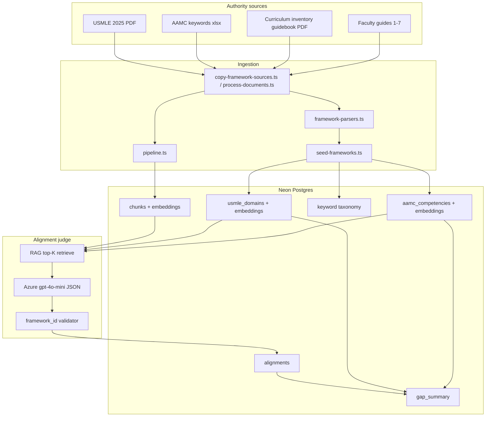

# feat: Real curriculum and framework document ingestion

## Goal Capsule

**Objective:** Replace abbreviated framework seeds and static alignment prompts with authority documents already available to the project, ingest all real RMD 563 faculty guides, and judge/map curriculum chunks against the parsed AAMC and USMLE taxonomies stored in Postgres.

**Authority:** This plan extends the MVP plan (`docs/plans/2026-07-03-001-feat-rushmap-ai-mvp-plan.md`). MVP routes, pipeline stages, and staged upload orchestration remain. This plan changes *what* is ingested and *what* alignment judges against — not the demo UX shell.

**Stop when:** Definition of Done is satisfied: frameworks loaded from real source files, all seven faculty guides processed through the pipeline, alignments reference only DB-backed framework IDs, gap analysis reflects the full imported USMLE taxonomy, and tests pass.

---

## Product Contract

Product Contract preservation: extends MVP R8–R12; narrows MVP deferral "full AAMC 105-keyword taxonomy seed" into active scope. MVP demo metrics (AE1–AE2) may shift numerically once real frameworks and seven cases are loaded — acceptable if UI still renders and gap/export/search behave correctly.

### Problem Frame

The MVP ships with ~20 hardcoded AAMC subs, placeholder EPAs, ~18 coarse USMLE rows, and alignment prompts that summarize frameworks in prose (`lib/alignment-prompts.ts`). GPT therefore judges against an approximation, not the official documents. Curriculum ingestion copies only four of seven faculty guides. Stakeholders expect mappings grounded in the real USMLE 2025 Content Outline and AAMC curriculum-inventory materials already present in the repo.

### Actors

- A1. Dean / curriculum committee — sees gap and coverage against real national frameworks
- A2. Course director — owns RMD 563 metadata for seven cases
- A3. Faculty reviewer — approves alignments whose `framework_id` traces to imported authority rows

### Key Flows

- F1. **Bootstrap frameworks** — Copy authority files → parse → seed `aamc_competencies`, `usmle_domains`, keyword taxonomy
- F2. **Bootstrap curriculum** — Copy seven faculty guides → seed `documents` → `process-documents` → chunks, embeddings, alignments
- F3. **Align with authority** — Per chunk: retrieve relevant framework rows → GPT JSON → validate IDs → persist alignments
- F4. **Gap against full taxonomy** — Uncovered USMLE/AAMC rows surface on gaps dashboard and CSV export

### Requirements

- R1. Authority framework sources live under `data/frameworks/` (copied from `Curriculum Map - AI project/` by script)
- R2. USMLE 2025 Content Outline PDF parsed into hierarchical `usmle_domains` rows (systems, subdomains, examples where extractable)
- R3. AAMC materials parsed: `meded-curriculum-keywords-083024.xlsx` → keyword taxonomy; guidebook PDF → supplemental PCRS/inventory text where structurally parseable
- R4. `scripts/seed-frameworks.ts` idempotently loads parsed frameworks; `scripts/seed.ts` delegates framework seeding to it (removes hardcoded `AAMC_PCRS`, `EPAS`, `USMLE` arrays)
- R5. Alignment prompts built dynamically from DB catalog, not static summaries
- R6. RAG retrieval: embed framework leaf descriptions; per chunk retrieve top-K candidates before GPT alignment call
- R7. Post-alignment validation: drop or flag alignments whose `framework_id` is not in the imported catalog
- R8. Curriculum manifest ingests all seven faculty guides with correct case metadata; prefer DOCX when both DOCX and PDF exist (MVP KTD-4), except Case 1 PDF-only
- R9. Pipeline `tagging` stage assigns AAMC keywords from imported taxonomy to chunks (not a no-op)
- R10. `recomputeGapSummary` and course-level gap queries include **uncovered** framework items from full taxonomy
- R11. README documents source-file placement, `db:seed-frameworks`, and re-run order after adding documents
- R12. Unit tests for parsers and framework-ID validation; parser fixtures use redacted text samples, not full copyrighted PDFs in git

### Acceptance Examples

- AE1. After `db:seed-frameworks`, `usmle_domains` row count is orders of magnitude larger than MVP’s 18 coarse rows (expect hundreds of leaf/subdomain rows from the 42-page outline)
- AE2. After `db:process`, Case 1 faculty guide produces alignments whose `framework_id` values exist in seeded tables; none reference invented labels from old static prompts
- AE3. Gaps page lists at least one USMLE system with `coverage_status: gap` when no chunk aligned to it (full-taxonomy comparison)
- AE4. Search and map drawer rationales cite framework labels matching imported descriptions, not hardcoded prompt text
- AE5. Keyword tags on processed chunks include values from the AAMC keywords spreadsheet categories

### Scope Boundaries

**In scope:** Seven faculty guides; three framework source files in `Curriculum Map - AI project/`; dynamic prompts; RAG-assisted alignment; keyword tagging; full-taxonomy gap analysis; tests for parsers/validation.

**Deferred for later:** Self-study guides and F2F syllabus as separate document types; Vercel Blob for framework PDFs; automatic download from usmle.org/aamc.org; Core EPA full text if not extractable from guidebook (placeholder EPA rows remain with `source: stub` flag); embedding refresh cron; rate-limit tuning for larger alignment calls.

**Outside this product's identity:** Licensing redistribution of AAMC/USMLE PDFs via public git — binaries stay local or gitignored; repo ships copy script paths only.

### Deferred to Follow-Up Work

- Ingest self-study guides as `document_type: self_study` for student-facing search
- Syllabus PDF as course-level metadata document
- Separate official AAMC PCRS PDF if team obtains it outside the guidebook
- Framework version pinning UI ("USMLE 2025", "AAMC keywords Aug 2024")

---

## Assumptions

- All **seven** faculty guides are in scope (extends MVP four-case demo subset).
- **Faculty guides only** — self-study guides and syllabus are deferred.
- Framework binaries are copied locally via script; they are not committed to the public GitHub remote.
- Hybrid **RAG + constrained JSON** is the alignment strategy (not full 42-page outline in every prompt).
- Core EPA descriptions may remain stub text until an official EPA source is added; PCRS subs and keywords come from real imports.

---

## Planning Contract

### Summary

Introduce a **parse → seed → retrieve → judge** loop. Official documents become the single source of truth in Postgres. The alignment layer reads from that catalog instead of `lib/alignment-prompts.ts` summaries. Curriculum ingestion expands the existing copy manifest pattern in `scripts/process-documents.ts`.

### Key Technical Decisions

| ID | Decision | Rationale |
|----|----------|-----------|
| KTD-1 | `data/frameworks/` + `scripts/copy-framework-sources.ts` mirroring curriculum copy pattern | Keeps repo portable; matches existing `data/curriculum/` approach |
| KTD-2 | Intermediate parsed JSON in `data/frameworks/parsed/*.json` committed after first successful parse | Speeds re-seed; makes parser output reviewable; avoids re-parsing PDFs on every seed |
| KTD-3 | USMLE parser: line-based state machine on pdf-parse text; hierarchy = system → subdomain → optional example bullets | 2025 outline is structured headings; full NLP unnecessary for MVP |
| KTD-4 | AAMC keywords: `xlsx` package reads `meded-curriculum-keywords-083024.xlsx`; map rows to `keyword_tags` taxonomy table and enrich `aamc_competencies` keyword links | File already in repo; MVP deferred this explicitly |
| KTD-5 | Guidebook PDF: extract PCRS domain sections where heading patterns match; store `source_doc` + `source_page` on rows | Partial parse beats hardcoded subs; manual JSON fallback file allowed for unparseable sections |
| KTD-6 | New `framework_items` optional unified view OR extend existing tables with `stable_id`, `parent_stable_id`, `source_doc`, `embedding` columns | Prefer extending `usmle_domains` / `aamc_competencies` minimally: add `stable_id text unique`, `full_text`, `embedding vector(1536)` on framework leaves only |
| KTD-7 | RAG top-K = 20 USMLE + 20 AAMC candidates per chunk via pgvector cosine on framework embeddings | Full taxonomy too large for prompt; K balances recall and token cost |
| KTD-8 | `alignToFramework` accepts candidate list; system prompt says "ONLY return framework_id from provided list" | Prevents hallucinated framework IDs |
| KTD-9 | `recomputeGapSummary` second pass: INSERT gap rows for taxonomy items with zero alignments for the course | Enables true gap dashboard vs alignment-only aggregation |
| KTD-10 | Idempotent reprocess: `clearDocumentArtifacts` unchanged; add `db:realign` script optional for alignment-only refresh without re-embedding | Saves Azure cost when only prompts/catalog change |
| KTD-11 | Parser tests use fixture snippets under `__tests__/fixtures/frameworks/` | Copyright-safe CI |

### Alternative Approaches Considered

| Alternative | Why not chosen |
|-------------|----------------|
| Put entire USMLE PDF text in every alignment prompt | Exceeds context limits; inconsistent judgments |
| Keep static prompts, only expand seed arrays manually | Does not scale; diverges from official docs over time |
| Separate vector DB for frameworks | Neon pgvector already in stack |
| LLM-only parsing of PDFs to JSON | Non-deterministic; harder to test; use LLM only at alignment stage |
| Commit full PDFs to public git | Licensing/redistribution risk |

### High-Level Technical Design



### Output Structure

```text
data/
  frameworks/
    .gitkeep
    parsed/
      usmle-2025.json
      aamc-keywords.json
      aamc-pcrs-partial.json
  curriculum/
    RMD563_FacultyGuide_Case*.pdf|docx
lib/
  framework-parsers.ts
  framework-catalog.ts
  framework-rag.ts
  alignment-prompts.ts          # slim: JSON schema + role only
scripts/
  copy-framework-sources.ts
  seed-frameworks.ts
  process-documents.ts          # expanded manifest
__tests__/
  lib/framework-parsers.test.ts
  lib/framework-validator.test.ts
  fixtures/frameworks/
```

---

## Implementation Units

### U1. Framework source layout and copy script

**Goal:** Establish `data/frameworks/` and copy authority files from `Curriculum Map - AI project/`.

**Requirements:** R1, R11

**Dependencies:** None

**Files:** `data/frameworks/.gitkeep`, `scripts/copy-framework-sources.ts`, `package.json`, `.gitignore`, `README.md`

**Approach:** Script copies `USMLE_Content_Outline_0 (1).pdf`, `meded-curriculum-keywords-083024.xlsx`, `meded-curriculum-inventory-guidebook-to-building-map_0.pdf` into `data/frameworks/` with stable renamed filenames. Add `npm run copy:frameworks`. Gitignore `data/frameworks/*.pdf` and `*.xlsx` if team prefers not to commit binaries; parsed JSON remains committable.

**Patterns to follow:** `scripts/process-documents.ts` `ensureCurriculumFiles` copy loop

**Test scenarios:**
- Happy path: all three source files exist → three files in `data/frameworks/`
- Edge case: missing source file → warning logged, script exits 0 with skip message
- Error path: destination not writable → throws clear error

**Verification:** `npm run copy:frameworks` leaves expected files at stable paths documented in README.

---

### U2. Schema extensions for framework authority metadata

**Goal:** Store stable IDs, full text, embeddings, and provenance on framework rows.

**Requirements:** R2, R3, R6

**Dependencies:** U1

**Files:** `drizzle/schema.ts`, new migration via `drizzle-kit push` pattern, `scripts/seed-frameworks.ts` (stub)

**Approach:** Add to `usmle_domains` and `aamc_competencies`: `stableId` (unique varchar), `fullText` (text), `parentStableId` (nullable varchar), `sourceDoc` (varchar), `sourcePage` (int nullable), `embedding` (vector 1536 nullable). Add `aamc_keywords` table (`id`, `keyword`, `category`, `subcategory`, `stableId`) OR seed `keyword_tags` taxonomy via separate `keywords` reference table — prefer dedicated `aamc_keywords` reference table; `keyword_tags` remains per-chunk assignments. Add `documents.sourcePath` optional text for traceability.

**Patterns to follow:** Existing `chunks.embedding` vector custom type in `drizzle/schema.ts`

**Test expectation:** none — schema-only; verified via seed integration in U3.

**Verification:** `npm run db:push` succeeds; new columns visible on framework tables.

---

### U3. Framework parsers and seed-frameworks

**Goal:** Parse USMLE PDF, AAMC xlsx, and guidebook PDF into JSON and seed Postgres.

**Requirements:** R2, R3, R4, R12

**Dependencies:** U1, U2

**Files:** `lib/framework-parsers.ts`, `scripts/seed-frameworks.ts`, `scripts/seed.ts`, `data/frameworks/parsed/*.json`, `__tests__/lib/framework-parsers.test.ts`, `__tests__/fixtures/frameworks/`

**Approach:**
- `parseUsmleOutline(pdfPath)` → array of `{ stableId, step, category, domain, subdomain, fullText, parentStableId }`. Derive `stableId` as slug e.g. `usmle:renal-urinary:acid-base`.
- `parseAamcKeywords(xlsxPath)` → keyword reference rows with categories from sheet headers.
- `parseAamcGuidebook(pdfPath)` → best-effort PCRS rows; merge with keyword categories where cross-referenced.
- `seed-frameworks.ts`: truncate framework tables (not courses/documents), insert parsed rows, write JSON artifacts.
- `seed.ts`: remove inline `AAMC_PCRS`, `EPAS`, `USMLE` constants; call `seedFrameworks()`; keep course + document metadata seeding.

**Execution note:** Implement parser unit tests first using fixture text extracted once from real PDFs into small snippet files.

**Test scenarios:**
- Happy path: USMLE fixture snippet parses into ≥3 hierarchical rows with parent/child stable IDs
- Happy path: xlsx fixture parses keyword rows with category preserved
- Edge case: blank lines and page headers in PDF text do not create spurious domains
- Error path: corrupt xlsx throws parse error with filename in message
- Integration: `seed-frameworks` against test DB leaves `usmle_domains` count > 100

**Verification:** `npm run db:seed-frameworks` populates tables; `SELECT count(*) FROM usmle_domains` reflects full outline scale.

---

### U4. Framework embeddings and RAG retrieval

**Goal:** Embed framework leaf nodes and retrieve top-K candidates per chunk for alignment.

**Requirements:** R6

**Dependencies:** U3

**Files:** `lib/framework-rag.ts`, `lib/azure-ai.ts`, `scripts/seed-frameworks.ts` (embedding pass), `__tests__/lib/framework-rag.test.ts`

**Approach:** After insert, batch-embed `fullText` for rows where `embedding IS NULL` using existing `generateEmbedding`. `retrieveFrameworkCandidates(chunkEmbedding, { framework: 'USMLE' | 'AAMC', k: 20 })` uses pgvector `<=>` ordering. Cache embeddings in DB; skip re-embed when `fullText` hash unchanged.

**Test scenarios:**
- Happy path: mock embedding returns nearest stable IDs in descending similarity
- Edge case: fewer than K framework rows returns all available
- Error path: null chunk embedding throws before Azure call

**Verification:** Spot-check SQL retrieval returns Renal/GI rows for a GI-heavy chunk embedding.

---

### U5. Dynamic alignment prompts and ID validation

**Goal:** Replace static framework prose in prompts with DB-backed candidate lists; validate GPT output.

**Requirements:** R5, R7, R8

**Dependencies:** U4

**Files:** `lib/framework-catalog.ts`, `lib/alignment-prompts.ts`, `lib/azure-ai.ts`, `__tests__/lib/framework-validator.test.ts`

**Approach:**
- `buildAlignmentSystemPrompt(framework, candidates[])` — role + JSON schema + enumerated candidate `{ stableId, label, description }` list.
- `alignToFramework(content, framework)` flow: embed chunk → retrieve candidates → call GPT → `validateAlignments(results, allowedIds)` strips invalid IDs and logs warnings.
- Map `stableId` to `framework_id` column in `alignments` (keep `framework` enum values `AAMC_PCRS`, `AAMC_EPA`, `USMLE`).

**Patterns to follow:** Existing `alignToFramework` in `lib/azure-ai.ts`; JSON response format unchanged for API compatibility.

**Test scenarios:**
- Happy path: GPT returns valid stableId → alignment persisted
- Edge case: GPT returns ID not in candidate list → dropped, no DB insert
- Edge case: confidence < 0.60 → dropped per existing rule
- Error path: malformed JSON from Azure → empty alignments, error surfaced in pipeline job message

**Verification:** Manual alignment call for GERD chunk returns GI-related `framework_id` present in seeded `usmle_domains`.

---

### U6. Expanded curriculum ingestion (seven faculty guides)

**Goal:** Copy and seed all seven real faculty guides with correct case metadata.

**Requirements:** R8, R11

**Dependencies:** None (parallel with U1–U3)

**Files:** `scripts/process-documents.ts`, `scripts/seed.ts`, `data/curriculum/` manifests

**Approach:** Extend `MAPPING` array for Cases 5–7 (Evelyn Dixon, Andrew Edwards, Gloria Lopez). Add case titles and diagnoses to `DEMO_DOCUMENTS` in `seed.ts` (extract from filenames or placeholder diagnosis until manual curation). Processing order by `case_number`. Keep DOCX-over-PDF preference per MVP KTD-4.

**Test scenarios:**
- Happy path: `process-documents` copy step produces seven files in `data/curriculum/`
- Edge case: Case 5 PDF+DOCX both present → only DOCX processed per policy
- Integration: `process-documents` runs without "file not found" for cases 1–7

**Verification:** `documents` table has seven rows after seed; pipeline completes for each.

---

### U7. Keyword tagging and full-taxonomy gap analysis

**Goal:** Implement real tagging stage; gaps reflect uncovered framework items.

**Requirements:** R9, R10

**Dependencies:** U3, U5, U6

**Files:** `lib/pipeline.ts`, `lib/gap-analyzer.ts`, `lib/queries.ts`, `app/api/courses/[courseId]/summary/route.ts`, `lib/demo-data.ts`

**Approach:**
- **Tagging:** For each chunk, match against `aamc_keywords` via embedding similarity or token overlap threshold; insert into `keyword_tags`.
- **Gaps:** After per-document `recomputeGapSummary`, run course-level `recomputeCourseFrameworkGaps(courseId)` that LEFT JOINs all `usmle_domains` / `aamc_competencies` leaves against alignments aggregated by course; insert `gap` rows for uncovered items. Update `lib/queries.ts` course summary to use full taxonomy denominators for coverage percent.
- Update `demo-data.ts` fallback only when DB empty — label as demo mode.

**Test scenarios:**
- Happy path: chunk about nutrition gets ≥1 keyword tag from taxonomy
- Happy path: course with only GI alignments shows non-GI USMLE systems as `gap`
- Edge case: no alignments for document → all taxonomy items gap for that course scope
- Integration: CSV export includes newly gap-flagged framework rows

**Verification:** Gaps page and export show gap rows not present in MVP seed-only data.

---

### U8. Documentation, npm scripts, and verification contract

**Goal:** Document operator workflow and wire package scripts.

**Requirements:** R11

**Dependencies:** U1–U7

**Files:** `README.md`, `package.json`, `.env.local.example`

**Approach:** Document ordered bootstrap: `copy:frameworks` → `db:push` → `db:seed-frameworks` → `db:seed` → `db:process` (which copies curriculum files then runs the pipeline). Note licensing for framework PDFs. Add optional `db:realign` if implemented in U5.

**Test expectation:** none — docs and script wiring.

**Verification:** Fresh clone + local source files + env vars can follow README without reading plan.

---

## Verification Contract

| Gate | Command / check |
|------|-----------------|
| Unit tests | `npm test` — parsers, validator, RAG helper |
| Typecheck + build | `npm run build` |
| Framework seed smoke | `npm run db:seed-frameworks` then count `usmle_domains` ≫ 18 |
| Curriculum smoke | `npm run db:process` processes seven guides without file-not-found |
| Alignment smoke | Spot-check alignments join to `usmle_domains.stable_id` / `aamc_competencies.stable_id` with 100% match on sample |
| UI smoke | `/courses/1/gaps` loads with taxonomy-scale rows; CSV export downloads |

---

## Implementation Audit (2026-07-03)

Audit method: plan-vs-code diff, `npm test` / `npm run build`, live parse smoke on authority files in `Curriculum Map - AI project/`, Azure MCP `get_azure_bestpractices` (AI app guidance for RAG + structured JSON).

### Parser smoke (authority files on disk)

| Source | Parsed rows | Plan expectation |
|--------|-------------|------------------|
| USMLE 2025 PDF | **632** total (18 systems, **614** leaf rows) | AE1: ≫ 18 — **met** |
| AAMC keywords xlsx | **104** keyword rows | ~105 terms — **met** |
| AAMC guidebook PDF | **Not parsed** — stub `AAMC_PCRS_CATALOG` | KTD-5 — **gap** |

`data/frameworks/` is empty locally — `copy:frameworks` not run; parsed JSON not committed.

### Unit completion matrix

| Unit | Status | Evidence |
|------|--------|----------|
| U1 | Done | `scripts/copy-framework-sources.ts`, `npm run copy:frameworks` |
| U2 | Done | `drizzle/schema.ts` extensions + `aamc_keywords` |
| U3 | Partial | Parsers + `seed-frameworks`; guidebook returns curated PCRS stub (deferred per KTD-5) |
| U4 | Partial | `lib/framework-rag.ts` + text-overlap fallback; no IVFFlat on framework vectors |
| U5 | Done | Dynamic prompts + validation; fail-closed when no candidates |
| U6 | Done | Seven guides in `seed.ts` + `process-documents.ts` |
| U7 | Done | Tagging + `recomputeCourseFrameworkGaps` persists taxonomy gaps |
| U8 | Done | README + package scripts including `db:realign` |
| U9 | Done | `alignToFramework` uses `resolveFrameworkCandidates` only; returns `[]` if empty |
| U10 | Partial | `scripts/realign.ts` + `db:realign`; guidebook PDF parse still stub |
| U11 | Done | `recomputeCourseFrameworkGaps` in pipeline; export reads `gap_summary` |

### Critical gaps (prioritized)

1. ~~**RAG fallback defeats authority**~~ — **Resolved (U9):** static prompt path removed; catalog text-overlap fallback when embeddings missing.
2. **Guidebook not parsed (KTD-5)** — PCRS/EPA rows remain curated stub; acceptable per deferred scope unless full EPA text sourced.
3. ~~**`db:realign` missing (KTD-10)**~~ — **Resolved (U10 partial):** `scripts/realign.ts` + `npm run db:realign`.
4. ~~**Gap persistence (KTD-9)**~~ — **Resolved (U11):** `recomputeCourseFrameworkGaps` writes taxonomy gaps to `gap_summary`.
5. **Missing tests** — `framework-catalog.test.ts` added; `framework-rag` integration tests still optional.
6. **Ops** — Neon/Azure not configured; end-to-end seed/process not run locally.

### Azure MCP note

AI app best practices confirm structured JSON + retrieval pattern is sound. No Agent Framework migration needed for this plan; keep OpenAI SDK + pgvector for MVP.

### Recommended follow-up units

**U9.** Fail-closed alignment — never use static prompts when catalog exists (`lib/azure-ai.ts`).

**U10.** Guidebook PCRS parser + `scripts/realign.ts` (`package.json` `db:realign`).

**U11.** Persist course taxonomy gaps to `gap_summary` (`lib/pipeline.ts`, export route).

---

## Definition of Done

- [x] Authority copy script + README paths (`copy:frameworks`) — run not verified in CI
- [x] `seed.ts` delegates to `seed-frameworks`; no hardcoded USMLE/AAMC arrays in seed path
- [x] Framework embeddings + RAG in `alignToFramework` with catalog text fallback (not static prompts)
- [x] Static framework prose removed from alignment path (`lib/azure-ai.ts` fail-closed)
- [x] Seven faculty guides in seed + process manifest
- [x] Keyword tagging stage writes `keyword_tags`
- [x] Full-taxonomy gaps persisted via `recomputeCourseFrameworkGaps`
- [x] `npm test` and `npm run build` pass
- [x] `framework_id` validation against candidate catalog
- [x] `db:realign` for catalog-only refresh without re-embedding chunks

**Audit verdict (updated 2026-07-03):** Implementation ~90% complete. Remaining: ops bootstrap with Neon/Azure, optional guidebook PDF extraction, IVFFlat index, committed parsed JSON artifacts.

---

## System-Wide Impact

- **Developers:** New bootstrap step before demo; longer initial `db:seed-frameworks` due to embedding pass
- **Azure cost:** More embedding calls (framework leaves + unchanged chunk embeddings); alignment prompts slightly larger but bounded by top-K
- **UI:** Coverage percentages and gap counts will change vs MVP demo constants — expected
- **Stakeholders:** Alignments traceable to official USMLE 2025 outline structure

---

## Risks and Dependencies

| Risk | Mitigation |
|------|------------|
| PDF parse quality varies by section | Commit parsed JSON; allow hand-edited overrides in `data/frameworks/parsed/` |
| AAMC guidebook does not yield full PCRS text | Keywords xlsx still powers tagging; stub EPA rows flagged `source: stub` |
| Copyright on committing PDFs | Gitignore binaries; document local copy paths |
| Token/cost spike on reprocess | `db:realign` skips re-embedding chunks when only catalog changes |
| pgvector index size | Create IVFFlat on framework embeddings when row count > 100 (MVP KTD-7 pattern) |

**Prerequisites:** MVP app scaffold complete; Neon + Azure env vars; source files in `Curriculum Map - AI project/` and F2F materials folder.

---

## Open Questions

| Question | Status |
|----------|--------|
| Commit framework PDFs to private repo or gitignore always? | Deferred — default gitignore; parsed JSON committed |
| Official Core EPA PDF source? | Deferred — stub EPAs until file provided |
| Exact diagnoses for Cases 5–7 metadata? | Deferred to implementation — extract from guide headers during U6 |

---

## Sources and Research

- Existing MVP plan: `docs/plans/2026-07-03-001-feat-rushmap-ai-mvp-plan.md`
- Local USMLE 2025 PDF: 42 pages, organ-system table of contents confirmed via pdf-parse sample
- Local AAMC files: `Curriculum Map - AI project/meded-curriculum-keywords-083024.xlsx`, guidebook PDF
- Curriculum faculty guides: `2026 Curriculum Inventory Project F2F materials/` (22 files)
- Implementation: `lib/framework-parsers.ts`, `lib/framework-rag.ts`, `lib/framework-catalog.ts`, `scripts/seed-frameworks.ts`
- Azure MCP: `get_azure_bestpractices` AI app guidance (structured output + RAG — no SDK migration required)
