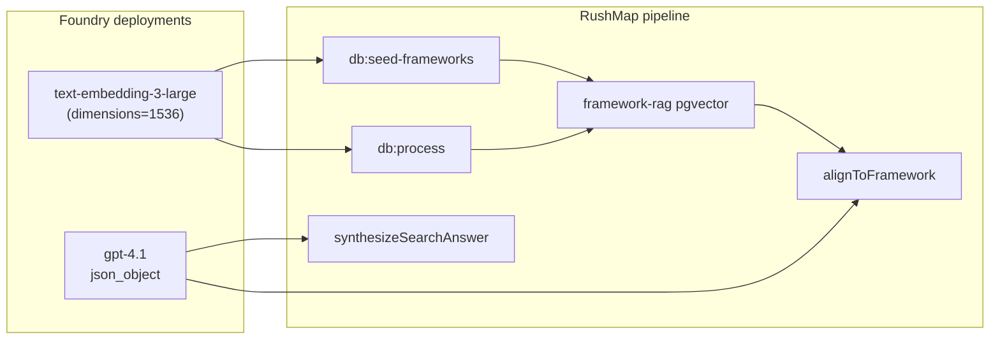

# feat: Quality-tier Azure model configuration

## Goal Capsule

**Objective:** Configure RushMap to use the highest-practical Azure OpenAI models for curriculum mapping — `gpt-4.1` for structured alignment and search synthesis, `text-embedding-3-large` (1536 dimensions) for framework and chunk RAG — then re-bootstrap embeddings and alignments so demo results reflect the quality tier.

**Authority:** Supersedes MVP R9 / ingestion defaults (`gpt-4o-mini`, `text-embedding-3-small`) for production demo runs. Ingestion architecture (RAG top-K, fail-closed alignment, pgvector) is unchanged.

**Stop when:** `.env.local` documents quality-tier deployments, embedding calls request 1536 dims from large model, README/setup scripts match, and a full `db:seed-frameworks` + `db:process` run completes against live Azure + Neon.

---

## Summary

User chose maximum accuracy over cost. [Foundry catalog](https://ai.azure.com/catalog) Azure OpenAI models `gpt-4.1` and `text-embedding-3-large` are the recommended pair for RushMap's three AI workloads: framework/chunk embeddings, per-chunk JSON alignment against a constrained catalog, and cited NL search answers. Schema stays `vector(1536)` — large embeddings use API `dimensions: 1536` rather than a migration to 3072.

---

## Problem Frame

MVP and ingestion plans defaulted to cost-tier models (`gpt-4o-mini`, `text-embedding-3-small`). For stakeholder demo quality, alignment precision on USMLE/AAMC taxonomy IDs and RAG recall on medical terminology matter more than token savings. The codebase already supports deployment-name env vars and OpenAI SDK `json_object` alignment; only embedding dimension handling and documentation need updates before reprocessing.

---

## Requirements

- R1. Chat deployment uses `gpt-4.1` for `alignToFramework` and `synthesizeSearchAnswer` (`lib/azure-ai.ts`)
- R2. Embedding deployment uses `text-embedding-3-large` with **1536 output dimensions** to match `drizzle/schema.ts` `vector(1536)`
- R3. `.env.local.example`, `README.md`, and `scripts/configure-foundry-env.sh` document quality tier as default recommendation
- R4. `generateEmbedding` passes `dimensions` when env or deployment indicates large model (no silent 3072-dim vectors into pgvector)
- R5. After model switch, operators re-run framework seed + document process (or full `npm run setup`) — existing small-model embeddings are invalid
- R6. API version `2024-10-21` or later for structured outputs on gpt-4.1 family

---

## Key Technical Decisions

| ID | Decision | Rationale |
|----|----------|-----------|
| KTD-1 | **Chat: `gpt-4.1`** (not mini, not gpt-5.x/o-series) | Best instruction-following + structured JSON for constrained catalog picking; [catalog](https://ai.azure.com/catalog/models/gpt-4.1) beats gpt-4o on following rules; reasoning models are slow/expensive for 2× calls per chunk with no catalog benefit |
| KTD-2 | **Embed: `text-embedding-3-large` @ 1536 dims** | Highest retrieval accuracy in embedding family ([catalog](https://ai.azure.com/catalog/models/text-embedding-3-large)); keeps existing pgvector schema without migration |
| KTD-3 | **No `vector(3072)` migration** in this plan | Full 3072-dim large embeddings are deferred — would require schema change + full re-embed; 1536-truncated large still beats small model per Microsoft MTEB benchmarks |
| KTD-4 | **Single chat deployment** for align + search | App uses one `AZURE_OPENAI_DEPLOYMENT_CHAT`; splitting align/search deployments is deferred |
| KTD-5 | **Reprocess mandatory on model change** | Embedding geometry changes invalidate all stored vectors; `db:realign` alone is insufficient after embedding model swap |

---

## High-Level Technical Design

---

## Implementation Units

### U1. Environment contract — quality tier defaults

**Goal:** Operators know exactly which Foundry models to deploy and which env vars to set.

**Requirements:** R1, R2, R3, R6

**Dependencies:** none

**Files:** `.env.local.example`, `README.md`, `scripts/configure-foundry-env.sh`, `scripts/setup.ts`

**Approach:** Replace example deployments with `gpt-4.1` and `text-embedding-3-large`. Add `AZURE_OPENAI_EMBEDDING_DIMENSIONS=1536` (optional explicit override). Set `AZURE_OPENAI_API_VERSION=2024-10-21`. Note in README that deployment names must match portal names in AI Innovation Foundry resource group.

**Test expectation:** none — documentation and env template.

**Verification:** Example file shows quality tier; README bootstrap section lists both deployments.

---

### U2. Embedding dimensions in Azure client

**Goal:** `text-embedding-3-large` returns 1536-dimensional vectors compatible with pgvector columns.

**Requirements:** R2, R4

**Dependencies:** U1

**Files:** `lib/azure-ai.ts`, `__tests__/lib/azure-ai.test.ts` (new, mocked)

**Approach:** In `generateEmbedding`, pass `dimensions` to `client.embeddings.create` when `AZURE_OPENAI_EMBEDDING_DIMENSIONS` is set OR when deployment name contains `large`. Default dimensions to 1536 for large, omit param for small (native 1536). Truncate input text remains 8000 chars in seed batch paths.

**Test scenarios:**
- Happy path: mock client receives `dimensions: 1536` when embed deployment is `text-embedding-3-large`
- Happy path: mock client omits `dimensions` when deployment is `text-embedding-3-small`
- Edge case: `AZURE_OPENAI_EMBEDDING_DIMENSIONS=1536` forces dimensions even if deployment name ambiguous

**Verification:** Unit test asserts dimensions param; manual smoke — one embedding returns array length 1536.

---

### U3. Operator bootstrap after model switch

**Goal:** Full dataset re-embedded and re-aligned with quality-tier models.

**Requirements:** R5

**Dependencies:** U1, U2

**Files:** `README.md` (bootstrap section only)

**Approach:** Document ordered re-bootstrap when changing embedding or chat models: `db:push` (if needed) → `db:seed-frameworks` (re-embeds ~750 framework rows) → `db:seed` → `db:process` (7 guides). Warn that Azure cost and runtime increase significantly vs mini/small tier. `db:realign` is only valid when embeddings unchanged.

**Execution note:** Prefer runtime smoke on Case 1 only before full seven-guide process if validating credentials.

**Test expectation:** none — operational procedure.

**Verification:** Spot-check: `usmle_domains` rows have non-null embeddings; sample alignment `framework_id` joins catalog.

---

## Scope Boundaries

**In scope:** Env vars, embedding dimensions param, docs, operator re-bootstrap guidance.

**Deferred for later:** `vector(3072)` migration for full large-model fidelity; separate chat deployments for align vs search; automatic model-router deployment; IVFFlat index tuning for larger embedding corpus.

**Outside this product's identity:** Changing Foundry quota, PTU provisioning, or cross-subscription model access.

---

## Verification Contract

| Gate | Check |
|------|--------|
| Unit tests | `npm test` — including new `azure-ai` embedding dimensions test |
| Build | `npm run build` |
| Embedding smoke | One `generateEmbedding` call returns length 1536 against live Azure |
| Framework seed | `db:seed-frameworks` completes; framework rows have embeddings |
| Process smoke | `db:process` on course 1; alignments reference catalog `stable_id` values |
| Search smoke | `/courses/1/search` returns cited answer |

---

## Definition of Done

- [ ] `.env.local.example` recommends `gpt-4.1` + `text-embedding-3-large` + API version 2024-10-21
- [ ] `generateEmbedding` supports 1536-dim large model without schema change
- [ ] README and setup scripts document quality tier and re-bootstrap order
- [ ] Live re-process completed (or documented blocker: missing credentials)
- [ ] `npm test` and `npm run build` pass

---

## Risks and Dependencies

| Risk | Mitigation |
|------|------------|
| gpt-4.1 not deployed in AI Innovation Foundry RG | Deploy from [catalog](https://ai.azure.com/catalog/models/gpt-4.1) before bootstrap |
| Deployment name ≠ model name | Use exact portal deployment name in env vars |
| 10–20× higher process cost | Run Case 1 smoke first; full process overnight if needed |
| Rate limits on embedding batch | Existing seed batch size 10; retry with backoff |

**Prerequisites:** Neon `DATABASE_URL`, Foundry endpoint + key, both deployments created, local files already copied (`npm run setup:files` done).

---

## Sources and Research

- [Microsoft Foundry Model Catalog](https://ai.azure.com/catalog)
- [gpt-4.1](https://ai.azure.com/catalog/models/gpt-4.1) — structured outputs, instruction following
- [text-embedding-3-large](https://ai.azure.com/catalog/models/text-embedding-3-large) — retrieval accuracy
- Azure MCP `get_azure_bestpractices` AI app guidance — structured JSON + retrieval pattern (no Agent Framework migration)
- Origin ingestion plan: `docs/plans/2026-07-03-002-feat-real-document-framework-ingestion-plan.md`
