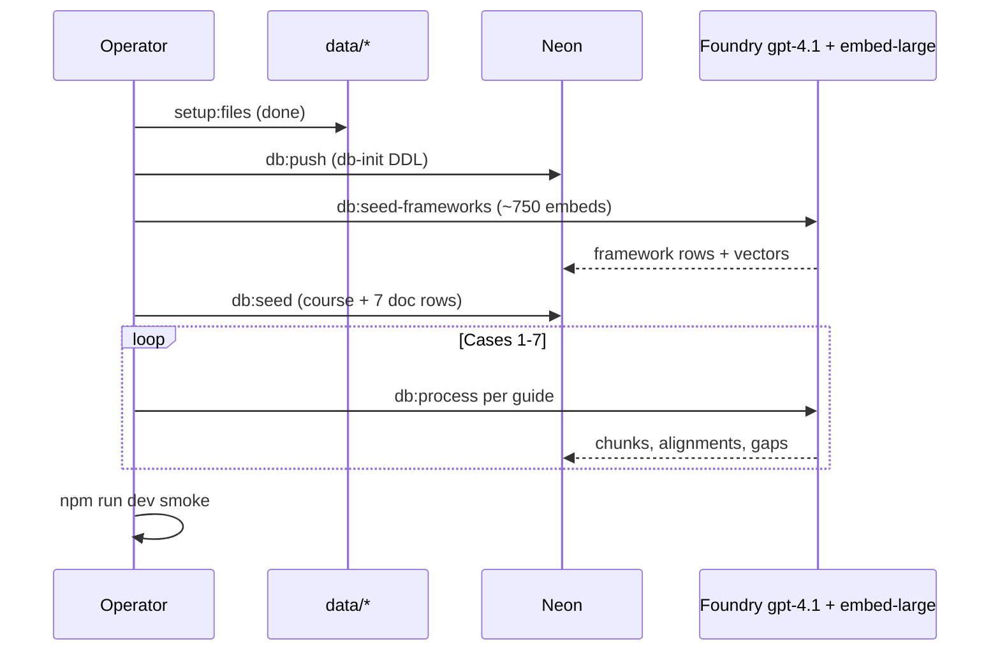

# feat: Full demo seed bootstrap (all documents)

## Goal Capsule

**Objective:** Bootstrap Neon with pgvector, embed all framework taxonomy rows, seed RMD 563 course metadata, and run the full AI pipeline on all seven faculty guides using quality-tier Azure models — producing a demo-ready database for `/courses/1` map, gaps, and search.

**Authority:** Final integration of plans 001–003. Files already copied to `data/frameworks/` and `data/curriculum/`; credentials in `.env.local`.

**Stop when:** All seven cases processed, framework embeddings present, spot-check alignments join catalog `stable_id`, and `npm run dev` shows populated dashboard.

---

## Summary

Local files are ready (7 guides, USMLE PDF, AAMC xlsx, guidebook PDF). Neon `DATABASE_URL` is set. Azure nonprod Foundry uses `gpt-4.1` + `text-embedding-3-large` @ 1536 dims. Bootstrap is a ordered script chain — not a single magic command — because framework embedding (~750 rows) and seven-guide processing are long-running and costly.

**Azure MCP note:** Foundry deployment discovery MCP requires `az login` (device flow timed out earlier). Bootstrap uses portal-pasted keys in `.env.local`; deployment names must match Foundry exactly.

---

## Problem Frame

Ingestion code (U1–U11) and quality-tier wiring (plan 003) are implemented, but the live Neon database has not been fully seeded and processed. `drizzle-kit push:pg` fails on `vector(1536)` against Neon pooler; `scripts/db-init.ts` replaces it for schema creation.

---

## Requirements

- R1. Schema: pgvector extension + all RushMap tables on Neon
- R2. Framework seed: parse authority files, insert USMLE/AAMC/keywords, embed with `text-embedding-3-large` @ 1536
- R3. Course seed: RMD 563 + seven document metadata rows (no duplicate framework seed in `db:seed`)
- R4. Process all seven faculty guides: parse → chunk → embed → align → tag → gap recompute
- R5. Optional smoke: process Case 1 only before full seven-guide run
- R6. Verification: tests + build pass; manual UI smoke on map/gaps/search

---

## Key Technical Decisions

| ID | Decision | Rationale |
|----|----------|-----------|
| KTD-1 | **`npm run db:push` → `scripts/db-init.ts`** | Neon + drizzle-kit 0.20 cannot apply `vector(1536)` via pooler; neon HTTP DDL on direct host works |
| KTD-2 | **Strict bootstrap order** | `db:push` → `db:seed-frameworks` → `db:seed` → `db:process` — seed must not re-call framework seed (fixed) |
| KTD-3 | **Smoke via `PROCESS_CASE_NUMBER=1`** | Validates Azure + DB before ~2–4 hr full process |
| KTD-4 | **Pooler URL for runtime, direct for DDL** | `lib/db.ts` uses pooler; `db-init` strips `-pooler` for migrations |
| KTD-5 | **No Agent Framework migration** | Azure MCP recommends Agent Framework for greenfield agents; RushMap correctly stays on OpenAI SDK + pgvector RAG (plan 003) |

---

## High-Level Technical Design

---

## Implementation Units

### U1. Pre-flight validation

**Goal:** Confirm env and files before spending Azure credits.

**Requirements:** R1

**Dependencies:** none

**Files:** `.env.local`, `data/frameworks/`, `data/curriculum/`

**Approach:** Verify `DATABASE_URL`, Azure endpoint/key/deployments, `AZURE_OPENAI_EMBEDDING_DIMENSIONS=1536`. Confirm 7 curriculum files + 3 framework binaries exist.

**Test expectation:** none — manual checklist.

**Verification:** `npm test` and `npm run build` pass.

---

### U2. Schema bootstrap

**Goal:** Create pgvector + tables on Neon.

**Requirements:** R1

**Dependencies:** U1

**Files:** `scripts/db-init.ts`, `package.json` (`db:push`)

**Approach:** Run `npm run db:push`. Uses direct Neon host (not pooler).

**Test expectation:** none — runtime DDL.

**Verification:** Tables exist; `SELECT extname FROM pg_extension WHERE extname='vector'` returns one row.

---

### U3. Framework seed with embeddings

**Goal:** Load ~632 USMLE + 33 AAMC + 104 keyword rows with large-model embeddings.

**Requirements:** R2

**Dependencies:** U2

**Files:** `scripts/seed-frameworks.ts`, `lib/azure-ai.ts`

**Execution note:** Expect 15–45 minutes; watch for rate limits.

**Test scenarios:**
- Happy path: `db:seed-frameworks` completes; `usmle_domains` count > 600
- Error path: invalid API key surfaces clear Azure error (no silent null embeddings for all rows)

**Verification:** Sample `usmle_domains.embedding` is non-null; embedding array length 1536.

---

### U4. Course + document metadata seed

**Goal:** Insert course 1 and seven document rows without re-seeding frameworks.

**Requirements:** R3

**Dependencies:** U3

**Files:** `scripts/seed.ts`

**Approach:** `npm run db:seed` only inserts course + documents; framework seed is separate.

**Test expectation:** none — data script.

**Verification:** `documents` has 7 rows with `case_number` 1–7.

---

### U5. Process faculty guides

**Goal:** Full AI pipeline on all seven cases.

**Requirements:** R4, R5

**Dependencies:** U4

**Files:** `scripts/process-documents.ts`, `lib/pipeline.ts`

**Execution note:** Run `PROCESS_CASE_NUMBER=1 npm run db:process` first; then full `npm run db:process`.

**Test scenarios:**
- Happy path: Case 1 completes with `processing_jobs.status=complete`, alignments > 0
- Integration: alignment `framework_id` values exist in `usmle_domains` or `aamc_competencies` stable_id set

**Verification:** Each document has chunks + alignments; `gap_summary` populated.

---

### U6. Demo smoke

**Goal:** Confirm UI routes work against live data.

**Requirements:** R6

**Dependencies:** U5

**Files:** `app/courses/[courseId]/**`

**Approach:** `npm run dev` → `/courses/1`, `/courses/1/map`, `/courses/1/gaps`, `/courses/1/search?q=GERD`

**Test expectation:** none — manual smoke.

**Verification:** Map shows alignments; search returns cited answer.

---

## Scope Boundaries

**In scope:** Full local bootstrap, smoke, demo verification.

**Deferred to Follow-Up Work:** IVFFlat index on framework embeddings; live Azure MCP deployment auto-discovery; Vercel env sync.

**Out of scope:** AAMC guidebook PDF parser (still stub catalog); production auth.

---

## Verification Contract

| Gate | Check |
|------|--------|
| Unit tests | `npm test` |
| Build | `npm run build` |
| Schema | `db:push` succeeds |
| Framework | `db:seed-frameworks` completes |
| Course | 7 documents in DB |
| Process | All 7 guides `complete` |
| UI | Map + search smoke |

---

## Definition of Done

- [ ] Neon schema + pgvector live
- [ ] Framework rows embedded with large model @ 1536
- [ ] Course + 7 documents seeded
- [ ] All 7 guides processed
- [ ] Demo routes verified

---

## Risks and Dependencies

| Risk | Mitigation |
|------|------------|
| Azure rate limits / cost | Smoke Case 1 first; batch size 10 in seed-frameworks |
| Long DOCX parse (Case 2 ~54MB) | Allow extra time; monitor memory |
| Pooler vs direct DDL | `db-init` uses direct host only |
| Secrets in chat/logs | Rotate Neon/Azure keys if exposed; never commit `.env.local` |

**Prerequisites:** `.env.local` complete; `data/` files present (already copied).

---

## Sources and Research

- Azure MCP `get_azure_bestpractices` AI app guidance — confirms structured JSON + retrieval pattern; no Agent Framework migration required for this app
- Plans 001–003 in `docs/plans/`
- Foundry endpoint: `rua-nonprod-ai-innovation.cognitiveservices.azure.com`
