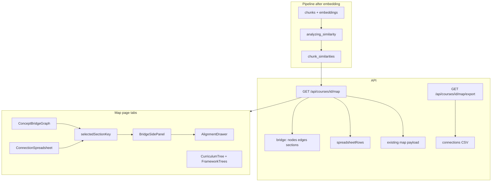
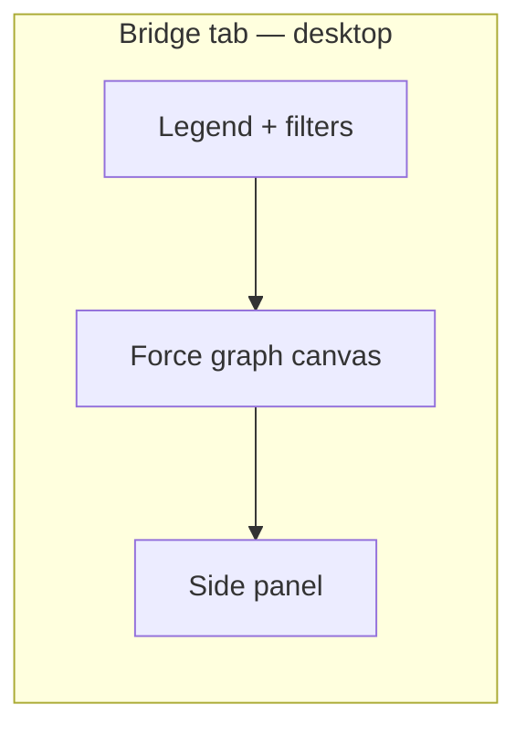
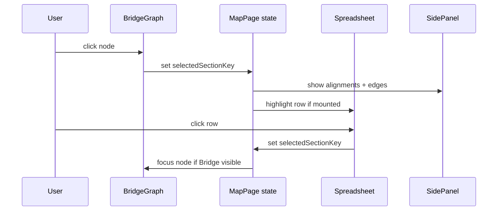

# feat: Concept Bridge curriculum map — graph + spreadsheet

## Goal Capsule

**Objective:** After demo data is clean (plan 005 rebootstrap complete), add a faculty-facing **Concept Bridge** curriculum map to RushMap AI with two linked views — an interactive force-directed graph and a sortable spreadsheet — so course directors can see cross-case semantic connections, framework alignments, and overlap at a glance, then export the same data for committee review.

**Authority:** Ideation artifact `docs/ideation/2026-07-03-interactive-curriculum-map-ideation.html` (Concept Bridge Graph, ranked #1). This plan preserves the existing tri-column tree map; the new feature is an additive mode on `/courses/[courseId]/map`. Product Contract preservation: unchanged from MVP R4 intent — extends the signature map rather than replacing it.

**Stop when:** Definition of Done is satisfied on course 1 with post-rebootstrap data; a director can explore connections in the graph, inspect the same relationships in the spreadsheet, export CSV, and open the alignment drawer without confusion.

---

## Product Contract

Product Contract source: `ce-plan-bootstrap` from ideation + user refinement (dual spreadsheet + interactive map, visually polished UX).

### Problem Frame

The current map shows three parallel lists (curriculum, AAMC, USMLE) with no edges between curriculum elements. Faculty cannot see why two cases both align to the same framework node, where content repeats across cases, or how sections relate beyond framework taxonomies. Committee workflows also need a **spreadsheet artifact** they can filter, sort, and attach to meetings — not only a visual graph.

### Actors

- A1. **Course director / curriculum committee** — explores overlap and connections; exports spreadsheet for meetings
- A2. **Faculty reviewer** — confirms alignments via existing drawer; uses graph to spot redundant teaching
- A3. **Dean (demo audience)** — needs a visually compelling, low-friction walkthrough during presentation

### Key Flows

- F1. **Explore bridge graph** — Map → Bridge tab → pan/zoom graph → select node → side panel shows alignments → click alignment → drawer
- F2. **Review as spreadsheet** — Map → Spreadsheet tab → sort/filter rows → row click highlights graph node (when Bridge tab visited) → export CSV
- F3. **Export for committee** — Spreadsheet tab → Export Connections (CSV) → open in Excel/Sheets
- F4. **Compare with classic map** — Map → Trees tab → existing tri-column view unchanged

### Requirements

- R1. **Prerequisite gate:** Feature ships only after plan 005 rebootstrap completes (`db:push` → `db:seed-frameworks` → `db:seed` → `db:process` all 7 guides); chunk embeddings and framework IDs must be valid
- R2. **Dual-view curriculum map UI** on `/courses/[courseId]/map` with three tabs: **Bridge** (default for new visits after launch), **Spreadsheet**, **Trees** (existing tri-column layout)
- R3. **Interactive Concept Bridge graph:** force-directed layout; nodes = curriculum sections grouped by case; edges = cross-case semantic similarity above configurable threshold; edge label shows similarity score
- R4. **Visual polish:** Rush green (`#00843D`), Sora headings, Inter body, card shadows, clear legend, empty/loading states, responsive desktop layout (demo-first; mobile scroll acceptable)
- R5. **Ease of use:** legend explains node colors (case), edge colors (similarity band), overlap badge; similarity threshold slider with live edge count; case filter (all 7 cases); search/filter box for section name; keyboard-accessible tab order and focus rings on controls
- R6. **Spreadsheet view:** sortable table of section rows with columns Case, Section, Top frameworks (AAMC/USMLE), Connection count, Max similarity, Linked cases; sticky header; row hover + click selects section
- R7. **Linked selection:** selecting a node in Bridge highlights matching spreadsheet row (shared selection state); selecting a spreadsheet row scrolls/highlights graph node when Bridge tab is active
- R8. **Side panel on node select:** section excerpt, case label, framework alignments above confidence threshold (reuse alignment drawer pattern), list of connected sections with similarity scores
- R9. **CSV export** of connection rows (`/api/courses/[courseId]/map/export`) mirroring spreadsheet columns plus edge endpoints and similarity — same pattern as gaps CSV export
- R10. **Precomputed similarities:** pipeline stage after embedding writes `chunk_similarities` table (top-k cross-chunk pairs per course, cross-document only); map API reads precomputed edges aggregated to section level
- R11. **Performance guardrails:** cap displayed edges (e.g. top 150 by similarity); cluster or hide low-similarity edges below slider; section-level aggregation keeps graph ≤ ~88 nodes for demo course
- R12. **Preserve Trees tab:** existing filters, confidence slider, framework filter, alignment drawer unchanged
- R13. **Fix case filter:** Trees and Bridge case filters include cases 1–7 (not hardcoded 1–4)

### Acceptance Examples

- AE1. Director opens Bridge tab: sees labeled case-colored nodes and dashed similarity edges; legend visible without scrolling on 1440px viewport
- AE2. Hover edge between Case 2 and Case 5 sections: tooltip shows similarity score and truncated shared concept text from both chunks
- AE3. Select a node: side panel lists USMLE/AAMC alignments; clicking one opens alignment drawer with approve/reject
- AE4. Switch to Spreadsheet tab: same course sections appear in table; sort by Connection count descending surfaces most redundant sections first
- AE5. Export CSV downloads file with header row; opens in Excel with Case, Section, Linked case, Linked section, Similarity columns populated
- AE6. Trees tab still renders tri-column map; demo script step 3 (select vignettes activity) still works

### Scope Boundaries

**In scope:** Bridge graph, spreadsheet table, CSV export, precomputed similarities, map page tab shell, UX polish per Rush design system, section-level aggregation, linked selection.

**Deferred for later:** Keyword Constellation layer (ideation #2), faculty annotation workflow ("intentional spiral"), XLSX export, student study-path lens, what-if case trim simulator, animated SVG beziers (`AlignmentLines.tsx`), mobile-optimized radial layout, pgvector IVFFlat index (unnecessary at ~240 chunks).

**Outside this product's identity:** LMS gradebook, automated "consolidate this" AI suggestions without faculty trust layer.

### Deferred to Follow-Up Work

- Keyword hub nodes using existing `keyword_tags` (orthogonal graph layer)
- Framework Hub Lens redundancy halo (ideation #3) as fourth tab
- Real-time edge computation API without precompute table

---

## Planning Contract

### Summary

Add `chunk_similarities` at pipeline time, aggregate to section-level nodes/edges in `lib/queries.ts`, expose via extended map API plus CSV export route. Rebuild `/courses/[courseId]/map` as a tabbed experience: **Bridge** (new `react-force-graph-2d` canvas), **Spreadsheet** (shadcn-style table matching `AlignmentTable` patterns), **Trees** (existing components). Shared React state drives linked selection. UX priority: clarity over density — default threshold hides weak edges; legend and empty states guide first-time users.

### Assumptions

- Plan 005 rebootstrap is complete before implementation starts; this plan does not include parser or re-seed work
- Demo course remains ~240 chunks / ~88 sections / 7 cases — section-level graph is sufficient without chunk-level nodes
- Directors accept CSV (not XLSX) for committee export in v1; `xlsx` package already in repo if XLSX is trivial follow-up
- `react-force-graph-2d` is acceptable new dependency (~lightweight d3-force wrapper); no Cytoscape/full graph suite

### Key Technical Decisions

| ID | Decision | Rationale |
|----|----------|-----------|
| KTD-1 | **Tabbed map page: Bridge / Spreadsheet / Trees** | User requires both spreadsheet and interactive map; Trees preserves MVP demo script |
| KTD-2 | **Section-level nodes, chunk-level similarity source** | `CurriculumTree` already groups by section; ~88 nodes vs ~240 keeps graph legible; aggregate max similarity per section pair |
| KTD-3 | **`chunk_similarities` table + pipeline stage `analyzing_similarity`** | Avoid O(n²) API latency; idempotent with `clearDocumentArtifacts`; re-run on `db:process` |
| KTD-4 | **Top-k=5 cross-document neighbors per chunk, similarity ≥ 0.75 stored** | ~1200 stored pairs upper bound for demo; UI slider filters display threshold upward from 0.75 |
| KTD-5 | **`react-force-graph-2d` for Bridge canvas** | No graph lib in repo today; recharts unsuitable; lighter than Cytoscape; supports pan/zoom/tooltip hooks |
| KTD-6 | **Rush-branded node canvas styling** | Case hue from fixed palette (7 cases); selected node ring `#FFD100`; overlap edges (shared framework + high similarity) stroke `#DC2626` |
| KTD-7 | **Shared selection via map page state** | `selectedSectionKey` string (`caseNumber::section`) syncs graph, table, side panel |
| KTD-8 | **CSV export route mirrors gaps export** | `app/api/courses/[courseId]/export/route.ts` pattern; new `map/export` for connections |
| KTD-9 | **Extend GET map API with `bridge` payload** | Single fetch for trees + bridge + spreadsheet rows avoids waterfall; optional `?view=bridge` later if payload too large |
| KTD-10 | **Default tab: Bridge** | Highlights new feature for demo; Trees remains one click away |

### High-Level Technical Design

**UX layout (Bridge tab):**

**Selection sync:**

### Risks & Dependencies

| Risk | Mitigation |
|------|------------|
| Graph visual clutter | Default threshold 0.82; edge cap 150; case filter |
| Stale data if rebootstrap skipped | R1 gate in DoD; README note |
| Force layout jank on re-render | Memoize graph data; freeze layout after initial tick option |
| Similarity ≠ pedagogical redundancy | Copy in side panel: "Semantic similarity — confirm with faculty"; no auto "consolidate" |
| Large CSV confusion | Export only edges above current slider threshold |

**Blocking dependency:** `docs/plans/2026-07-03-005-fix-usmle-parser-rebootstrap-plan.md` Definition of Done must pass first.

---

## Implementation Units

### U1. Schema and pipeline similarity stage

**Goal:** Persist cross-chunk similarity pairs at process time.

**Requirements:** R1, R10

**Dependencies:** Plan 005 rebootstrap complete (external)

**Files:** `scripts/db-init.ts`, `drizzle/schema.ts`, `lib/pipeline.ts`, `lib/chunk-similarity.ts` (new), `lib/queries.ts`

**Approach:** Add `chunk_similarities (id, course_id, chunk_a_id, chunk_b_id, similarity numeric(4,3), created_at)` with unique constraint on `(chunk_a_id, chunk_b_id)` where `chunk_a_id < chunk_b_id`. New `computeChunkSimilarities(courseId)` runs pgvector kNN per chunk (cross-document only, top 5, similarity ≥ 0.75). Call after embedding insert in `runFullPipeline`; delete course pairs in `clearDocumentArtifacts` scope. Add `analyzing_similarity` to `PIPELINE_STAGES`.

**Execution note:** Add unit tests for aggregation helper before wiring pipeline.

**Patterns to follow:** `searchChunks` cosine formula in `lib/queries.ts`; `clearDocumentArtifacts` in `lib/pipeline.ts`

**Test scenarios:**
- Happy path: two chunks in different documents with high embedding overlap produce one stored pair (ordered ids)
- Edge: same-document chunk pairs are excluded
- Edge: similarity below 0.75 is not stored
- Error: missing embedding skips chunk without throwing entire pipeline

**Verification:** Re-run `db:process` on Case 1; `chunk_similarities` has rows; `npm test` passes

---

### U2. Bridge data queries and section aggregation

**Goal:** Build DTOs for graph nodes, edges, spreadsheet rows from similarities + alignments.

**Requirements:** R3, R6, R8, R11

**Dependencies:** U1

**Files:** `lib/queries.ts`, `lib/bridge-graph.ts` (new), `__tests__/lib/bridge-graph.test.ts`

**Approach:** Use a composite section key (`caseNumber` + section title). Aggregate chunk pairs to section pairs (max similarity). Nodes: case color, label, section title, chunk excerpt preview, alignment count. Edges: similarity, shared framework flag (both sections align same `framework_id` above confidence). Spreadsheet rows: one per section with connection count, max similarity, linked case list, top 3 framework labels. Apply edge cap and threshold filter in query layer.

**Patterns to follow:** `getMapData` join pattern; `confidenceBadgeClass` / `formatConfidence` from `lib/utils.ts`

**Test scenarios:**
- Happy path: fixture chunk pairs aggregate to one section edge with correct max similarity
- Edge: section with no cross-case edges omitted from edges array but present in nodes
- Edge: edge cap returns top N by similarity
- Integration: shared framework detection when alignments overlap

**Verification:** Unit tests pass; manual inspect JSON shape via temporary log or test snapshot

---

### U3. Map API extension and CSV export

**Goal:** Serve bridge + spreadsheet payload and downloadable CSV.

**Requirements:** R9, R12

**Dependencies:** U2

**Files:** `app/api/courses/[courseId]/map/route.ts`, `app/api/courses/[courseId]/map/export/route.ts` (new), `lib/queries.ts`

**Approach:** Extend `getMapData` return with `bridge: { nodes, edges, cases }` and `spreadsheetRows`. Export route accepts optional `?minSimilarity=` query param; emits CSV columns: case, section, linked_case, linked_section, similarity, shared_framework.

**Patterns to follow:** `app/api/courses/[courseId]/export/route.ts` CSV escaping

**Test scenarios:**
- Happy path: GET map returns bridge nodes array non-empty after process
- Happy path: export returns `text/csv` with header and ≥1 data row
- Edge: empty similarities returns empty edges but valid nodes
- Error: invalid courseId returns 404/500 JSON (match existing routes)

**Verification:** `curl` map and export endpoints after local process; `npm test` if route tests added

---

### U4. Map page tab shell and shared selection state

**Goal:** Three-tab layout with linked selection and filters.

**Requirements:** R2, R5, R7, R13

**Dependencies:** U3

**Files:** `app/courses/[courseId]/map/page.tsx`, `components/map/MapViewTabs.tsx` (new), `components/map/MapFilters.tsx` (new)

**Approach:** Refactor map page: fetch once; tabs via shadcn-style button group or Radix Tabs (install `@radix-ui/react-tabs` if needed, else styled button state). State: `activeTab`, `selectedSectionKey`, `caseFilter`, `minSimilarity`, `sectionSearch`. Pass props to child views. Fix case filter options from `data.documents` case numbers. Default tab `bridge`. Loading skeleton and error card.

**Patterns to follow:** Existing map page filter row; `components/ui/card.tsx`, `button.tsx`, `slider.tsx`

**Test scenarios:**
- Happy path: switching tabs preserves selected section when returning
- Happy path: case filter reduces visible nodes/rows
- Edge: section search hides non-matching rows and dims graph nodes
- Covers AE6. Trees tab renders existing three columns unchanged

**Verification:** Manual tab switch; Trees demo script step still works

---

### U5. Concept Bridge graph component (visual UX)

**Goal:** Polished interactive force-directed graph.

**Requirements:** R3, R4, R5, R8

**Dependencies:** U4

**Files:** `components/map/ConceptBridgeGraph.tsx` (new), `components/map/BridgeLegend.tsx` (new), `components/map/BridgeSidePanel.tsx` (new), `package.json`

**Approach:** Add `react-force-graph-2d`. Custom `nodeCanvasObject` for case-colored circles + section label on hover/zoom. Edge width scales with similarity; dashed below 0.85, solid above; red tint when `sharedFramework`. Tooltip on edge hover (AE2). Click node → `onSelectSectionKey`. Side panel: excerpt, alignments list, connected sections; alignment click → existing `AlignmentDrawer`. Legend component documents colors and controls. Min height 520px; canvas `rounded-lg border bg-white shadow-sm`.

**Execution note:** Smoke-test layout in browser before polishing colors; prefer readable defaults over physics accuracy.

**Patterns to follow:** Rush tokens in `tailwind.config.ts`; `AlignmentDrawer` integration from current map page

**Test scenarios:**
- Test expectation: none for canvas — browser smoke per Verification Contract
- Unit-testable: pure helpers for node color by case number in `bridge-graph.ts` (covered in U2)

**Verification:** Covers AE1, AE2, AE3 visually on 1440px viewport

---

### U6. Connection spreadsheet component

**Goal:** Sortable, filterable table view of the same connection data.

**Requirements:** R6, R7, R9

**Dependencies:** U4

**Files:** `components/map/ConnectionSpreadsheet.tsx` (new), `components/map/MapViewTabs.tsx`

**Approach:** HTML table with sticky header inside scroll container (`max-h-[600px]`). Client-side sort by column click (connection count default desc). Row click → `onSelectSectionKey`. Selected row `bg-accent-soft`. Export button links to `/api/courses/[courseId]/map/export?minSimilarity={value}`. Badge for overlap count; confidence badges for top framework.

**Patterns to follow:** `AlignmentTable` in `components/dashboard/MetricCard.tsx`; gaps page export link pattern

**Test scenarios:**
- Happy path: sort by connection count reverses row order
- Covers AE4. Highest connection count rows appear first by default
- Covers AE5. Export href includes current similarity threshold
- Row click invokes selection callback with correct section key

**Verification:** Spreadsheet matches graph selection; CSV opens in Excel

---

### U7. Documentation and navigation polish

**Goal:** Discoverability and ops notes for demo.

**Requirements:** R4, R5

**Dependencies:** U5, U6

**Files:** `README.md`, `components/layout/Sidebar.tsx`, `app/about/page.tsx` (optional one-liner)

**Approach:** README section: run rebootstrap before bridge map; describe Bridge vs Spreadsheet vs Trees. Sidebar label "Curriculum Map" unchanged; optional subtitle tooltip. About page mention dual views if space allows.

**Test expectation:** none — documentation smoke

**Verification:** Fresh reader can find Bridge tab from README

---

## Verification Contract

| Gate | Command / check |
|------|-----------------|
| Unit tests | `npm test` |
| Build | `npm run build` |
| Rebootstrap prerequisite | Plan 005 DoD complete |
| Data | `npm run db:process` (all 7) → `chunk_similarities` populated |
| API | `GET /api/courses/1/map` includes `bridge.nodes.length > 0` |
| Export | `GET /api/courses/1/map/export` returns valid CSV |
| UI smoke | Bridge + Spreadsheet + Trees tabs; AE1–AE6 |
| Demo regression | MVP demo script step 3 on Trees tab |

---

## Definition of Done

**Global:**

- [ ] Plan 005 rebootstrap verified complete
- [ ] `chunk_similarities` populated for course 1 after full process
- [ ] Map page has Bridge, Spreadsheet, and Trees tabs with Rush-styled UX
- [ ] Graph is readable at default threshold on 1440px without overwhelming edge hairball
- [ ] Spreadsheet sort, filter, and CSV export work
- [ ] Linked selection between graph and spreadsheet
- [ ] Trees tab unchanged for demo script
- [ ] `npm test` and `npm run build` pass
- [ ] README documents prerequisite chain and new views

**Per unit:** Each U1–U7 verification section satisfied.

---

## Sources & Research

- Origin: `docs/ideation/2026-07-03-interactive-curriculum-map-ideation.html` — Concept Bridge Graph (#1), Keyword Constellation deferred (#2)
- MVP map: `docs/plans/2026-07-03-001-feat-rushmap-ai-mvp-plan.md` U8 (AlignmentLines deferred)
- Prerequisite: `docs/plans/2026-07-03-005-fix-usmle-parser-rebootstrap-plan.md`
- Codebase: `lib/queries.ts` (`getMapData`, `searchChunks`), `app/courses/[courseId]/map/page.tsx`, gaps CSV export pattern
- External research: not run; ideation captured mapEDU / CloudPedagogy prior art; local embedding patterns sufficient
