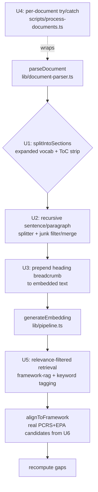

# feat: World-class RAG chunking and goal-accuracy hardening

## Goal Capsule

**Objective:** Make RushMap AI's RAG pipeline world-class on the documents that actually carry the curriculum (the self-study guides), and bring the app's public claims into line with what the code truly does — so a stakeholder demo maps real Rush content against real national frameworks with no fabricated numbers or stub authorities.

**Authority:** Derived from an empirical audit that ran the repo's own parser + chunker (`lib/document-parser.ts`, `lib/chunker.ts`) over all 14 real RMD 563 documents. The audit is the origin; its numbers anchor the problem frames below. This plan extends — does not replace — the pipeline and UX shell from plans 001/002.

**Stop when:** Definition of Done is satisfied — self-study guides chunk on real semantic boundaries, no document silently fails processing, every embedded chunk carries heading context, retrieval is relevance-filtered, AAMC PCRS + Core EPA alignments judge against real sourced text, and no user-facing surface or doc states a claim the code doesn't back.

---

## Problem Frame

The pipeline architecture is sound: parse → extract objectives → chunk → embed → RAG-retrieve framework candidates → LLM-align (fail-closed, temp 0, IDs restricted to the candidate set) → recompute gaps. Two classes of defect sit on top of it.

**Chunking collapses on the highest-value content.** `lib/chunker.ts` recognizes only 5 heading patterns (`Activity N`, `Take-Home Points`, `Case N`, `Learning Objectives`, `Objectives`). Faculty guides (~11k tokens) are built around "Activity N" and split acceptably. But self-study guides (25k–64k tokens each, ~80% of total corpus) are organized by headings the regex never sees — `Self-Study Topics:`, `Discipline Director Notes:`, `Rationale:`, `Key Words:`, `Overview`, `Summary`, `Question N`. Their bodies dump into one giant "section" that is then sliced into blind fixed 500-token windows:

| Document | Largest single detected "section" | Resulting chunks (all blind 500-tok windows) |
|---|---|---|
| SelfStudy Case 3 | 54,573 tokens (≈ whole doc) | 134 |
| SelfStudy Case 4 | 38,463 tokens | 134 |
| SelfStudy Case 1 | 28,251 tokens | 152 |

Consequences measured across the 14 docs: ~76% of chunk boundaries in large docs land mid-sentence (116 of 152 in SelfStudy Case 1); every document produces 8–11-token junk chunks from table-of-contents fragments (e.g. `"Case 2\t14"`) that are still embedded, aligned, and keyword-tagged; ToC lines double as duplicate section headers; and embedded chunk text carries no heading context, so a chunk under `Rationale:` loses which question it answers. Separately, `RMD563_FacultyGuide_Case2_JessicaDonner.docx` is a genuinely truncated zip (valid PK header, no end-of-central-directory record — confirmed with `unzip -t`); `parseDocument` throws, and `runFullPipeline` at `scripts/process-documents.ts:155` is not wrapped in try/catch, so the exception aborts every document queued after Case 2. Retrieval has no relevance floor anywhere — keyword tagging attaches the 5 nearest keywords to every chunk regardless of distance (`lib/pipeline.ts:186`), framework retrieval pulls k=20 with no cutoff, and search returns a fixed top-5 with no threshold or re-ranking.

**Public claims outrun the implementation.** The landing page ships hardcoded literals — "4 Faculty Guides Processed / 87% AAMC Coverage / 3 USMLE Gaps Detected" (`app/page.tsx:65-70`) — copied from `DEMO_SUMMARY` (`lib/demo-data.ts:2-9`), with no disclosure, contradicting both the real 14-document seed and `getCourseSummary` (`lib/queries.ts:28`), which already computes these numbers from Postgres. "Maps to Core EPAs" is unbacked: all 13 EPA catalog rows are placeholders (`lib/framework-parsers.ts:309-318`, `fullText: "Core EPA {n} (stub …)"`). "AAMC PCRS" is a hand-written 20-line paraphrase (`framework-parsers.ts:288-308`), not the official framework, and `parseAamcGuidebookPdf` deliberately returns the stub instead of parsing anything (`:321-326`). `middleware.ts:11-13` exempts every GET from `API_SECRET`, so summary/map/objectives/export are readable unauthenticated despite README/ARCHITECTURE claiming all `/api/*` are protected. `/upload` renders 4 fabricated `DEMO_CASES` with fixed "ready/processed" badges. Note this partly *completes* work plan 002 recorded as `done`: 002's DoD claimed real framework ingestion, but the AAMC PCRS catalog and EPAs remained stubs.

### Actors

- A1. Dean / curriculum committee — reads coverage and gap numbers on the landing page and dashboard; must never see fabricated stats.
- A2. Course director — owns RMD 563; expects all seven cases (14 documents) to process, not silently drop one.
- A3. Faculty reviewer — approves alignments; each `framework_id` must trace to a real sourced authority row, including EPAs and PCRS.
- A4. Curriculum-search user — asks natural-language questions; expects retrieved chunks that are coherent (not mid-sentence fragments) and relevant (not forced top-5).

---

## Scope Boundaries

### In scope
- Chunking: semantic section detection for self-study vocabulary, ToC stripping, recursive sentence/paragraph splitting, junk-chunk filtering/merging, heading-context prefixing.
- Pipeline robustness: per-document error isolation; re-export of the corrupt Case 2 source.
- Retrieval: relevance thresholds for keyword tagging, framework candidate retrieval, and search.
- Framework authenticity: seed real official AAMC PCRS competencies and real Core EPA source text; re-embed.
- Credibility: real landing-page stats; honest `/upload` demo disclosure; `API_SECRET` GET fix; documentation accuracy pass.

### Deferred to Follow-Up Work
- Image/table/figure extraction from documents (OCR/vision) — faculty guides reference `Answer Image:`, esophagrams that text-only parsing drops. Large, separate effort.
- Search re-ranking / MMR diversity beyond a simple similarity floor (U5 adds the floor; a cross-encoder re-ranker is a later enhancement).
- Chunk-quality regression metrics dashboard (this plan verifies via fixtures + the audit script, not a standing metric surface).

### Outside this product's identity
- Replacing Azure AI Foundry / pgvector / Drizzle. The stack is fixed (README "Stack").

---

## Key Technical Decisions

- **KTD1 — Recursive splitter over fixed-token windowing.** Replace the token-slice loop in `chunkText` with a recursive splitter that prefers paragraph (`\n\n`) then sentence boundaries, packing up to the token budget and only falling back to a hard token cut when a single sentence exceeds it. Rationale: the audit shows fixed windowing severs ~76% of boundaries mid-sentence; sentence-aware packing is the standard world-class baseline and is deterministic (important for the temp-0, reproducible pipeline). Keep the 500-token budget and 50-token overlap as tunables.
- **KTD2 — Expand semantic vocabulary rather than switch to layout parsing.** Add the self-study heading patterns and a trailing-colon short-line heuristic to `SECTION_PATTERNS`, and strip the ToC region, instead of moving to a DOCX-structure/style parser. Rationale: mammoth already flattens to raw text; the missed boundaries are lexically obvious (the audit enumerated them), so pattern expansion is high-value and low-risk, and it keeps PDF and DOCX on one code path.
- **KTD3 — Heading path lives in embedded text, not just the `section` column.** Prefix each chunk's embedded content with its heading breadcrumb (`{case} › {section} › {heading}`) while storing the raw content unchanged for display/citation. Rationale: retrieval quality depends on the embedded string; the `chunks.section` column already exists for display, so this is additive and does not require a schema change.
- **KTD4 — Isolate per-document failures; treat corrupt sources as data errors.** Wrap each `runFullPipeline` call in `scripts/process-documents.ts` so one bad file logs and is skipped, not fatal; re-export the Case 2 `.docx` from source rather than attempting byte-repair. Rationale: a demo pipeline must be resilient to one bad input, and the file is genuinely truncated (not a parser bug), so repair belongs at the source.
- **KTD5 — Real framework data replaces stubs in place; alignment IDs stay stable where possible.** Seed official AAMC PCRS competency statements and Core EPA texts into the existing `aamc_competencies` table via `framework-parsers.ts`, preserving `aamc:pc1`-style stable IDs where the official structure maps cleanly. Rationale: keeps `alignments.framework_id` continuity and the `AAMC_EPA` vs `AAMC_PCRS` classification heuristic intact; only `full_text`/`description`/coverage set changes. New official sub-competencies get new stable IDs.
- **KTD6 — Landing stats come from `getCourseSummary`, computed at request time.** Delete the hardcoded literals and the now-unused `DEMO_SUMMARY`; the landing section reads real metrics (course 1). Rationale: the query already exists and returns exactly these fields; empty-DB renders a documented bootstrap state rather than a fake number.
- **KTD7 — `API_SECRET` protects reads too; SSE authenticates via query token.** Remove the blanket GET exemption; allow the one EventSource route (`/api/upload/[jobId]/stream`) via a short-lived query-param token check instead of exempting all GETs. Rationale: closes the disclosure hole named in the audit while preserving the SSE flow that motivated the exemption.

---

## High-Level Technical Design

Where the chunking changes land in the existing pipeline (unchanged stages greyed conceptually):



Chunk-boundary behavior, before vs after (illustrative, not literal output):

```text
BEFORE (fixed 500-tok window, self-study body = one 54k section)
  chunk N   : "...beta-oxidation. Regulation of beta-ox"   <- severed mid-word/sentence
  chunk N+1 : "idation occurs via malonyl-CoA. Question 3..."  <- two concepts fused

AFTER (semantic sections + sentence packing + heading prefix)
  chunk N   : "Case 6 › Self-Study Topics › Beta-oxidation\n
               ...beta-oxidation. Regulation of beta-oxidation occurs via malonyl-CoA."
  chunk N+1 : "Case 6 › Self-Study Topics › Question 3\nQuestion 3: ..."
```

---

## Implementation Units

Grouped into four phases. Chunking and framework-data units (U1–U6) change what gets embedded and therefore require a re-run of `db:seed-frameworks` and/or `db:process` to take effect — that reprocessing is Azure/VPN-gated (same constraint plan 005 recorded). Units land and are unit-tested against fixtures independent of Azure; the full re-embed is the integration gate in the Verification Contract.

### U1. Semantic section detection + table-of-contents stripping

**Goal:** Make `splitIntoSections` recognize the self-study heading vocabulary and stop emitting ToC lines as sections, so self-study bodies split on real boundaries instead of collapsing into one block.

**Requirements:** A4; addresses Problem Frame "chunking collapses."

**Dependencies:** none.

**Files:**
- `lib/chunker.ts` (modify `SECTION_PATTERNS`, `splitIntoSections`; add ToC detection/strip)
- `__tests__/lib/chunker.test.ts` (extend)
- `__tests__/fixtures/` (add a trimmed self-study text fixture capturing the heading + ToC shapes)

**Approach:** Extend `SECTION_PATTERNS` with the audit-enumerated headings: `Self-Study Topics`, `Discipline Director Notes`, `Rationale`, `Key Words`/`Key Points`, `Overview`, `Summary`, `Resource Material`, `References`, `Question \d+`, and a general trailing-colon short-line heuristic (`^[A-Z][A-Za-z ,&/-]{2,60}:$`) for the "Short Title:" style. Add a ToC-region detector: a run of lines matching `.*\t\s*\d+$` or `.*\.{2,}\s*\d+$` (heading + page number) near the document head — strip these lines before sectioning so they neither become sections nor survive as chunk content. Guard against over-splitting: require a heading line to be short (≤ ~80 chars) and not end mid-sentence.

**Patterns to follow:** existing `SECTION_PATTERNS` array and `flush()` loop in `lib/chunker.ts`; mirror the section-end vocabulary already curated in `lib/objective-extractor.ts:29-41` (which independently lists `Discipline Director`, `Overview`, `Introduction`, etc. — reuse that list as the source of truth to avoid drift).

**Test scenarios:**
- Self-study fixture with `Self-Study Topics:` / `Discipline Director Notes:` / `Rationale:` headings splits into ≥ those many sections, none exceeding ~1× the token budget after U2 (here: assert section count and that no single section holds the whole body).
- ToC block (`Activity 1B: Questions … \t 13` lines) is stripped: those lines appear in no section and produce no chunk.
- Faculty-guide fixture (Activity-based) still splits as before — no regression in Activity/Take-Home detection.
- Trailing-colon heuristic matches `HORMONE:` but not a mid-paragraph sentence containing a colon.
- Empty/short document still returns the single `Document` fallback block.

**Verification:** Re-running the audit script (see Verification Contract) shows no self-study document with a single section > ~2,000 tokens.

### U2. Recursive sentence/paragraph splitter + junk-chunk filtering

**Goal:** Replace fixed-token windowing with boundary-aware packing, and drop or merge sub-threshold fragments, so chunks stop severing sentences and ToC scraps stop becoming standalone chunks.

**Requirements:** A4; KTD1.

**Dependencies:** U1.

**Files:**
- `lib/chunker.ts` (rewrite `chunkText`; add merge/filter in `buildChunksFromDocument`)
- `__tests__/lib/chunker.test.ts` (extend)

**Approach:** Rewrite `chunkText` to split section content on paragraph boundaries first, then sentence boundaries, packing units until adding the next would exceed `maxTokens`; carry `overlapTokens` of trailing sentences into the next chunk for continuity. Only when a single sentence alone exceeds the budget, fall back to the current token-slice cut for that sentence. In `buildChunksFromDocument`, after splitting, drop chunks below a `MIN_CHUNK_TOKENS` floor (~40) unless they are the only chunk of their section, and merge a short trailing chunk into its predecessor within the same section. Keep the `chunkText(text) <= maxTokens → [text]` fast path.

**Patterns to follow:** existing `encode`/`decode` usage from `gpt-tokenizer` in `lib/chunker.ts`; keep the function signature `chunkText(text, maxTokens=500, overlapTokens=50)` so `buildChunksFromDocument` and tests need no ripple changes.

**Test scenarios:**
- A 3-paragraph section under budget returns one chunk (fast path).
- A section over budget splits on paragraph boundaries; assert no chunk ends mid-word and, except where a lone sentence overflows, each chunk ends on sentence-terminal punctuation.
- Overlap: consecutive chunks in the same section share trailing/leading sentence text.
- A single sentence longer than `maxTokens` falls back to a hard cut and does not throw.
- Junk filter: an 8-token ToC fragment section is dropped (or merged), not embedded; a section whose only content is short is preserved (not silently lost).
- Boundary regression metric: on the self-study fixture, the fraction of chunks ending on non-terminal characters drops to near zero.

**Verification:** Audit script reports mid-sentence boundary rate near zero and zero sub-40-token chunks on all 14 docs.

### U3. Heading-context prefix for embedded chunks

**Goal:** Embed each chunk with its heading breadcrumb so retrieval knows which case/section/question a chunk belongs to, while keeping stored/displayed content raw.

**Requirements:** A4; KTD3.

**Dependencies:** U1, U2.

**Files:**
- `lib/chunker.ts` (emit a `breadcrumb`/`embedText` alongside `section`/`content`/`chunkIndex`)
- `lib/pipeline.ts` (embed `embedText`, persist raw `content` unchanged — `lib/pipeline.ts:113-129`)
- `__tests__/lib/chunker.test.ts`, `__tests__/lib/pipeline.test.ts` (extend)

**Approach:** `buildChunksFromDocument` returns, per chunk, an `embedText` = `"{caseTitle} › {section} › {heading}\n{content}"` where the breadcrumb is assembled from the detected section header (and case, derivable from the section or passed in). In `pipeline.ts`, pass `item.embedText` to `generateEmbedding` but keep inserting `item.content` into `chunks.content`. No schema change — `chunks.section` already stores the heading for display.

**Patterns to follow:** the existing `built` loop and `db.insert(chunks).values({ … content: item.content, embedding })` in `lib/pipeline.ts:113-129`; change only the embedding input.

**Test scenarios:**
- `buildChunksFromDocument` output includes an `embedText` that starts with the breadcrumb and contains the raw content.
- Pipeline test (mocked embedder) asserts `generateEmbedding` is called with the breadcrumbed string while the persisted `content` equals the raw chunk.
- A chunk in the fallback `Document` section produces a sensible breadcrumb (no `undefined ›`).
- Citation/display path (search results) still shows raw content, not the breadcrumb.

**Verification:** Search over a reprocessed course returns results whose stored content is clean while relevance visibly improves for section-specific queries (spot-check in the Verification Contract).

### U4. Per-document pipeline isolation + Case 2 source repair

**Goal:** One corrupt or unparseable document logs and is skipped instead of aborting the batch; the truncated Case 2 faculty guide is re-exported so all seven faculty guides process.

**Requirements:** A2; KTD4.

**Files:**
- `scripts/process-documents.ts` (wrap the `runFullPipeline` call at `:155` in try/catch; collect and report failures at the end)
- `data/curriculum/RMD563_FacultyGuide_Case2_JessicaDonner.docx` (replace with a valid re-export from the original source)
- `__tests__/scripts/process-documents.test.ts` (extend)

**Approach:** Wrap each document's `runFullPipeline` in try/catch; on failure, log the filename + error, record it in a failures array, do **not** `markDocumentProcessed`, and continue the loop. After the loop, print a summary (`processed N, failed M: [...]`) and exit non-zero if any failed so CI/operators notice. Separately, obtain a clean copy of the Case 2 `.docx` (re-save/re-export from the authoritative source) and replace the truncated file; verify with `unzip -t` and a `parseDocument` smoke.

**Patterns to follow:** the existing `fs.access` try/catch skip at `scripts/process-documents.ts:134-139` and the `markDocumentProcessed`/`maybeCheckpoint` flow at `:157-164`.

**Test scenarios:**
- Given two queued docs where the first throws in `runFullPipeline`, the second still processes and the first is reported as failed (not marked processed).
- Batch with all-valid docs behaves exactly as today (no behavior change on the happy path).
- Failure summary is emitted and process exit code is non-zero when ≥1 doc failed.
- `unzip -t` on the replaced Case 2 file passes and `parseDocument` returns non-empty text (smoke; may live as a scripted check rather than a unit test).

**Execution note:** Start with a failing test that a throwing first document does not prevent the second from processing, then make it pass.

**Verification:** `npm run db:process` completes all 14 documents; Case 2 appears in the map with chunks and alignments.

### U5. Relevance thresholds across retrieval

**Goal:** Stop attaching irrelevant keyword tags and forcing weak framework/search hits by adding cosine-distance floors.

**Requirements:** A3, A4; addresses "retrieval has no relevance floor."

**Dependencies:** benefits from U1–U3 (better chunks) but implementable independently.

**Files:**
- `lib/framework-rag.ts` (`retrieveKeywordCandidates`, `retrieveAamcCandidates`, `retrieveUsmleCandidates` — apply a distance cutoff)
- `lib/pipeline.ts` (keyword tagging loop at `:181-197` — respect the filtered set)
- `lib/queries.ts` (`searchChunks` at `:197` — add a minimum-similarity filter)
- `app/api/search/route.ts` (drop below-threshold results before synthesis)
- `__tests__/lib/framework-catalog.test.ts` / a new `__tests__/lib/framework-rag` test, `__tests__/lib/pipeline.test.ts`
- `docs/ARCHITECTURE.md`, `docs/SCHEMA.md` (document the thresholds)

**Approach:** Add a configurable cosine-distance threshold (env-overridable, sensible default e.g. distance ≤ ~0.55 / similarity ≥ ~0.45; tune against fixtures) to the keyword and framework retrieval queries — keep the existing `LIMIT k` but discard rows beyond the floor, and keep the fail-closed behavior (empty candidate set → skip alignment, already at `lib/azure-ai.ts:80-85`). For `searchChunks`, return the top-5 that clear the similarity floor; if none clear it, return the best available and let the route surface a low-confidence note rather than fabricating relevance. Keyword tagging: only insert tags that clear the floor (may attach fewer than 5, or zero).

**Patterns to follow:** the existing `ORDER BY embedding <=> ${vec}::vector LIMIT ${k}` queries in `lib/framework-rag.ts`; the `1 - (c.embedding <=> …) AS similarity` expression already in `searchChunks` (`lib/queries.ts:202`).

**Test scenarios:**
- Keyword tagging: a chunk whose nearest keyword exceeds the distance floor gets fewer than 5 (or zero) tags; a clearly on-topic chunk still gets tags.
- Framework retrieval below the floor returns an empty candidate set → alignment is skipped (fail-closed preserved).
- `searchChunks`: results all satisfy the similarity floor; the no-result case degrades gracefully (best-effort + note), not an empty crash.
- Threshold is env-overridable and defaults sanely when unset/invalid (mirror `resolveEmbeddingDimensions` parsing in `lib/azure-ai.ts:32-41`).

**Verification:** On reprocessed data, spot-checked chunks carry only topical keyword tags; search for an off-topic query returns the low-confidence path rather than five forced hits.

### U6. Real AAMC PCRS + Core EPA framework data

**Goal:** Replace the 20-line PCRS paraphrase and the 13 EPA placeholders with real official competency and EPA text, so alignments and gap analysis judge against genuine authorities.

**Requirements:** A1, A3; KTD5. Completes plan 002's unmet framework-ingestion DoD.

**Dependencies:** none (code + data); re-embed depends on Azure.

**Files:**
- `data/frameworks/` (add official AAMC PCRS competency source + Core EPA source — text/JSON committed as authority data, following the existing `data/frameworks/` convention)
- `lib/framework-parsers.ts` (replace `AAMC_PCRS_CATALOG` with real rows; implement real parsing/loading in `parseAamcGuidebookPdf` or a new loader; remove the `aamc-epa-stub` `sourceDoc` and stub `fullText`)
- `scripts/seed-frameworks.ts` (no signature change expected; verify embedding-text construction uses the richer `fullText` — `:150`)
- `__tests__/lib/framework-parsers.test.ts`, `__tests__/scripts/seed-frameworks.test.ts` (update expectations)
- `docs/SCHEMA.md` (correct the `aamc_competencies` "source" description — audit flagged `SCHEMA.md:116`)

**Approach:** Source the official AAMC PCRS competency statements (8 domains / full sub-competency list) and the 13 Core EPAs with their real descriptions, commit them as authority files under `data/frameworks/`, and load them into `ParsedAamcCompetencyRow[]` with full `fullText`. Preserve existing `aamc:pc1`-style stable IDs where the official structure maps 1:1; assign new stable IDs for genuinely new sub-competencies. Keep the `aamc:epaN` IDs for EPAs (the `AAMC_EPA` classification heuristic keys on the string "epa" — `lib/pipeline.ts:153`). Confirm `stable_id` fits `varchar(80)` (schema `drizzle/schema.ts:63`).

**Patterns to follow:** the real USMLE parser path (`parseUsmleOutlinePdf` → `usmle_domains`) and the XLSX keyword parser (`parseAamcKeywordsXlsx`) already in `lib/framework-parsers.ts` — mirror their row-shape and `slugify` stable-id construction.

**Test scenarios:**
- Parser returns the full official PCRS set (assert domain count = 8 and sub-competency count matches the source) with non-empty `fullText` for every row.
- No row has `sourceDoc: "aamc-epa-stub"` or a `fullText` containing "stub".
- All 13 EPAs present with real descriptions and stable IDs `aamc:epa1..13`.
- Every `stableId` ≤ 80 chars (guard like `assertUsmleStableIdLengths`).
- Seed test: embedding text for a competency uses its `fullText`, not just `domain`.

**Verification:** After `db:seed-frameworks`, `aamc_competencies` holds the real set with embeddings; a Case-1 alignment references a real PCRS/EPA `framework_id` whose `full_text` is authentic (not a stub).

### U7. Real landing-page stats + honest demo disclosure

**Goal:** Remove fabricated numbers from user-facing pages; show real computed metrics on the landing page and clearly label or replace the `/upload` demo cards.

**Requirements:** A1; KTD6.

**Dependencies:** most meaningful after U6 + reprocessing, but the code change is independent.

**Files:**
- `app/page.tsx` (replace hardcoded stat literals `:65-70` with real values)
- `lib/queries.ts` (reuse `getCourseSummary`; add a tiny landing-stats accessor if a Server Component fetch is cleaner)
- `app/upload/page.tsx` (`DEMO_CASES` usage `:78-88` — replace with real recent documents or an unambiguous "Sample data" empty state)
- `lib/demo-data.ts` (delete `DEMO_SUMMARY`; remove `DEMO_CASES`/`DEMO_OBJECTIVES` if no longer referenced)
- `docs/README.md` (the stale `:71` "demo metric removal merged" claim — make it true)
- `__tests__/` (add a rendering/query test for the landing stats source if a component test harness exists; otherwise a `getCourseSummary` query test)

**Approach:** Make the landing stat section read from `getCourseSummary(1)` (or a purpose-built lightweight query) in a Server Component: guides processed = document count, AAMC coverage %, USMLE gaps = computed gap count. On empty DB, render the documented bootstrap state (mirroring `app/courses/[courseId]/page.tsx:22-28`) instead of a number. For `/upload`, either query real recently-processed documents or, if none, show a clearly labeled "Sample — not live data" state; do not present fabricated cases as processed. Delete now-dead `demo-data.ts` exports.

**Patterns to follow:** `getCourseSummary` field names (`guidesProcessed`, `aamcCoveragePercent`, gap rows) in `lib/queries.ts:28-160`; the empty-state pattern in `app/courses/[courseId]/page.tsx`.

**Test scenarios:**
- Landing stats resolve from the query, not literals (assert no hardcoded `"87%"`/`"4"`/`"3"` remain in `app/page.tsx`).
- Empty-DB path renders the bootstrap state, not a fabricated number.
- `/upload` shows real documents when present; when absent, the sample state is explicitly labeled.
- No remaining import of `DEMO_SUMMARY`; `demo-data.ts` exports are gone or clearly test-only.

**Verification:** With the seeded 14-document course, the landing page shows real counts matching the dashboard; grep confirms no fabricated literals remain.

### U8. Fix `API_SECRET` GET exemption

**Goal:** Protect read routes with `API_SECRET` while preserving the EventSource streaming flow.

**Requirements:** addresses the auth-disclosure finding; KTD7.

**Files:**
- `middleware.ts` (remove the blanket GET exemption `:11-13`; allow only the SSE route via token)
- `app/api/upload/[jobId]/stream/route.ts` (accept a short-lived query-param token when `API_SECRET` is set)
- `app/upload/page.tsx` (pass the token on the EventSource URL when configured)
- `docs/ARCHITECTURE.md`, `README.md` (correct the "all `/api/*` protected" claim to describe the SSE exception precisely)
- `__tests__/` (middleware/auth test if harness supports; otherwise a documented manual check)

**Approach:** When `API_SECRET` is set, require `Authorization: Bearer` on all `/api/*` except the single SSE stream route, which instead validates a `?token=` query param (EventSource cannot send headers — the real reason behind the original blanket exemption). Keep the no-secret path fully open (dev default) exactly as today.

**Patterns to follow:** existing bearer comparison in `middleware.ts:15-18`; keep the `matcher` config unchanged.

**Test scenarios:**
- With `API_SECRET` set: GET `/api/courses/1/summary` without auth → 401; with bearer → 200.
- SSE route with a valid `?token=` → allowed; with none/invalid → 401.
- With `API_SECRET` unset: all routes open (dev parity, no regression).
- Mutating routes (POST/PATCH) still require bearer as before.

**Verification:** Manual curl matrix (documented in the plan's verification) confirms read routes are protected and SSE still streams.

### U9. Documentation accuracy pass

**Goal:** Bring README / ARCHITECTURE / SCHEMA claims into line with the shipped behavior after U1–U8.

**Requirements:** A1, A3; closes the doc↔code mismatches the audit enumerated.

**Dependencies:** U5, U6, U7, U8 (documents their final behavior).

**Files:**
- `README.md` (framework description now real PCRS+EPA; `API_SECRET` scope corrected; stats real)
- `docs/ARCHITECTURE.md` (auth exception; retrieval thresholds; chunking description updated to semantic+recursive)
- `docs/SCHEMA.md` (`aamc_competencies` source corrected — `:116`; note EPA/PCRS provenance)
- `docs/README.md` (resolve the stale "demo metric removal merged" line)

**Approach:** A focused edit pass — each changed claim points to the real behavior. Describe the chunking strategy as "semantic section detection + recursive sentence-aware splitting with heading-context embedding," the frameworks as officially sourced, and the auth model precisely (bearer on all `/api/*`; SSE via query token).

**Test scenarios:** `Test expectation: none — documentation-only unit.` Verified by review against the shipped code in U1–U8.

**Verification:** A reviewer reading README/ARCHITECTURE/SCHEMA cannot find a claim the code doesn't back (the exact check the original audit ran).

---

## Verification Contract

- **Unit gate (no Azure needed):** `npm test` passes, including the extended chunker, pipeline, framework-parsers, process-documents, and retrieval tests.
- **Chunk-quality gate (audit script):** Re-run the empirical audit (the parser+chunker sweep used to build this plan, re-added under `scripts/` or run ad hoc) over all 14 documents and confirm: no self-study document has a single detected section > ~2,000 tokens; mid-sentence boundary rate near zero; zero sub-40-token chunks; no ToC fragments as chunks.
- **Pipeline resilience gate:** `npm run db:process` (Azure/VPN available) completes all 14 documents; a deliberately corrupt input is skipped-and-reported, not fatal; Case 2 processes.
- **Framework authenticity gate:** After `db:seed-frameworks`, `aamc_competencies` contains the full official PCRS + 13 real EPAs with embeddings and no "stub" text; a Case-1 alignment cites a real `framework_id`.
- **Retrieval gate:** Spot-checked chunks carry only topical keyword tags; an off-topic search query takes the low-confidence path.
- **Credibility gate:** Landing page shows real computed stats matching the dashboard; `grep` finds no fabricated `"87%"`/`"4"`/`"3"` literals; `/upload` shows real or clearly-labeled sample data.
- **Auth gate:** curl matrix — read routes 401 without bearer when `API_SECRET` is set; SSE streams with a valid query token.
- **Docs gate:** README/ARCHITECTURE/SCHEMA reviewed against shipped behavior; no unbacked claim remains.

## Definition of Done

1. Self-study guides chunk on real semantic boundaries (U1–U2); no section collapses into a single giant block.
2. Every embedded chunk carries a heading breadcrumb while stored content stays raw (U3).
3. No document silently aborts the batch; Case 2 processes (U4).
4. Retrieval is relevance-filtered for keyword tagging, framework candidates, and search (U5).
5. AAMC PCRS + Core EPA alignments judge against real sourced text; no stub rows remain (U6).
6. No user-facing surface shows a fabricated number; `/upload` sample data is clearly labeled (U7).
7. `API_SECRET` protects read routes; SSE still streams (U8).
8. README/ARCHITECTURE/SCHEMA match shipped behavior (U9).
9. `npm test` passes and the chunk-quality audit script confirms the structural gates above.

---

## Sources & Research

- Empirical audit, 2026-07-03: repo parser+chunker (`lib/document-parser.ts`, `lib/chunker.ts`) run over all 14 RMD 563 documents; per-document section/chunk/token statistics and missed-heading enumeration anchor every Problem Frame number here.
- Goal-accuracy audit, 2026-07-03: claims-vs-code trace across `app/`, `lib/`, `drizzle/schema.ts`, `middleware.ts`, `docs/`.
- Corrupt-file confirmation: `unzip -t` and `file` on `RMD563_FacultyGuide_Case2_JessicaDonner.docx` (truncated zip, missing end-of-central-directory).
- Related prior work: plan 002 (real ingestion — recorded done but left PCRS/EPA as stubs) and plan 005 (USMLE parser fix, full reprocess pending Azure/VPN).
