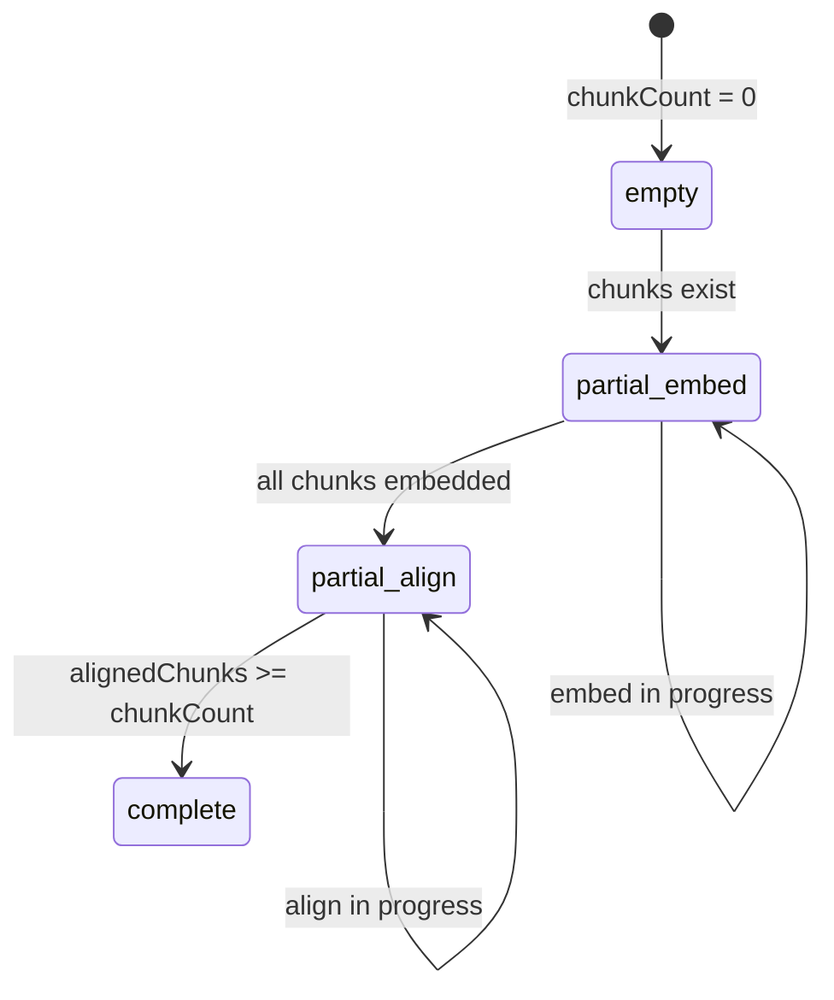

## Goal Capsule

Close the remaining P2/P3 findings from the bootstrap hardening code review.

**Status (2026-07-03):** Complete — implemented in `a2970a5` and `959e861`. This plan is retained as audit trail.

**Authority:** This plan supersedes ad-hoc fix order. Repo conventions and existing bootstrap tests take precedence over new patterns.

**Stop conditions:** All Definition of Done items met; `npm test` and `npm run lint` pass; no new bootstrap auto-runs without explicit user request.

---

## Product Contract

### Problem Frame

Bootstrap smoke/full orchestration merged to `main` with checkpointed state, shared curriculum copy, and audit CLI. A code review found four P1 defects (fixed locally, uncommitted) and eight P2/P3 follow-ups still open. The highest-risk gaps are false `complete` document status (partial alignments treated as done) and non-atomic state writes during long runs.

### Requirements

| ID | Requirement |
|----|-------------|
| R1 | Commit and preserve the four P1 review fixes (smoke verifies all case docs, idempotent `seedCourse`, framework `complete` derived from counts, corrupt state fails loud). |
| R2 | Document pipeline status `complete` only when every chunk is embedded **and** every chunk has at least one alignment. |
| R3 | Batch status SQL returns accurate per-document counts (no JOIN inflation). |
| R4 | Bootstrap state writes are atomic (temp file + rename). |
| R5 | Curriculum copy skip detects content changes, not just size (use mtime comparison — safest, no hash I/O on large docx). |
| R6 | `fullBootstrap` fails clearly when the DB has zero documents. |
| R7 | `audit-bootstrap` lists partial document filenames in its exit-1 message. |
| R8 | P3 cleanup: document or remove `--track-bootstrap` alias; clarify `processedDocumentIds` role (DB status remains canonical for skip). |

### Scope Boundaries

**In scope:** `lib/bootstrap-state.ts`, `scripts/process-documents.ts`, `scripts/bootstrap.ts`, `scripts/curriculum-sources.ts`, `scripts/audit-bootstrap.ts`, `scripts/seed-frameworks.ts` (minor `total > 0` guard on `complete`), related Vitest files.

**Out of scope:** Parallel Azure embedding/processing, shared framework bundle writer, refactoring `setup.ts` off `execSync`, running live bootstrap against Neon.

### Deferred to Follow-Up Work

- SHA-256 content hashing for curriculum copy (heavier; mtime suffices for repo-managed sources).
- Integration test hitting real DB for `loadDocumentPipelineStatusMap`.
- Using `processedDocumentIds` as a resume shortcut without DB round-trip.

---

## Planning Contract

### Key Technical Decisions

| ID | Decision | Rationale |
|----|----------|-----------|
| KTD1 | Require `alignmentCount >= chunkCount` for `complete` | Matches review finding #5; one alignment on one chunk must not mark whole doc complete. |
| KTD2 | SQL: `COUNT(DISTINCT c.id)` for chunks; `COUNT(DISTINCT c.id) FILTER (WHERE c.embedding IS NOT NULL)` for embedded; keep `COUNT(DISTINCT a.id)` for alignments but compare aligned **chunks** via subquery or `COUNT(DISTINCT a.chunk_id)` | Fixes JOIN double-count (#6); alignments counted per chunk, not per alignment row duplication. |
| KTD3 | Atomic write: `writeFile(.tmp)` + `rename` in `saveBootstrapState` | Standard crash-safe pattern (#8). |
| KTD4 | `shouldCopyFile`: copy when size differs **or** `src.mtimeMs > dest.mtimeMs` | Detects same-size edits when source is newer (#7); avoids full-file hash reads. |
| KTD5 | `frameworks.*.complete = embedded >= total && total > 0` | Prevents empty framework tables reporting complete. |
| KTD6 | Keep `processedDocumentIds` as audit/manifest hint; skip-complete uses DB map only | Avoids dual sources of truth; satisfies R8 without risky resume logic. |

### High-Level Technical Design



Status query shape (per document):

```
chunk_count        = COUNT(DISTINCT c.id)
embedded_count     = COUNT(DISTINCT c.id) FILTER (WHERE c.embedding IS NOT NULL)
aligned_chunks     = COUNT(DISTINCT a.chunk_id)  -- chunks with >=1 alignment
```

`deriveDocumentPipelineStatus` compares `alignedChunks` to `chunkCount`, not raw alignment row count.

### Assumptions

- Curriculum sources in-repo are edited in place; mtime reflects content updates for typical workflows.
- Partial alignment state exists in production DB only after interrupted runs; fixing detection is sufficient without backfill migration.

---

## Implementation Units

### U1. Land P1 review fixes

**Goal:** Commit the four P1 fixes already in the working tree.

**Requirements:** R1, KTD5

**Dependencies:** None

**Files:**
- `scripts/bootstrap.ts`
- `scripts/seed-frameworks.ts`
- `lib/bootstrap-state.ts`

**Approach:** Review diff; add `&& total > 0` to `complete` in `seed-frameworks.ts` if missing. Commit as `fix(review): bootstrap smoke idempotency and verification` (user must request commit, or leave staged for user).

**Test scenarios:**
- Existing suite still passes (54 tests).
- Manual: `verifySmoke` iterates all case-1 docs (grep/read test).

**Verification:** `npm test` green.

---

### U2. Accurate pipeline complete detection

**Goal:** Fix false `complete` and inflated SQL counts.

**Requirements:** R2, R3, KTD1, KTD2

**Dependencies:** U1

**Files:**
- `scripts/process-documents.ts`
- `__tests__/scripts/process-documents.test.ts`

**Approach:**
- Extend `deriveDocumentPipelineStatus` input with `alignedChunkCount` (or derive from `alignmentCount` once SQL is fixed).
- Change completion rule: `alignedChunkCount >= chunkCount` (with existing embed gate).
- Update SQL in `loadDocumentPipelineStatusMap` to use DISTINCT counts as in KTD2.
- Update/add unit tests: partial align (5 chunks, 5 embedded, 2 aligned chunks) -> `partial-align`; all aligned -> `complete`.

**Execution note:** Update failing unit test at line 39 first — current test expects `complete` with 3 alignments on 5 chunks; change expectation to `partial-align`, add new complete case.

**Verification:** `npm test __tests__/scripts/process-documents.test.ts`

---

### U3. Atomic bootstrap state persistence

**Goal:** Prevent corrupt `bootstrap-state.json` on crash mid-write.

**Requirements:** R4, KTD3

**Dependencies:** U1

**Files:**
- `lib/bootstrap-state.ts`
- `__tests__/lib/bootstrap-state.test.ts`

**Approach:** Write to `bootstrap-state.json.tmp`, `fs.rename` to final path. Extend test to assert write uses temp + rename (mock/spy or read implementation).

**Test scenarios:**
- Save then load round-trips state.
- Simulated read after save returns valid JSON (existing test coverage).

**Verification:** `npm test __tests__/lib/bootstrap-state.test.ts`

---

### U4. Curriculum copy freshness

**Goal:** Re-copy when source is newer even if size unchanged.

**Requirements:** R5, KTD4

**Dependencies:** None (parallel with U2/U3)

**Files:**
- `scripts/curriculum-sources.ts`
- `__tests__/scripts/curriculum-sources.test.ts`

**Approach:** In `shouldCopyFile`, return true when dest missing, sizes differ, or `srcStat.mtimeMs > destStat.mtimeMs`.

**Test scenarios:**
- Same size, newer src mtime -> should copy.
- Same size, equal or older mtime -> skip.
- Missing dest -> copy.

**Verification:** `npm test __tests__/scripts/curriculum-sources.test.ts`

---

### U5. Bootstrap guards and audit clarity

**Goal:** Fail fast on empty DB; name partial docs in audit output.

**Requirements:** R6, R7, R8, KTD6

**Dependencies:** U2 (audit uses fixed status map)

**Files:**
- `scripts/bootstrap.ts`
- `scripts/audit-bootstrap.ts`
- `scripts/process-documents.ts` (help text for CLI flags)

**Approach:**
- `fullBootstrap`: after smoke check, query document count; if 0, log error and exit 1 with hint to run smoke/seed.
- `audit-bootstrap`: when `partial > 0`, collect `[status] filename` lines into `issues` message.
- Add one-line comment above `--track-bootstrap` in `parseBootstrapPhase`: deprecated alias for `--full`; prefer `npm run db:bootstrap:full`.
- Add one-line comment on `processedDocumentIds`: manifest of processed IDs during bootstrap tracking; skip-complete uses DB status.

**Test scenarios:**
- Test expectation: none for CLI exit paths — manual smoke of audit message shape.

**Verification:** `npm test`; optional manual `npm run db:audit-bootstrap` when DB available.

---

## Verification Contract

```bash
npm test
npm run lint
```

Optional manual (user-initiated only):

```bash
npm run db:audit-bootstrap
npm run db:bootstrap:status
```

---

## Definition of Done

- [ ] All P1 fixes committed (or explicitly left uncommitted per user choice) with KTD5 `total > 0` guard
- [ ] U2: No document marked `complete` unless all chunks embedded and all chunks aligned
- [ ] U3: State save is atomic
- [ ] U4: Curriculum copy respects mtime
- [ ] U5: Full bootstrap guards empty DB; audit names partial files; P3 items documented
- [ ] 54+ tests pass; new tests cover U2 and U4 behavior
- [ ] `npm run lint` clean

---

## Risks and Dependencies

| Risk | Mitigation |
|------|------------|
| Stricter complete detection surfaces previously "complete" docs as partial | Expected; re-run `db:process --force` for affected docs |
| mtime-only copy miss same-mtime edits | Rare for git checkout; defer hash to follow-up |
| Atomic rename on Windows edge cases | Node `fs.rename` is atomic same-volume on macOS/Linux (primary dev env) |
