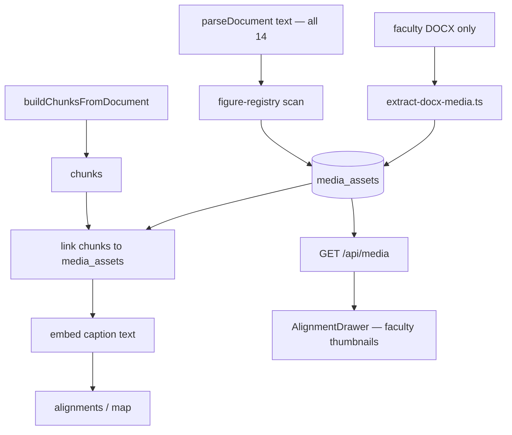
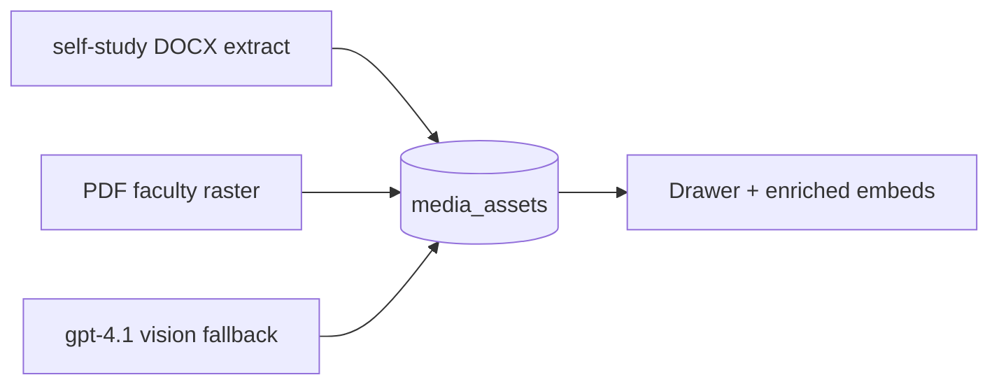

# feat: Curriculum image ingestion for map coverage

## Goal Capsule

**Objective:** Make assessment-critical figure content visible and searchable on the curriculum map by cataloging figure references across all 14 documents, extracting faculty DOCX images for drawer preview, embedding caption text where prose already exists, and surfacing linked figures in the map UI — without multimodal embeddings or OCR in MVP.

**Authority:** Ideation `docs/ideation/2026-07-03-image-ingestion-ideation.html` (sequence #1–#3). Corpus scan (2026-07-03) on real guides under `data/curriculum/` defines MVP vs Full boundaries below. Product Contract preservation: **changed: R3, R6, Scope Boundaries, DoD** — narrowed MVP to faculty-first extract and caption mining; Full phase adds self-study binaries, PDF raster, and selective vision OCR.

**Stop when:** MVP Definition of Done is satisfied. Full phase units (U8–U10) are explicitly out of MVP scope.

---

## Product Contract

Product Contract source: `ce-plan-bootstrap` from ideation + user request (“image handling in all docs to add value to map”) + corpus-informed scope refinement.

### Problem Frame

2,780 embedded images across 12 DOCX curriculum files never enter `parseDocument`. The map and alignment pipeline only see prose. Faculty guides label assessment-critical visuals (`Answer Image:`, `Figure 1A`) while self-study guides embed histology slides and pathway diagrams with partial or no caption text. Directors cannot tell from the map which sections depend on unseen figures or whether framework coverage gaps are text-only artifacts.

**Corpus facts (parsed text + `word/media` counts, July 2026):**

| Segment | Files | Embedded images | Text figure refs | Answer-image blocks | Caption coverage |
|---------|-------|-----------------|------------------|---------------------|------------------|
| Faculty PDF (Cases 1–2) | 2 | n/a | 5 + 0 `Figure` | 28 | Captions in following prose; no binary extract in MVP |
| Faculty DOCX (Cases 3–7) | 5 | **67** | 19 `Figure` | **9** | **~8/9** have usable prose (`text_for_embed`) |
| Self-study DOCX (Cases 1–7) | 7 | **2,713** | **271** `Figure` | 0 | **~220/271** have nearby prose; **~51** weak/`Figure N` only |
| **Total DOCX** | 12 | **2,780** | **271+** | **9** faculty answer | **35/36** answer blocks corpus-wide have caption text |

Most map value for assessment lives in **faculty answer images** (~9 DOCX + 28 PDF text refs). Self-study is dominated by unlabeled textbook art (~10 embedded images per text `Figure` mention in Case 2: 566 images, 10 figure lines).

### Actors

- A1. **Course director** — sees which sections reference figures and whether caption text exists for alignment
- A2. **Faculty reviewer** — opens the figure while reviewing alignments in the map drawer
- A3. **Pipeline operator** — runs figure audit alongside chunk audit before bootstrap/process

### Key Flows

- F1. **Audit figures** — `npx tsx scripts/audit-figures.ts --gate` reports image-only references per document
- F2. **Process with figures (MVP)** — extract faculty DOCX media, build registry for all 14 files, pipeline links chunks and embeds caption text
- F3. **Review on map** — Trees map → select section/chunk → alignment drawer shows linked figure thumbnails and labels (faculty DOCX in MVP)
- F4. **Import official captions (ops)** — curriculum team drops CSV manifest → import script updates `text_for_embed` without re-exporting Word files

### Requirements

- R1. **Figure registry** for all 14 documents: label, case, section context, reference type (`answer_image`, `figure`, `provided_image`, `inline_ref`), `has_caption_in_text`, optional chunk link via join table
- R2. **Media storage** under `data/curriculum/media/` (gitignored binaries); serve via API for map UI
- R3. **Extract DOCX embedded images — MVP: faculty guides only (Cases 3–7, ~67 files).** Self-study DOCX extraction deferred to Full (U8). PDF faculty guides (Cases 1–2) register text references only until Full (U9).
- R4. **Caption text for embedding** — mine adjacent prose into `text_for_embed` and enrich chunk `embedText` when caption is not already in chunk body; no full re-chunking
- R5. **Map value** — `getMapData` returns linked `mediaAssets` per chunk; alignment drawer renders figure preview + label when `storage_path` exists
- R6. **Audit gate — faculty `answer_image` rows must have `storage_path` OR `text_for_embed`.** PDF faculty (Cases 1–2) pass on caption text alone. Self-study `image_only` refs are warnings only.
- R7. **Shared schema** — `media_assets` supports `type: figure | video` for future video work; video population is out of scope
- R8. **No multimodal vectors** — only text descriptions/captions go to `generateEmbedding`

### Acceptance Examples

- AE1. Audit on full corpus lists ≥1 registry row per document; Case 4 faculty `Answer Image 1A` fails gate only if both asset and caption text missing
- AE2. Map drawer for Case 4 faculty chunk under `Answer Image 1A:` shows thumbnail and label “Alcohol-related cirrhosis”
- AE3. Section referencing `Figure 2A` with adjacent `Answer Figure 2A: …` prose drives alignment via caption-enriched embed text
- AE4. Self-study doc with image-only histology slide appears in audit as `image_only` warning (never hard gate in MVP)

### Scope Boundaries

**MVP (U1–U7):** Schema, figure registry (all 14 docs), **faculty DOCX extract only**, caption mining, audit script, pipeline link + embed enrichment, map drawer + media API, CSV caption import.

**Deferred for later (Full phase U8–U10):** Self-study DOCX media extraction (~2,713 images), PDF faculty raster (Cases 1–2), selective gpt-4.1 vision OCR on audit-flagged rows, Bridge spreadsheet “Figures” column (plan 006).

**Outside this product's identity:** Image hosting CDN, student-facing slide viewer, automated “replace figure with AI diagram,” full-corpus PaddleOCR on all 2,780 images.

### Deferred to Follow-Up Work

- Video registry population (shared table, separate plan)
- Full self-study figure thumbnails and labeled-figure linking at scale (U8)
- PDF answer-image drawer previews (U9)
- Hybrid OCR: local batch optional + gpt-4.1 vision on low-confidence / faculty gaps only (U10)
- pgvector on vision-generated descriptions at scale

---

## Planning Contract

### Key Technical Decisions

- **KTD1 — Text for embed, bytes for display.** Store files on disk; store captions in `media_assets.text_for_embed` and/or chunk `embedText` enrichment. Never write image blobs to Postgres or vector columns.

- **KTD2 — Registry-first, extract-second.** Parse figure labels from `parseDocument` text before binary extraction so audit runs even when media paths are missing. Extraction fills `storage_path` heuristically (document order + `source_index`).

- **KTD3 — Faculty-first extract (MVP).** Extract ~67 faculty DOCX images only (~tens of MB). Do not extract 2,713 self-study images in MVP — registry + warnings suffice for directors. Gitignore `data/curriculum/media/**`; run extract on bootstrap.

- **KTD4 — Faculty Answer Image priority.** Hard gate (R6) on faculty guides only. PDF faculty pass on `text_for_embed` without `storage_path`. Self-study warnings only.

- **KTD5 — Chunk linking without re-splitting.** `chunk_media` join populated post-chunking by label match in chunk content. Embed enrichment when `text_for_embed` is not a substring of chunk body (plan 007 breadcrumb pattern).

- **KTD6 — API static serve.** `GET /api/media/[assetId]` reads `storage_path` with token pattern matching existing map routes.

- **KTD7 — No OCR in MVP.** Corpus shows 35/36 answer-image blocks already have prose captions. MVP gaps (e.g. Case 3 `Answer image:` → serum amino acids table) use CSV import (U7) or Full U10 — not cloud vision during MVP.

- **KTD8 — Mammoth `convertImage` over raw unzip (implementer note).** Prefer Mammoth image callbacks when wiring extraction so image bytes align with document order; raw `word/media` unzip remains acceptable for U3 if order mapping is tested on Case 4.

### Phased Delivery

| Phase | Units | Outcome | Corpus rationale |
|-------|-------|---------|------------------|
| **MVP** | U1–U7 | Registry all 14 docs; extract + link faculty DOCX answer figures; map drawer for Case 4; audit gate passes faculty set | 9 faculty DOCX answer blocks; ~67 images; captions already in text for search |
| **Full** | U8–U10 | Self-study thumbnails for labeled figures; PDF faculty pixels; selective gpt-4.1 vision on flagged rows | 2,713 self-study images mostly unlabeled; 28 PDF answer refs need raster for drawer; ≤10 rows need vision after CSV |

### High-Level Technical Design

**MVP path:**

**Full path (follow-up):**

### Assumptions

- Plan 007 chunking (`embedText`, section breadcrumbs) is merged or available on the implementation branch.
- Curriculum files remain the 14-file set under `data/curriculum/`.
- Existing Azure deployment `gpt-4.1` is used only in Full U10 — no new model deployment.
- Case 3 faculty table image may need one CSV row in U7 if heuristic link fails.

---

## Implementation Units

Units U1–U7 are **MVP**. Units U8–U10 are **Full phase** — do not implement during MVP `/ce-work` unless explicitly scoped.

### U1. `media_assets` schema and types — **MVP**

**Goal:** Persist figure (and future video) metadata with optional embed text and storage path.

**Requirements:** R7, R2

**Dependencies:** none

**Files:**
- Modify: `drizzle/schema.ts`
- Modify: `docs/SCHEMA.md`
- Create: `lib/media-types.ts`
- Test: `__tests__/lib/media-types.test.ts`

**Approach:** Add `media_assets` (`id`, `document_id`, `type`, `label`, `section`, `reference_kind`, `has_caption_in_text`, `text_for_embed`, `storage_path`, `source_index`, `extraction_scope` enum or flag: `faculty | self_study | pdf_pending`, `created_at`). Add `chunk_media` (`chunk_id`, `media_asset_id`) with index on `chunk_id` and `media_asset_id`. Export Drizzle relations.

**Patterns to follow:** `drizzle/schema.ts` chunk/document patterns; vector columns unchanged.

**Test scenarios:**
- Happy path: insert figure row with required fields validates
- Edge case: `type` rejects unknown enum at app layer
- Integration: relation from chunk to media via join table; index definitions present in schema

**Verification:** `npm run db:push` applies cleanly; unit test passes.

---

### U2. Figure reference parser and registry builder — **MVP**

**Goal:** Scan parsed document text for figure labels and caption proximity across all 14 files.

**Requirements:** R1, R4

**Dependencies:** U1

**Files:**
- Create: `lib/figure-registry.ts`
- Create: `__tests__/lib/figure-registry.test.ts`
- Create: `__tests__/fixtures/figure-registry/faculty-answer-image-snippet.txt`
- Create: `__tests__/fixtures/figure-registry/case4-john-jackson-answer-image.txt`
- Create: `__tests__/fixtures/figure-registry/case3-marie-herandez-table-snippet.txt`

**Approach:** Regex/heuristics for `Answer [Ii]mage`, `Answer Figure`, `Figure \d+[A-Z]?`, `Provided image`, `Watch this video` / YouTube URLs (video stub). Capture ~500-char context window; set `has_caption_in_text` when inline title (`Answer Image 1A: Alcohol-related cirrhosis`) or following rationale exists. Expose `buildFigureRegistry(text, documentMeta)`.

**Execution note:** Characterization tests from real Case 4 inline captions and Case 3 table block before generalizing.

**Test scenarios:**
- Covers AE3. Happy path: `Answer Image 1A:` with inline title → `has_caption_in_text: true`, `text_for_embed` populated
- Edge case: bare `Answer Image:` line followed by table headers still sets partial `text_for_embed` from context
- Edge case: PDF-style `Answer image: Philip Armstrong's sigmoidoscopy` on same line → caption detected
- Error path: empty text → empty registry
- Integration: Case 4 snippet yields multiple `answer_image` rows with captions

**Verification:** Unit tests pass; manual run on faculty Case 4 + self-study Case 5 returns expected registry counts (~6 answer + warnings for bare `Figure N`).

---

### U3. Faculty DOCX media extraction script — **MVP**

**Goal:** Extract embedded images from **faculty DOCX guides only** (Cases 3–7) and attach to registry rows.

**Requirements:** R3, R2

**Dependencies:** U1, U2

**Files:**
- Create: `scripts/extract-docx-media.ts`
- Create: `__tests__/scripts/extract-docx-media.test.ts`
- Modify: `.gitignore` (ignore `data/curriculum/media/**` if not already)
- Modify: `README.md` (faculty extract step in bootstrap docs)
- Modify: `scripts/curriculum-sources.ts` or extract script — filter to `FACULTY_GUIDES` DOCX entries only

**Approach:** For each faculty DOCX in `data/curriculum/`, unzip `word/media/*` to `data/curriculum/media/{caseNumber}/{documentBasename}/{index}.{ext}`. Skip self-study and PDF with logged reason. Map files to registry rows by document order (`source_index`); faculty answer images first. Idempotent re-run skips unchanged mtime/size. Target: ~67 files total.

**Patterns to follow:** `scripts/curriculum-sources.ts` path conventions; `shouldCopyFile` mtime pattern.

**Test scenarios:**
- Happy path: extract on faculty fixture DOCX writes files and returns paths
- Edge path: self-study DOCX input skipped with `--scope faculty` default
- Edge path: PDF input skipped with clear message
- Edge case: re-run does not duplicate when mtime unchanged

**Verification:** Extract on `RMD563_FacultyGuide_Case4_JohnJackson.docx` produces files; registry rows gain `storage_path`; self-study file produces zero bytes when scope is faculty.

---

### U4. Figure audit script — **MVP**

**Goal:** Operator gate for image coverage before process/bootstrap.

**Requirements:** R6, R1

**Dependencies:** U2, U3

**Files:**
- Create: `scripts/audit-figures.ts`
- Create: `__tests__/scripts/audit-figures.test.ts`

**Approach:** For each file in `data/curriculum/`, parse text, build registry, merge extraction status. `--gate`: faculty `answer_image` rows fail only when **both** `storage_path` and `text_for_embed` are empty. PDF faculty rows with caption text pass without file. Self-study emits `image_only` warnings (expect ~51 weak figure refs corpus-wide); never fail MVP gate. JSON report like `audit-chunks.ts` includes corpus summary counts.

**Patterns to follow:** `scripts/audit-chunks.ts` gate structure.

**Test scenarios:**
- Covers AE1. Happy path: Case 4 faculty figure with caption + extracted file passes gate
- Gate pass: PDF faculty row with `text_for_embed` only passes gate
- Gate fail: faculty `answer_image` with no caption and no file fails `--gate`
- Warning: self-study bare `Figure 4` does not fail gate

**Verification:** `npx tsx scripts/audit-figures.ts --gate` exit 0 on current corpus after faculty extract.

---

### U5. Pipeline integration — link media and enrich embed text — **MVP**

**Goal:** After chunking, link chunks to figures and ensure caption text is embedded.

**Requirements:** R4, R5, R8

**Dependencies:** U1, U2, U3

**Files:**
- Modify: `lib/pipeline.ts`
- Modify: `lib/pipeline.ts` (`clearDocumentArtifacts` — include media tables)
- Create: `lib/media-linker.ts`
- Create: `__tests__/lib/media-linker.test.ts`

**Approach:** Post-`buildChunksFromDocument`, upsert registry rows per document, link labels in chunk content → `chunk_media`. When `text_for_embed` set and not substring of chunk content, prepend to `embedText` for embedding only. Clear document media rows in `clearDocumentArtifacts` with stable re-upsert on reprocess.

**Execution note:** Proof-first on linker — test Case 4 `Answer Image 1A` label match before pipeline wiring.

**Test scenarios:**
- Happy path: chunk containing `Answer Image 1A` links to registry row
- Edge case: PDF faculty chunk links to registry row without `storage_path` (embed only)
- Integration: pipeline mock inserts join rows; `generateEmbedding` receives enriched text with caption

**Verification:** Process Case 4 faculty guide; DB has `media_assets` + `chunk_media`; embedding input includes cirrhosis caption.

---

### U6. Map API and alignment drawer figure previews — **MVP**

**Goal:** Faculty reviewers see linked figure thumbnails when reviewing alignments.

**Requirements:** R5, R2

**Dependencies:** U5

**Files:**
- Modify: `lib/queries.ts` (`getMapData`)
- Create: `app/api/media/[assetId]/route.ts`
- Modify: `components/map/AlignmentDrawer.tsx`
- Modify: `app/courses/[courseId]/map/page.tsx`
- Create: `__tests__/lib/queries-map-media.test.ts`

**Approach:** Extend map query with `mediaByChunkId`. Drawer section “Linked figures”: thumbnail when `storage_path` set, label from registry, `image_only` badge when no caption, text-only note for PDF-linked rows without pixels. Hide section when empty.

**Patterns to follow:** Existing drawer alignment list; map page fetch pattern.

**Test scenarios:**
- Covers AE2. Happy path: Case 4 faculty chunk with linked asset returns media in API payload; drawer label matches registry
- Edge case: PDF-linked chunk shows caption without thumbnail (no broken ``)
- Edge case: chunk without media omits key

**Verification:** Manual smoke on `/courses/1/map` with processed Case 4 faculty data shows Answer Image thumbnail.

---

### U7. Caption sidecar import (ops) — **MVP**

**Goal:** Allow curriculum team to supply official captions without vision OCR — primary escape hatch for Case 3 table image and mis-linked faculty PNGs.

**Requirements:** R4, F4

**Dependencies:** U1

**Files:**
- Create: `scripts/import-figure-captions.ts`
- Create: `__tests__/scripts/import-figure-captions.test.ts`
- Create: `data/curriculum/figure-captions.example.csv`

**Approach:** CSV columns: `filename`, `label`, `text_for_embed`. Upsert matching `media_assets` rows. Document `--reembed` as requiring `db:process` / realign pass.

**Test scenarios:**
- Happy path: import updates `text_for_embed` on matching row; audit gate passes
- Error path: unknown filename skipped with summary

**Verification:** Import example CSV; registry row updates; optional manual row for Case 3 amino-acid table if audit flags gap.

---

### U8. Self-study DOCX media extraction — **Full**

**Goal:** Extract embedded images from self-study guides for labeled figures and drawer preview where text refs exist.

**Requirements:** R3 (Full), R5 (Full)

**Dependencies:** U1–U7 (MVP complete)

**Files:**
- Modify: `scripts/extract-docx-media.ts` (add `--scope all` or self-study filter)
- Modify: `lib/media-linker.ts` (link labeled self-study `Figure N` rows)
- Test: extend `__tests__/scripts/extract-docx-media.test.ts`

**Approach:** Extract ~2,713 self-study images to gitignored storage. Link only registry rows with text labels (~271); do not attempt to name 2,500+ unlabeled slides. Audit remains warning-only for self-study.

**Test scenarios:**
- Happy path: `--scope self-study` extracts Case 5 file without re-extracting faculty
- Edge case: unlabeled embedded images have registry row absent or `storage_path` without chunk link

**Verification:** Labeled self-study figure in Case 4 shows thumbnail in drawer after Full process.

---

### U9. PDF faculty raster extraction — **Full**

**Goal:** Produce displayable assets for Cases 1–2 faculty answer images (~28 text refs).

**Requirements:** R3 (Full), R5 (Full)

**Dependencies:** U1–U7

**Files:**
- Create: `scripts/extract-pdf-media.ts`
- Create: `__tests__/scripts/extract-pdf-media.test.ts`

**Approach:** Raster embedded images from `RMD563_FacultyGuide_Case1_DavidTilo.pdf` and `RMD563_FacultyGuide_Case2_JessicaDonner.pdf` (PyMuPDF/pdfimages or Node equivalent). Map to registry rows by page order + proximity to parsed `Answer image:` lines. MVP registry + captions already exist; this adds `storage_path`.

**Test scenarios:**
- Happy path: Case 2 extract yields ≥1 PNG linked to sigmoidoscopy answer row
- Edge path: text-only registry row upgraded with `storage_path` after raster

**Verification:** Map drawer shows thumbnail for Case 2 faculty answer image post-Full process.

---

### U10. Selective vision OCR fallback — **Full**

**Goal:** Fill `text_for_embed` for audit-flagged rows still missing caption after U7 CSV — using existing `gpt-4.1` chat deployment, not a new model.

**Requirements:** R4 (Full), R8

**Dependencies:** U8 or U9 (pixels available), U4

**Files:**
- Create: `scripts/describe-figure-images.ts`
- Create: `lib/vision-caption.ts`
- Test: `__tests__/lib/vision-caption.test.ts`

**Approach:** Run only on faculty `answer_image` rows where audit reports both empty caption and empty/mislinked file, plus optional `--include-self-study` for the ~51 weak figure refs. Strict prompt: transcribe visible text verbatim, one factual description sentence, no speculative diagnosis. Cap `VISION_OCR_MAX_IMAGES` (default 50). **Do not** run on full 2,780 corpus. Reuse `AZURE_OPENAI_DEPLOYMENT_CHAT` (gpt-4.1). Optional later: local PaddleOCR batch with gpt-4.1 only on low-confidence rows.

**Test scenarios:**
- Happy path: mock vision response writes `text_for_embed`; embed pipeline picks it up on reprocess
- Edge case: script skips rows that already have caption text
- Error path: over cap exits with summary without partial silent failure

**Verification:** After CSV + vision on Case 3 gap row, faculty audit gate exit 0.

---

## Verification Contract

### MVP gates

| Gate | Command | Expect |
|------|---------|--------|
| Unit tests | `npm test` | All pass including new figure/media tests |
| Figure audit | `npx tsx scripts/audit-figures.ts --gate` | Exit 0 on current corpus after faculty extract |
| Chunk audit regression | `npx tsx scripts/audit-chunks.ts --gate` | Still passes |
| Pipeline smoke | Process Case 4 faculty guide | `media_assets` + `chunk_media` populated; embed includes caption |
| Map smoke | `/courses/1/map` → Case 4 Answer Image chunk | Drawer shows faculty thumbnail + label |
| Scope guard | Faculty extract only | Self-study DOCX produces 0 extracted files in default MVP run |

### Full gates (when U8–U10 implemented)

| Gate | Expect |
|------|--------|
| PDF drawer | Case 2 faculty answer image shows thumbnail |
| Self-study labeled figure | At least one Case 4/5 labeled `Figure N` shows thumbnail |
| Vision cap | describe script processes ≤ configured max; no full-corpus run |

---

## Definition of Done

### MVP (stop here for first ship)

- [ ] U1–U7 implemented with tests noted above
- [ ] All 14 documents produce registry output from audit (self-study warnings OK)
- [ ] Faculty DOCX guides pass `audit-figures.ts --gate` after extract (~67 images)
- [ ] PDF faculty guides pass gate on caption text without `storage_path`
- [ ] Map drawer shows linked faculty figure on demo course (Case 4 minimum)
- [ ] README documents faculty extract + audit in bootstrap path
- [ ] U8–U10 not started or half-shipped

### Full phase (separate ship)

- [ ] U8–U10 implemented when directors need self-study thumbnails or PDF drawer previews
- [ ] Selective gpt-4.1 vision capped; no 2,780-image batch job
- [ ] Full Verification Contract gates pass

---

## System-Wide Impact

- **Bootstrap:** add `npm run db:extract-media` (faculty scope default) before or during `db:process`
- **Storage:** MVP ~tens of MB (faculty); Full adds hundreds of MB for self-study if U8 enabled
- **Map plan 006:** Bridge “Figures” column can reuse `media_assets` query after MVP schema lands

---

## Risks and Dependencies

| Risk | Mitigation |
|------|------------|
| DOCX image order ≠ figure labels | Faculty-first gate; `source_index`; U7 CSV override; Full U10 last resort |
| PDF faculty no MVP thumbnails | Expected; caption text still drives alignments; U9 adds pixels |
| Self-study director expects all slides visible | Set expectation: MVP registry warnings only; U8 for labeled subset |
| Re-process clears media rows | Include media in `clearDocumentArtifacts`; stable re-upsert |
| gpt-4.1 vision cost if run at scale | U10 cap + faculty-only default; corpus shows ≤10 rows likely |

**Depends on:** Plan 007 chunker/`embedText` merged on implementation branch (soft).

---

## Sources and Research

- `docs/ideation/2026-07-03-image-ingestion-ideation.html` — ranked approach #1–#4
- `docs/plans/2026-07-03-007-feat-worldclass-chunking-and-goal-accuracy-plan.md` — OCR deferral precedent
- **Corpus scan 2026-07-03** — `parseDocument` + `word/media` counts on all 14 files in `data/curriculum/` (2,780 embedded; 36 answer-image blocks; 35 with prose captions)
- `lib/document-parser.ts`, `scripts/audit-chunks.ts`, `components/map/AlignmentDrawer.tsx`, `scripts/curriculum-sources.ts`
- MCP audit (Ref/Tavily): Mammoth `convertImage`, join-table indexes, CSV manifest for faculty Answer Images — reflected in KTD8 and U7
