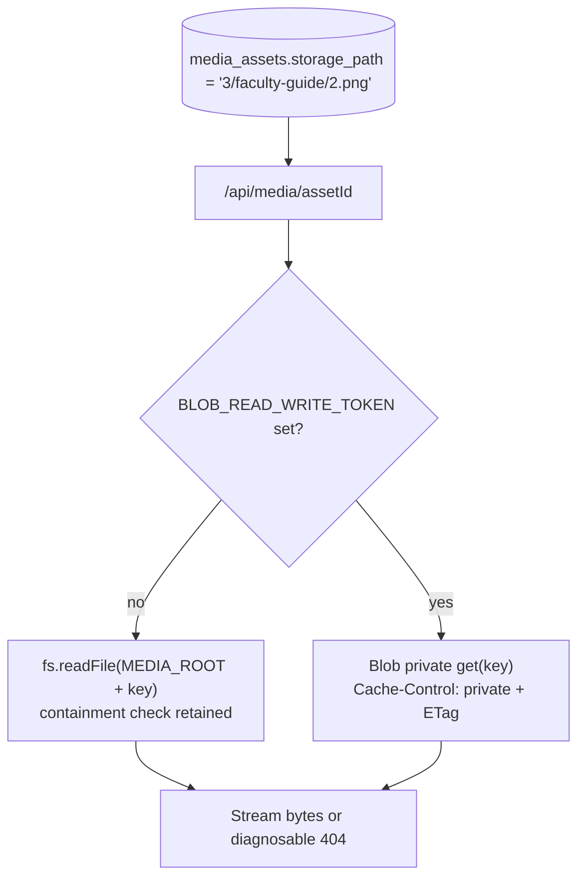
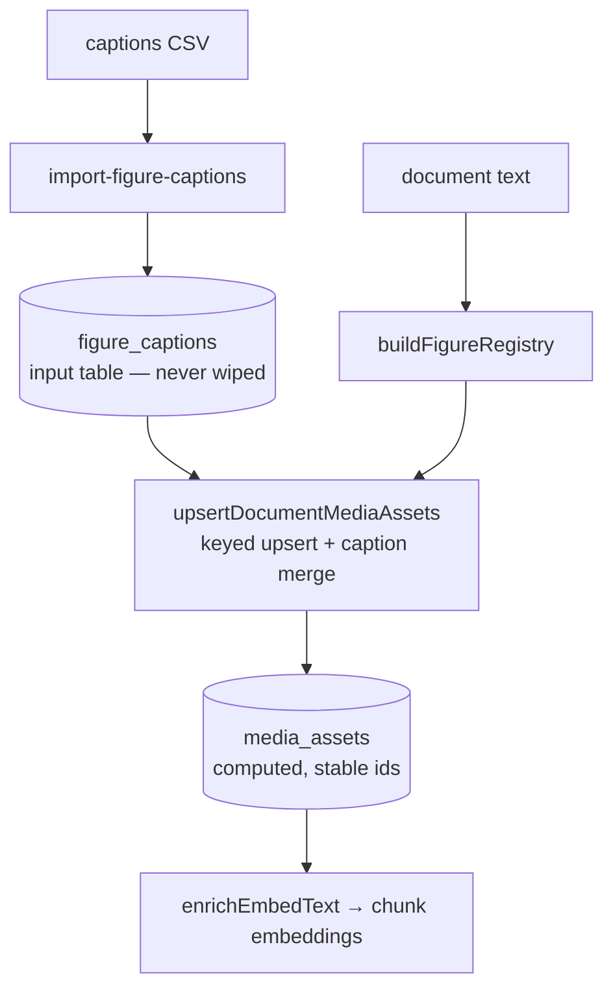

# Deployment-Readiness Hardening - Plan

## Goal Capsule

- **Objective:** Make the demo MVP deployable to Vercel by fixing the two review findings that block it working at all — media that 404s on any deploy (#7) and captions that vanish on reprocess (#8) — plus the live duplicate-media-row bug the recent resume feature introduced.
- **Authority:** This plan's Product Contract (from the brainstorm dialogue, 2026-07-03) governs product behavior; the Planning Contract governs technical shape; repo conventions in AGENTS.md override where they conflict on workflow.
- **Stop conditions:** Stop and surface rather than guess if (a) the Blob private-access API differs materially from the documented `get(pathname, {access:'private'})` shape, or (b) the unique-index backfill finds duplicate media rows that cannot be collapsed automatically.
- **Execution profile:** Standard-depth, four units, dependency-ordered; U1 fixes a live bug and lands first.

---

## Product Contract

### Summary

Store media as relative locator keys resolved by a per-environment storage driver (dev filesystem, prod Vercel Blob private), and move human-authored captions into an input table merged into every rebuild through a true keyed upsert. This is the MVP demo scope: it makes the app work on a real deploy without building auth the demo doesn't need yet.

### Problem Frame

The app is about to demo on Vercel, and two review findings block that. `media_assets.storage_path` holds dev-machine absolute paths, and Vercel's runtime filesystem is read-only with `data/` gitignored, so every figure 404s on deploy regardless of path format. CSV-imported figure captions are wiped by `clearDocumentMedia` on every non-resume rebuild, and because captions feed chunk embed text *before* the embed stage, re-applying them after the fact would ship stale embeddings silently. Separately, the new chunk-level resume path skips the media wipe while the media "upsert" is a bare insert — resumed runs duplicate media rows today, independent of either review finding.

The review also flagged that any page visitor is minted a working API session cookie (#3, deployment/auth posture). That decision — and the defense-in-depth companion for it — is **explicitly out of scope for this MVP demo**: the demo ships with no auth to start, so building a credential gate now would be solving a problem the deployment doesn't have yet. See Scope Boundaries.

### Requirements

**Media portability**

- R1. `media_assets.storage_path` stores a relative locator key `{caseNumber}/{docBasename}/{sourceIndex}.{ext}` — never an absolute path.
- R2. `/api/media/[assetId]` resolves bytes through a storage driver: local filesystem under `MEDIA_ROOT` when no Blob token is configured; Vercel Blob private when it is.
- R3. The map API JSON no longer exposes `storagePath`; clients get a boolean (`hasFile`) instead.
- R4. A one-time backfill converts existing absolute-path rows to locator keys.
- R5. `db:extract-media` uploads extracted files to Blob (same keys) when the Blob token is present; upload remains a manual pre-deploy step.
- R6. A media request whose Blob object is missing returns a diagnosable not-found (distinct from unknown-asset), so a forgotten upload is identifiable from logs.

**Caption durability**

- R7. Human-authored captions live in a `figure_captions` input table keyed `(filename, label, sourceIndex)`; the CSV importer writes there and never patches `media_assets`.
- R8. Every rebuild merges `figure_captions` over text-derived registry defaults during media upsert — upstream of the embed stage, so caption text always reaches chunk embeddings.
- R9. Media rows persist through reprocessing via a true keyed upsert on `(documentId, label, sourceIndex, referenceKind)`: computed columns update, rows whose key vanished are deleted, and `media_assets.id` stays stable. `clearDocumentMedia` shrinks to clearing `chunk_media` links.
- R10. A one-time migration moves already-imported captions into `figure_captions`.
- R11. `media_assets.caption_source` records provenance (`text` | `csv`).

### Success Criteria

- A fresh Vercel deploy serves figures and search correctly with no auth configured (matching the demo's actual posture).
- A full reprocess (`npm run db:process`) loses no human-authored caption and changes no `media_assets.id`.
- A resumed run inserts zero duplicate media rows (the live bug is gone).

### Scope Boundaries

- **Deferred for later — MVP explicitly ships without it:** the capability-link access gate and API defense-in-depth (review finding #3). The demo runs with no auth to start; building a credential system now would be over-engineering ahead of an actual need. When auth becomes a real requirement (multi-audience access, sensitive content, or a production launch beyond the demo), resume from `docs/ideation/2026-07-03-review-decisions-ideation.html` (ideas 1, 5) — the design work (separate gate secret, mint-once cookie binding, in-handler defense-in-depth, redirect-strip, entropy floors) was scoped in this planning session and can be pulled back in as its own plan rather than re-derived.
- **Deferred for later:** vision-generated captions for null-caption assets (ideation idea 7, prototype later); per-person identity, attribution, or audit trail; extending binary extraction beyond faculty guides (self-study media, ~559MB, would revisit only the extract scope — the Blob backend already accommodates it).
- **Deferred to Follow-Up Work:** locking against concurrent `db:process` runs (pre-existing residual risk from the review); CSV→Excel formula escaping on export (pre-existing).

---

## Planning Contract

Product Contract preservation: derived from the brainstorm dialogue this session; narrowed during planning to exclude the auth-gating workstream per explicit user direction (this is an MVP demo shipping without auth to start) — see Scope Boundaries.

### Key Technical Decisions

- KTD1. **Storage driver selected by Blob-token presence, not `NODE_ENV`.** Vercel preview deploys run `NODE_ENV=production`; keying on `BLOB_READ_WRITE_TOKEN` presence means a preview without the token degrades to the fs driver's diagnosable miss instead of crashing Blob calls. The locator key is the DB contract; the driver is an environment concern — either backend serves the same keys.
- KTD2. **Unique index uses `COALESCE(source_index, -1)`, on both media tables.** Postgres treats `NULL <> NULL` in unique indexes; faculty answer-image rows legitimately carry `sourceIndex: null`, and a naive index would let exactly those rows duplicate again. The same expression applies to `figure_captions` (U2) — a plain unique constraint there reproduces the identical hole for label-only captions. Expression indexes in `scripts/db-init.ts` DDL (this repo is push-based; no drizzle migrations folder), each guarded `IF NOT EXISTS` and preceded by a duplicate check so a dirty DB fails loudly with a pointer to the one-time collapse script rather than wedging every future bootstrap (`pushSchema` runs its DDL array sequentially and throws on first error).
- KTD3. **Captions merge inside `upsertDocumentMediaAssets`, upstream of embedding.** The upsert runs at `lib/pipeline.ts:230`, the embed stage at `:297`, and `enrichEmbedText` injects `textForEmbed` into chunk embed text — the merge point must precede embedding or caption-informed retrieval silently degrades. This is why re-apply-after-clear was rejected outright.
- KTD4. **One-time backfills are `tsx` scripts, run manually, idempotent.** Matches the repo's push-based operational pattern (`scripts/db-init.ts`, `scripts/seed.ts`); documented in the bootstrap checklist rather than run on deploy. Each script recognizes already-migrated rows as no-ops on a second run (already-relative paths, already-imported captions), distinct from the "needs attention" bucket it reports for anything it can't safely convert.
- KTD5. **The one-time duplicate collapse (U1) is data-mutating and stays out of `db-init.ts`.** `db-init.ts`'s DDL runs on every bootstrap and must stay schema-only; collapsing existing duplicate `media_assets` rows is a one-time data operation that runs once, transactionally, paired with the index creation in the same script and the same deploy as the upsert code change (see U1 Approach for the survivor rule and transaction boundary).

### High-Level Technical Design

Media resolution (locator key is the stable contract; driver varies by environment):

Caption dataflow across a rebuild (input layer survives; computed layer regenerates):

### Sequencing

U1 (keyed upsert) → U2 (caption table builds on the keyed upsert) is one dependency chain; U3 (locator keys) → U4 (Blob driver builds on locator keys) is the other. The two chains are mutually independent and can interleave, but U1 lands first regardless — it fixes the live resume-duplication bug.

---

## Implementation Units

### U1. True keyed upsert for media rows

- **Goal:** `upsertDocumentMediaAssets` becomes a real upsert; resumed and rebuilt runs converge on identical, stable rows.
- **Requirements:** R9, R11; fixes the live duplicate-rows bug (Problem Frame).
- **Dependencies:** none — first to land.
- **Files:** `lib/media-pipeline.ts`, `lib/pipeline.ts`, `scripts/db-init.ts` (unique-index DDL), `drizzle/schema.ts` (caption_source column, R11), `__tests__/lib/media-pipeline.test.ts`, `__tests__/lib/pipeline.test.ts`.
- **Approach:** One-time collapse script (transactional, run once before the code deploy, not part of `db-init.ts`'s per-bootstrap DDL — KTD5): group existing `media_assets` by `(documentId, label, referenceKind, COALESCE(sourceIndex, -1))`; where a group has duplicates, pick a deterministic survivor (prefer the row with `storagePath` set, then non-null `textForEmbed`, tiebreak lowest id), coalesce any caption/storage fields present only on a loser into the survivor, repoint losers' `chunk_media` links to the survivor's id (deduplicating on the composite PK), then delete losers — links repointed before rows deleted, never the reverse. Only after collapse succeeds does `scripts/db-init.ts` add the `IF NOT EXISTS` expression unique index, itself preceded by a duplicate-count guard that fails loudly (naming the collapse script) instead of throwing mid-DDL-array if any duplicates remain. Rework `upsertDocumentMediaAssets`'s bare insert into insert-on-conflict-update on that same key (the `ON CONFLICT` target must match the index expression exactly), updating computed columns only. Collect the registry's key set and delete rows absent from it — but first assert the registry isn't suspiciously empty relative to existing rows (a parser regression producing a near-empty registry must abort loudly, not mass-delete a document's media and churn every id). Shrink `clearDocumentMedia` to `chunk_media` deletion only. The collapse script, the index, and the upsert code change land in the same commit/deploy, with no `db:process` run in flight during migration (noted in the bootstrap checklist).
- **Patterns to follow:** `chunkMedia`'s existing `onConflictDoNothing` (`lib/media-pipeline.ts:131`); the FK-safe wipe ordering in `scripts/seed.ts`.
- **Test scenarios:**
  - Happy: two consecutive full pipeline runs on the same document yield identical row count and identical `media_assets.id` values.
  - Happy: a resumed run (chunks resume-match) inserts zero new media rows.
  - Edge: a row with `sourceIndex: null` (faculty answer image) does not duplicate across runs — the coalesced index catches it.
  - Edge: a figure label removed from the document text disappears from `media_assets` on the next rebuild; its `chunk_media` links go with it.
  - Edge: the vanished-key delete aborts (does not run) when the freshly-parsed registry is empty or drastically smaller than the existing row count for that document.
  - Error: pre-existing duplicate rows on an already-affected DB are collapsed per the survivor rule above, with the caption and chunk links from the losing row preserved on the survivor — not silently dropped.
  - Error: `CREATE UNIQUE INDEX` on a DB that still has duplicates fails with a message pointing at the collapse script, not a generic constraint error, and does not abort statements earlier in the DDL array.
- **Verification:** 133+ existing tests stay green; the two-runs-idempotent scenario passes; `npx tsx scripts/audit-figures.ts` gate stays green; a duplicate-key assertion query (grouped by the same `(documentId, label, referenceKind, COALESCE(sourceIndex,-1))` key, expecting zero groups with count > 1) returns clean after collapse, after a resumed run, and after the two-runs-idempotent check; a link-preservation query confirms the total distinct `(chunkId → assetId)` link count is unchanged across the collapse.

### U2. Caption input table and merge

- **Goal:** Captions become pipeline input that survives every rebuild by construction.
- **Requirements:** R7, R8, R10, R11.
- **Dependencies:** U1.
- **Files:** `drizzle/schema.ts`, `scripts/db-init.ts`, `scripts/import-figure-captions.ts`, `lib/media-pipeline.ts`, new `scripts/migrate-captions.ts`, `__tests__/scripts/import-figure-captions.test.ts`, `__tests__/lib/media-pipeline.test.ts`.
- **Approach:** New `figure_captions` table keyed `(filename, label, source_index)` with the same `COALESCE(source_index, -1)` uniqueness treatment as `media_assets` (KTD2) — a plain unique constraint would reproduce the null-key duplication hole for label-only captions, and the importer's upsert conflict target must match that expression. Keyed by filename, not `documentId`, so captions can be imported before a document's first pipeline run. Importer upserts into it (no `media_assets` writes). `upsertDocumentMediaAssets` loads the document's caption rows and merges them over registry defaults (`textForEmbed`, `hasCaptionInText`, `caption_source='csv'`) before the keyed upsert. Migration: the archived CSV file is authoritative, not `media_assets` (which has no reliable pre-migration provenance marker — `hasCaptionInText` is set by both the text-derived registry and the importer). The "migration" is simply running the new importer against the existing CSV once — upsert-on-key semantics make this trivially idempotent. Only rows demonstrably captioned in `media_assets` but absent from any known CSV get copied across, and those are reported, never silently imported.
- **Patterns to follow:** the CSV parsing already in `scripts/import-figure-captions.ts`; "preserve input data, wipe only computed artifacts" (`docs/solutions/logic-errors/bootstrap-resume-false-complete-and-destructive-rerun.md`).
- **Test scenarios:**
  - Happy: import CSV → full rebuild → captions present in `media_assets.textForEmbed` and in the chunk embed text (integration through `enrichEmbedText`).
  - Happy: re-import with a corrected caption → next rebuild reflects the correction; `caption_source` reads `csv`.
  - Edge: caption row with no matching registry entry (typo'd label) is reported by the importer, not silently dropped.
  - Edge: CSV imported before the document is ever processed still applies on first processing.
  - Edge: re-importing a CSV containing a null-source-index row twice yields exactly one `figure_captions` row, not two.
  - Error: malformed CSV row fails with a line-numbered message (existing behavior preserved).
- **Verification:** the R8 ordering holds — merge occurs inside the upsert call at `lib/pipeline.ts:230`, before the embed stage at `:297`; a reprocess round-trip preserves every imported caption; a coverage query confirms zero `media_assets` rows with `caption_source='csv'` lacking a matching `figure_captions` row, and zero `figure_captions` rows matching no known document filename.

### U3. Locator keys and API leak fix

- **Goal:** The DB stores portable locator keys; serving resolves them at read time; the map API stops leaking filesystem paths.
- **Requirements:** R1, R3, R4.
- **Dependencies:** none (interleaves with U1/U2; touches the same upsert function — coordinate merge order with U1).
- **Files:** `lib/media-storage.ts`, `lib/media-pipeline.ts`, `app/api/media/[assetId]/route.ts`, `lib/queries.ts`, `components/map/AlignmentDrawer.tsx` (single `storagePath`-truthiness call site → `hasFile`), `app/courses/[courseId]/map/page.tsx` (`mediaByChunkId` client-state type carries the same field), new `scripts/backfill-media-paths.ts`, `__tests__/lib/media-storage.test.ts`.
- **Approach:** `mediaFilePath` already computes the key shape — split it into `mediaLocatorKey(...)` (relative, persisted) and a resolver that joins `MEDIA_ROOT` at read time. Persist keys in `upsertDocumentMediaAssets` and the extract script. The route resolves key → absolute path with the existing containment check. `getMapData` emits `hasFile: boolean` in place of `storagePath`. Backfill strips the known absolute prefix from existing rows; rows that don't match the prefix are reported.
- **Patterns to follow:** `resolveSafeMediaPath` containment logic (retain, applied post-join); `MEDIA_ROOT` gains an env override while keeping the current default.
- **Test scenarios:**
  - Happy: new extraction persists relative keys; `/api/media/{id}` serves the same bytes as before.
  - Happy: map API response contains `hasFile` and no `storagePath` for any asset.
  - Edge: traversal attempt in a stored key (`../../etc/passwd`) is rejected by containment.
  - Edge: backfill converts an absolute-path row to the correct key; a foreign-prefix row is listed in output, not mangled.
  - Edge: running the backfill a second time is a no-op for already-relative rows (idempotent per KTD4), distinct from the foreign-prefix report bucket.
  - Integration: `AlignmentDrawer` renders `` exactly when `hasFile` is true.
- **Verification:** figures render locally end-to-end after backfill; `npm test` and `tsc` green; a post-backfill audit query confirms zero `storage_path` values with an absolute-path prefix and zero unreconciled "foreign prefix" rows before deploy.

### U4. Vercel Blob private driver and extract upload

- **Goal:** Production serves media from private Blob under the same locator keys.
- **Requirements:** R2, R5, R6.
- **Dependencies:** U3.
- **Files:** `lib/media-storage.ts` (driver seam), `app/api/media/[assetId]/route.ts`, `scripts/extract-docx-media.ts`, `package.json` (`@vercel/blob` ≥2.3), `__tests__/lib/media-storage.test.ts`, `__tests__/scripts/extract-docx-media.test.ts`.
- **Approach:** Driver selection per KTD1 (token presence). Blob path: `get(key, {access:'private'})`, stream with `Cache-Control: private, no-cache` plus ETag/304 handling; missing object → 404 whose body/log distinguishes "asset unknown" from "bytes not uploaded" (R6). Extract script uploads each written file to Blob under its key when the token is set, after local write (local remains the source of truth for re-upload). No auto-upload from the pipeline — manual pre-deploy step per the confirmed scope.
- **Execution note:** Driver behavior is mockable, but the Blob round-trip itself warrants one manual smoke against a real store before calling the unit done — private access is public-beta surface.
- **Test scenarios:**
  - Happy: with token set, route fetches from Blob and forwards ETag; without token, falls back to fs driver.
  - Edge: `If-None-Match` match returns 304 without a body.
  - Error: Blob object missing → 404 with the diagnosable marker (R6); asset id unknown → plain 404.
  - Error: extract upload failure surfaces per-file (consistent with the script's per-file error reporting) and does not corrupt local output.
- **Verification:** preview/prod deploy serves a figure from Blob; a deliberately un-uploaded key produces the diagnosable error in logs.

---

## Verification Contract

| Gate | Command | Applies to |
|---|---|---|
| Unit + integration tests | `npm test` | all units |
| Typecheck | `npx tsc --noEmit` | all units |
| Chunk quality gate | `npx tsx scripts/audit-chunks.ts` | U1, U2 (pipeline-touching) |
| Figure coverage gate | `npx tsx scripts/audit-figures.ts` | U1, U2, U3 |
| Reprocess round-trip | full `db:process` twice on a seeded DB: identical media ids, captions intact | U1, U2 |
| Blob smoke | one manual figure fetch from a real private Blob store (preview deploy acceptable) | U4 |

---

## Definition of Done

- All four units land with their test scenarios implemented and the full suite, typecheck, and both audit gates green.
- The reprocess round-trip check passes as described above.
- One-time scripts (`backfill-media-paths`, `migrate-captions`) have been run against the working database and their steps added to the bootstrap checklist in `docs/README.md`; `README.md` env table documents `BLOB_READ_WRITE_TOKEN` and the `MEDIA_ROOT` override.
- No dead code from abandoned approaches remains in the diff.

---

## Sources & Research

- Ideation artifact with adversarially verified evidence: `docs/ideation/2026-07-03-review-decisions-ideation.html` (ideas 3-6 adopted for this MVP scope; ideas 1-2 — auth gating — deferred, see Scope Boundaries).
- Upstream plans: `docs/plans/2026-07-03-009-feat-curriculum-image-ingestion-plan.md` (the "stable re-upsert" contract U1 finally implements).
- Institutional learning applied: `docs/solutions/logic-errors/bootstrap-resume-false-complete-and-destructive-rerun.md` (inputs vs. computed artifacts).
- External: Vercel Blob private storage docs (route-handler delivery, `Cache-Control: private` + ETag, ≥2.3 SDK).
- Load-bearing code facts verified this session: bare insert `lib/media-pipeline.ts:84-85`; upsert-before-embed ordering `lib/pipeline.ts:230` vs `:297`; embed-text injection `lib/media-linker.ts:23-28`; hardcoded `MEDIA_ROOT` `lib/media-storage.ts:4`; `storagePath` leak `lib/queries.ts:224`; media scope measurement ~26MB faculty-only vs ~559MB with self-study.
