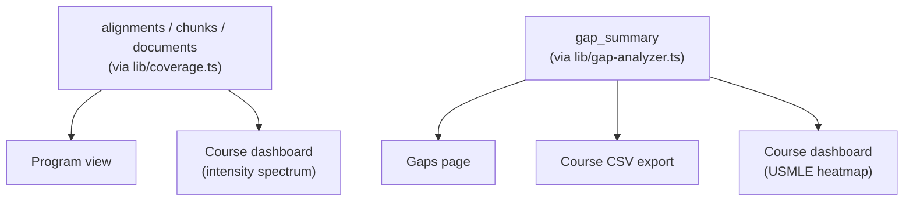
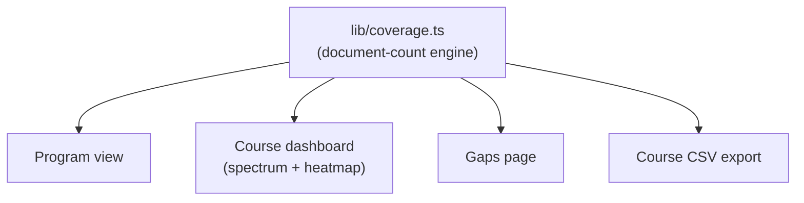
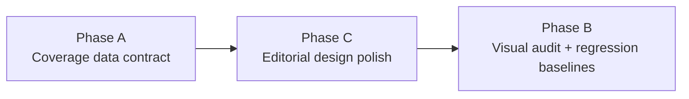

# Demo-Ready Coverage Contract and Visual Audit - Plan

## Goal Capsule
- **Objective:** Make RushMap AI demo-ready for the curriculum committee: one consistent, auditable coverage methodology everywhere it's shown; a durable mobile + desktop screenshot audit with regression protection; and an editorial-quality visual redesign (NYT/538-inspired) that makes the coverage story legible at a glance — without ever touching how a number is computed.
- **Product authority:** AGENTS.md's auditable, deterministic-first coverage doctrine (canonical); `docs/plans/2026-07-05-002-feat-intensity-coverage-model-plan.md` (the shipped intensity engine and its unshipped gap-analysis retrofit); `docs/plans/2026-07-04-003-feat-page-journey-audit-plan.md` (the prior manual audit, which already verified data fidelity).
- **Open blockers:** none.
- **Product Contract preservation:** changed — added R11-R15 (visual design quality) and AE4-AE5 to the original requirements-only draft, per explicit user direction to expand scope to a full editorial visual redesign. R1-R10 and AE1-AE3 are unchanged.

---

## Product Contract

### Summary
Retire the pipeline's legacy chunk-count `gap_summary` methodology everywhere it still surfaces — the gaps page, the course CSV export, and the course dashboard's USMLE heatmap — so all three read from the same document-count coverage engine already powering the program view. Then give the app an editorial, NYT/538-inspired visual redesign (annotation-led charts, restrained semantic-only color, clear typographic hierarchy, a mobile-first heatmap) that is presentation-only and never changes a computed number. Finally, run a mobile + desktop screenshot audit of the finished app, fix any remaining real defects, and commit Playwright regression baselines against that final state.

### Problem Frame
The gaps page, its CSV export, and the course dashboard's USMLE heatmap still compute coverage via a per-document chunk-count + confidence-threshold methodology (`gap_summary` / `deriveCoverageStatus` in `lib/gap-analyzer.ts`), populated by the pipeline's `recomputeGapSummary`. This is a different methodology than the shipped document-count intensity engine (`lib/coverage.ts`) that already drives the program view and the course dashboard's intensity spectrum — on pages a curriculum-committee member will see in the next few days, that split-brain is a trust problem the product's own north star (auditable, deterministic knowledge a committee can defend to an accreditor) can't tolerate.

Separately, the app's data visualizations — a stacked-bar coverage spectrum, a systems-by-cases heatmap, an AAMC bar chart, and plain card-based method-explainer text — are functionally correct but visually flat: legend-and-axis charts with no annotation layer, decorative rather than semantic color use, and no typographic hierarchy distinguishing a takeaway from a data label. For a curriculum committee evaluating whether to trust this tool, presentation quality is part of the auditability story: a chart that states its "so what" plainly is easier to verify than one that makes the reader do the work. And no systematic screenshot or visual-regression harness exists to catch responsive breakage as this redesign lands across mobile and desktop.

### Split-brain today (Track A)

### Target state — one engine, one design language

### Requirements

**Coverage data contract**
- R1. Every coverage surface — program view, course dashboard spectrum, course dashboard USMLE heatmap, gap-analysis page, and course CSV export — computes coverage from the single document-count intensity engine (`lib/coverage.ts`). No surface reads `gap_summary` / `deriveCoverageStatus` for display.
- R2. The gaps page presents one coverage methodology, not two. The current "per-document snapshot" vs. "authoritative" framing goes away because there is only one source left to reconcile.
- R3. The course-level CSV export is self-describing (a method note, matching the program export's shape) and structurally consistent with `/api/program/export`, per the existing one-serializer export doctrine.
- R4. The course dashboard's per-system USMLE heatmap — previously fixed for an all-red rendering regression (PR #8) — continues to render correct, varying per-system coverage after moving off `gap_summary`. This is a regression to guard, not just a data-source swap.
- R5. Legacy `gap_summary`-driven code (the recompute functions in `lib/gap-analyzer.ts`, the pipeline stage that populates `gap_summary`, and the CLI script that also calls it) is removed once no surface reads it. No orphaned code silently computes data nobody consumes.

**Visual audit & regression protection**
- R6. Every page — the 9 routes `/`, `/about`, `/upload`, `/program`, and `/courses/[courseId]/{page,gaps,map,objectives,search}` — is captured at one mobile breakpoint (~390×844) and one desktop breakpoint (~1440×900).
- R7. Real visual/responsive defects found (layout breakage, overflow, unreadable text, broken touch targets) are fixed as part of this work, not just logged.
- R8. Findings are recorded (page, breakpoint, severity, what's wrong) so the audit itself is auditable.
- R9. Playwright regression baselines (`toHaveScreenshot`) are captured for all 9 pages at both breakpoints against the final, post-redesign state, and committed so future changes are checked against them going forward.
- R10. The audit does not re-verify data fidelity or journey correctness — the 2026-07-04 page-journey audit already covers that. Scope here is visual/responsive only.

**Visual design quality (editorial, NYT/538-inspired)**
- R11. The app's charts (coverage spectrum, USMLE heatmap, AAMC bar chart) lead with a plain-language, data-derived takeaway annotation — the "so what" — rather than relying on axis labels and a legend alone.
- R12. Color is restricted to semantic meaning only: the existing 5 coverage-level colors remain the only colors that carry information; all non-focal UI (chrome, gridlines, secondary text) uses a restrained grayscale palette.
- R13. Typography establishes a clear, consistent hierarchy (takeaway headline vs. data label vs. body) across all 9 pages, replacing the current flat, undifferentiated card-based type.
- R14. The USMLE heatmap gets a mobile-appropriate alternate layout below the mobile breakpoint instead of a horizontally-cramped grid.
- R15. None of the above changes a computed coverage number, threshold, or introduces new LLM dependence. The redesign is presentation-only: every annotation is a deterministic string template over existing engine output, never LLM-generated summary text. The existing method-transparency doctrine (AGENTS.md; R6 in the intensity-coverage plan) is preserved and made more prominent, not diluted.

### Key Decisions
- **Full retirement over a minimal patch, even at schedule risk.** Every `gap_summary`-dependent surface is rebuilt on the document-count engine, accepting this may push past the original 3-day demo target — two coexisting coverage methodologies on committee-facing pages is a trust risk the auditability doctrine can't carry, even temporarily.
- **The dashboard heatmap is in scope, not carved out.** It was an undiscovered third `gap_summary` consumer found during scoping (beyond the gaps page and CSV export); leaving it on the legacy model would make "one engine everywhere" false.
- **The visual redesign is presentation-only, by design.** Every new annotation is a string template computed from `lib/coverage.ts` distributions, never a new data source or LLM call — non-negotiable per the product's auditability doctrine. This is what makes "make it pop" compatible with "everything must be deterministic and auditable for the medical college."
- **Design language grounded in named conventions, not generic restyling.** Serif takeaway headline + sans data labels (the NYT editorial/functional type split); one semantic accent hue per chart, grayscale for everything non-focal (the 538 style-sheet discipline); annotation-led chart headers stating the "so what" above the chart (the Amanda Cox / NYT-graphics convention); the mobile heatmap collapses to a per-system list rather than shrinking a grid (the small-multiples / responsive-table convention). See Sources & Research.
- **Regression baselines are captured last, against the fully finished state.** Because the visual redesign changes far more than bug fixes would, baselines are captured after both the redesign (Phase C) and the final audit/fix pass (Phase B) land — not immediately after Track A, and not before the redesign — so they lock in the real target state.

### Acceptance Examples
- AE1. For RMD 563, the course dashboard's USMLE heatmap, after migrating off `gap_summary`, still shows varying (not all-red) covered/partial/gap cells across systems, consistent with the per-system distribution the intensity spectrum already shows. The PR #8 regression does not return. Covers R4.
- AE2. On the gaps page for RMD 563, the on-screen coverage numbers, the CSV export's per-topic level, and the program export's figure for the same topic all agree — one number, one methodology. Covers R1, R2, R3.
- AE3. Running the Playwright visual-regression suite after an unrelated future change to a shared component (e.g., the sidebar) fails the baseline diff on every page that renders it, since the component appears on all 9 routes. Covers R9.
- AE4. The program view's USMLE spectrum leads with a takeaway sentence such as "245 of 597 domains addressed; 352 need attention" directly above the stacked bar — computed from the existing distribution object, not authored or LLM-generated. Covers R11, R15.
- AE5. On a 390px-wide screen, the USMLE heatmap no longer renders as a cramped, illegible grid — it collapses to a per-system list showing the same covered/partial/gap information. Covers R14.

### Scope Boundaries
**In scope:** rebuilding the gaps page, course CSV export, and dashboard USMLE heatmap onto `lib/coverage.ts`; retiring the `gap_summary`-dependent code once nothing reads it; an editorial visual redesign (typography, semantic-only color, annotation-led charts, mobile heatmap layout) applied consistently across all 9 pages; a final screenshot audit fixing real remaining defects; committing Playwright regression baselines for all 9 pages × 2 breakpoints.

#### Deferred to Follow-Up Work
- Dropping the `gap_summary` database table/schema entirely (a real migration) — this plan only removes the code that reads/writes it; the empty table is left in place as low-risk cleanup for after the demo.
- A wider viewport matrix (tablet, additional desktop widths).
- Re-verifying data fidelity or journey correctness — already covered by the 2026-07-04 page-journey audit.
- Replacing the underlying chart library (Recharts) or introducing a new design-token/theming system beyond extending the existing Tailwind config.
- Consolidating the duplicated per-(framework, topic, course) rollup query across `getProgramSummary`, `getCourseSummary`, and `getGapExportRows` into a shared helper (KTD8) — real debt, not worth the extra surface area this close to the demo.
- The remaining unrelated units in `docs/plans/2026-07-05-002-feat-intensity-coverage-model-plan.md` (provenance drill-down, learning-spiral view) — untouched by this work, still open in that plan.

---

## Planning Contract

### Key Technical Decisions
- **KTD1 — The heatmap gets its own deterministic threshold rule, not a reuse of the course-wide engine.** `lib/coverage.ts`'s `distribution()`/`levelOf()` answer "how many distinct documents across the course address topic X" — a course-wide, per-topic depth question. The heatmap answers a different question: "for this one session (case), how many leaf domains in system Y did it touch" — a per-document breadth question. Reusing the exact same function would silently misrepresent one as the other. The new rule: for a given (case, system) cell, count the distinct USMLE leaf domains in that system the case's document has ≥1 alignment to, then bucket it the same way the heatmap's existing 3-color legend expects (0 → gap, a small number → partial, more → covered). Co-locate this as a small, pure, deterministic helper near `lib/coverage.ts` or inline in the query layer — it must have zero DB/LLM dependence, same as the engine it sits beside. Exact bucket cutoffs are directional (implementer tunes against real data so the heatmap visibly varies, matching AE1) rather than pinned here.
- **KTD2 — `gap_summary` retirement removes code, not the table.** Delete the recompute functions and every call site (`lib/pipeline.ts`'s `recomputeGapSummary`, `lib/gap-analyzer.ts`'s `recomputeCourseFrameworkGaps`, and `scripts/realign.ts`, which calls both) so nothing in the app writes or reads the table. Leave the table itself in the Drizzle schema and Neon DB undropped — an actual schema migration this close to a live demo is unnecessary risk for a table nobody reads. Dropping it is a trivial, safe follow-up.
- **KTD3 — Course export becomes a thin consumer of the existing serializer, not a new one.** `app/api/courses/[courseId]/export/route.ts` is rewritten to call `lib/coverage-export.ts`'s `coverageRowsToCsv`/`coverageRowsToJson` (the same pure serializer `/api/program/export` already uses), scoped to one course's rows instead of all courses — no second CSV-shaping code path to diverge from the program export again.
- **KTD4 — Annotations are string templates, never freeform or LLM-authored.** Each chart's takeaway line is built by a small deterministic function that reads the same `CoverageDist`/export-row values already rendered elsewhere on the page (e.g., `` `${addressed} of ${total} domains addressed; ${gap} need attention` ``) — directional phrasing, not exact copy. This keeps R15's auditability guarantee mechanically true: the annotation cannot say anything the underlying numbers don't already say.
- **KTD5 — Design tokens extend the existing Tailwind config; no new design-system dependency.** The type scale and the semantic-only color palette (the 5 existing coverage-level colors, `bg-gap-red`/`bg-partial-yellow`/`bg-covered-green` etc. already defined, plus a grayscale scale for chrome) are added to `tailwind.config.ts` as named tokens, not a new CSS-in-JS or theming library. Components consume the tokens; no chart library swap.
- **KTD6 — Visual-regression baselines run in CI via the pinned official Playwright Docker image.** Local macOS and CI Linux render fonts differently, which is the documented cause of spurious `toHaveScreenshot` diffs across contributor machines. Generating and comparing baselines only inside the pinned `mcr.microsoft.com/playwright` image (one consistent environment) avoids that flakiness class entirely; baseline updates remain a manual `--update-snapshots` step reviewed and committed alongside the change that caused them.
- **KTD7 — Screenshot capture masks volatile, DB-driven content and disables animations.** Every page renders real database-derived numbers (alignment counts, coverage percentages) that can shift between runs as the corpus changes, plus any CSS transitions. Captures use `toHaveScreenshot`'s `mask` option on DB-driven number regions and `animations: 'disabled'`, and wait for the page's data-loaded signal before capturing — otherwise the baselines themselves become the flaky thing this work is trying to prevent.
- **KTD8 — Accept, don't extract, the query-duplication across `getProgramSummary`/`getCourseSummary`/`getGapExportRows`.** All three now hand-roll a similar per-(framework, topic, course) alignments/chunks/documents rollup with slightly different scoping (whole program vs. one course vs. export rows). A shared query-builder helper would remove the duplication, but extracting one now is an architectural change with its own risk, this close to a demo, for code that isn't changing behavior. Accepted as explicit debt — see Deferred to Follow-Up Work — rather than scope creep on a demo-critical plan.

### High-Level Technical Design

Phase sequencing — data contract first (highest demo-trust risk), then the redesign, then a final audit against the truly-finished state:

Phase A lands first because it fixes the trust-critical split-brain independent of anything visual. Phase C depends on Phase A for the two components it touches that also change data source (the spectrum and heatmap) — restyling before the data is correct would mean redoing work. Phase B runs last and audits the fully assembled result, so its baselines represent the actual target state rather than an intermediate one.

---

## Implementation Units

### Phase A — Coverage data contract

### U1. Rewrite course-level queries onto the document-count engine
**Goal:** `getCourseSummary`'s USMLE heatmap computation and `getGapExportRows` compute directly from `alignments`/`chunks`/`documents`, mirroring `getProgramSummary`'s per-(framework, topic, course) query pattern, instead of reading `gap_summary`.
**Requirements:** R1, R4.
**Dependencies:** none.
**Files:** `lib/queries.ts` (`getCourseSummary`, `getGapExportRows`), `lib/coverage.ts` (new heatmap-cell helper per KTD1), `__tests__/lib/course-summary-heatmap.test.ts` (new).
**Approach:** Add a small deterministic heatmap-cell-status function (KTD1) alongside `lib/coverage.ts`. Replace the heatmap SQL's `gap_summary` join with a query over `alignments`/`chunks`/`documents` grouped by case number and USMLE system, feeding the new cell-status function. Replace `getGapExportRows`'s `gap_summary` read with a query shaped like `getProgramSummary`'s per-topic rollup, scoped to the one course.
**Test scenarios:** a case's document with alignments across 4+ leaf domains in a system renders "covered"; 1-2 renders "partial"; 0 renders "gap"; a course with real data shows a heatmap with a mix of all three (not all-red, guarding AE1); `getGapExportRows` for a course returns the same per-topic figures `getCourseSummary`'s spectrum already shows.
**Verification:** `getCourseSummary` and `getGapExportRows` no longer import `gapSummary` from `@/drizzle/schema`; live query against course 1 reproduces AE1's varying heatmap.

### U2. Rebuild the gaps page UI and course CSV export on the shared engine
**Goal:** The gaps page's gap-card list and the course-level CSV export both read from `lib/coverage.ts`/`lib/coverage-export.ts` (KTD3) instead of `gap_summary`, eliminating the "per-document snapshot" vs. "authoritative" framing.
**Requirements:** R2, R3.
**Dependencies:** U1.
**Files:** `app/courses/[courseId]/gaps/page.tsx`, `app/api/courses/[courseId]/export/route.ts`, `lib/coverage-export.ts` (if a course-scoped row-builder is needed alongside the existing program one).
**Approach:** Gap cards render from the same per-topic rows `getGapExportRows` (U1) now returns; drop the page's dual-panel caption entirely since there's only one methodology left. The export route calls `coverageRowsToCsv`/`coverageRowsToJson` (KTD3) scoped to the course, matching `/api/program/export`'s column shape (`framework,system,topic,level,documents,courses`) and self-describing method note.
**Test scenarios:** gap cards for RMD 563 show one set of numbers matching the intensity spectrum on the same page; the CSV export for a course opens with the method-note row, header row, and per-topic level column; a topic's level in the course export matches its level in the program export. Covers AE2.
**Verification:** the page's old "per-document snapshot" caption is gone; CSV and on-screen figures agree for a sampled topic.

### U3. Retire pipeline-side `gap_summary` population
**Goal:** Nothing in the app writes to `gap_summary` anymore, and no dead code or stale documentation references the retired path.
**Requirements:** R5.
**Dependencies:** U1, U2 (confirm nothing reads the table before removing what writes it). Land U1-U3 together as one atomic, single-revertible change (see Risks & Dependencies) rather than merging U3 separately.
**Files:** `lib/pipeline.ts` (remove `recomputeGapSummary`, its call site, **and** the separate `db.delete(gapSummary)` call inside `clearDocumentArtifacts`), `lib/gap-analyzer.ts` (remove `recomputeCourseFrameworkGaps` and `deriveCoverageStatus`), `scripts/realign.ts` (remove its calls to both), `__tests__/lib/gap-analyzer.test.ts` (delete — it unit-tests `deriveCoverageStatus` directly and won't compile once the function is gone), `__tests__/lib/pipeline-{caption-resume,embedding,resume}.test.ts` (remove the now-dead mocks of `recomputeCourseFrameworkGaps`/`recomputeGapSummary`/`deriveCoverageStatus`), `docs/ARCHITECTURE.md` and `docs/SCHEMA.md` (update the pipeline-stage description and the sentence/ERD referencing `gap_summary` as the aggregation source for gaps/heatmaps).
**Approach:** Delete the functions and call sites rather than leaving them dead in place (R5's "no orphaned pipeline stage"). Leave the `gap_summary` table and its Drizzle schema definition untouched (KTD2) — this unit is code-only. `scripts/seed.ts`'s `db.delete(gapSummary)` during reseed is an accepted exception, not something to remove: it becomes a permanent zero-row no-op once nothing writes the table, and is harmless (correct FK ordering already), so leave it with a short comment marking it as such rather than touching seed.ts's behavior. Removing the `"recomputing_gaps"` pipeline stage may leave a cosmetic gap in the upload page's progress percentage sequence (e.g., a jump instead of a smooth step) — adjust the preceding stage's literal progress value so it still reads as a smooth sequence.
**Test scenarios:** running the pipeline against a document no longer inserts `gap_summary` rows; `scripts/realign.ts` still completes its realignment work without the removed calls; existing pipeline tests continue to pass with the dead mocks removed; the upload page's progress sequence still reads smoothly with one fewer stage.
**Verification:** `grep` for `gapSummary`/`gap_summary` across `lib/`, `scripts/`, and `drizzle/` returns only the untouched table definition (`drizzle/schema.ts`, `scripts/db-init.ts`) and the accepted `scripts/seed.ts` exception; `docs/ARCHITECTURE.md`/`docs/SCHEMA.md` no longer describe `gap_summary` as the live aggregation source.

### U4. Track A verification
**Goal:** Confirm the data-contract migration holds against live data and doesn't regress the dashboard.
**Requirements:** R1-R5.
**Dependencies:** U1, U2, U3.
**Files:** `__tests__/lib/course-summary-heatmap.test.ts` (from U1), `e2e/journeys.spec.ts` (extend existing A1/gap-analysis assertions).
**Approach:** Extend the existing e2e journey assertions for the gaps page and dashboard heatmap to check the new single-methodology behavior instead of (or in addition to) today's amber/red severity check.
**Test scenarios:** live course 1 reproduces AE1 (varying heatmap) and AE2 (on-screen, CSV, and program export agree for a sampled topic).
**Verification:** `npm test` and `npm run test:e2e` green; `tsc` clean.

### Phase C — Editorial design polish

### U5. Design tokens: editorial type scale and semantic-only color palette
**Goal:** A named type scale (takeaway headline / data label / body) and a restrained color set where the 5 existing coverage-level colors are the only colors carrying meaning, plus a grayscale scale for everything else.
**Requirements:** R12, R13.
**Dependencies:** none.
**Files:** `tailwind.config.ts`, `app/globals.css` (if font-face/serif headline declarations are needed).
**Approach:** Extend `tailwind.config.ts` with named tokens rather than introducing a new styling system (KTD5): a serif display font for takeaway headlines, the existing sans for data labels and body (with tabular figures for numbers where supported), a grayscale scale for chrome/gridlines/secondary text, and the 5 coverage-level colors already defined (`bg-gap-red`, `bg-partial-yellow`, `bg-covered-green`, etc.) reaffirmed as the only semantic colors in the app.
**Test scenarios:** none — this is a token/config unit with no standalone behavior.
`Test expectation: none -- design tokens only, verified visually by the units that consume them.`
**Verification:** the new tokens are referenced by name (not ad hoc hex/px values) in the units below.

### U6. Annotation-led chart redesign
**Goal:** The coverage spectrum, USMLE heatmap, and AAMC bar chart each lead with a deterministic, data-derived takeaway sentence above the chart (KTD4), per the NYT/538 annotation-led convention.
**Requirements:** R11, R15.
**Dependencies:** U1 (correct heatmap data), U5 (tokens).
**Files:** `components/coverage/CoverageSpectrum.tsx`, `components/dashboard/MetricCard.tsx` (`CoverageHeatmap`, `AamcBarChart`), a small shared takeaway-template helper (co-located with `lib/coverage.ts` or the components).
**Approach:** Each chart gets a one-line, templated takeaway computed from the same `CoverageDist`/export-row data already passed into the component today (KTD4) — no new data fetch, no LLM call. Style the takeaway in the new headline token, data labels in the sans/tabular token.
**Test scenarios:** the spectrum's takeaway sentence matches its underlying `addressed`/`total`/`gap` values exactly for a sampled course; the heatmap's takeaway names the count of gap cells; the AAMC bar chart's takeaway names the lowest-coverage domain. Covers AE4.
**Verification:** each chart is legible from its takeaway sentence alone, without reading the legend.

### U7. Method-transparency visual elevation
**Goal:** `MethodExplainer` reads as an editorial footnote/callout rather than a plain card, with the exact same method text — more prominent, not diluted (R15).
**Requirements:** R15.
**Dependencies:** U5.
**Files:** `components/coverage/MethodExplainer.tsx`.
**Approach:** Restyle only — small-caps label, footnote-style typographic treatment per the new tokens. The `METHOD_NOTE` string from `lib/coverage.ts` is rendered verbatim; this unit touches presentation, not content.
**Verification:** the rendered method text is byte-identical to `lib/coverage.ts`'s `METHOD_NOTE`; it is visually more prominent than the current plain-card treatment.
`Test expectation: none -- presentation-only change to an already-tested string constant.`

### U8. Mobile-first heatmap redesign
**Goal:** Below the mobile breakpoint, the USMLE heatmap collapses to a per-system list/accordion instead of a horizontally-cramped grid (R14).
**Requirements:** R14.
**Dependencies:** U1, U5, U6.
**Files:** `components/dashboard/MetricCard.tsx` (`CoverageHeatmap`).
**Approach:** Below ~450px, render one row per system (system name + its per-case cells as a compact inline strip or expandable detail) instead of the full case×system grid, per the small-multiples/responsive-table convention (KTD sources). Desktop keeps the existing grid.
**Test scenarios:** at 390px, the heatmap shows a per-system list with the same covered/partial/gap information, no horizontal scroll needed to read a system's status; at 1440px, the existing grid layout is unchanged. Covers AE5.
**Verification:** the mobile view is legible without pinch-zoom or horizontal scrolling.

### U9. Shell and page-level design-system rollout
**Goal:** All 9 pages and the shared shell (Header/Footer/Sidebar) consistently use the new type/color/spacing tokens.
**Requirements:** R13.
**Dependencies:** U5.
**Files:** `components/layout/{Header,Footer,Sidebar}.tsx`, `app/page.tsx`, `app/about/page.tsx`, `app/upload/page.tsx`, `app/program/page.tsx`, `app/courses/[courseId]/{page,gaps,map,objectives,search}.tsx`.
**Approach:** Apply the new typographic hierarchy and grayscale/semantic-color discipline across the shell and each page's non-chart chrome (headings, body copy, spacing rhythm), so the redesign reads as one system rather than per-page patchwork.
**Test scenarios:** none beyond the screenshot audit (U11), which verifies the rollout visually across all 9 pages.
`Test expectation: none -- verified visually by the Phase B screenshot audit, not unit tests.`
**Verification:** no page retains the old flat card styling once this unit lands.

### Phase B — Visual audit and regression protection

### U10. Playwright multi-viewport configuration and capture hygiene
**Goal:** `playwright.config.ts` gains a mobile (~390×844) and desktop (~1440×900) project, and screenshot captures reliably avoid flakiness from live DB-driven numbers and animations.
**Requirements:** R6, R9 (setup), and KTD6/KTD7.
**Dependencies:** none (can start any time; sequenced last only because it audits the finished app).
**Files:** `playwright.config.ts`, a new `e2e/visual.spec.ts` (or similarly named spec, separate from `e2e/journeys.spec.ts`'s journey-assertion shape).
**Approach:** Add the two viewport projects per KTD6. Screenshot calls mask DB-driven number regions and use `animations: 'disabled'` (KTD7), waiting for each page's data to finish loading before capture.
**Test scenarios:** none — configuration unit, exercised by U11/U12.
`Test expectation: none -- configuration and harness setup, exercised by the units that use it.`
**Verification:** a manual run of the new spec against one page succeeds at both viewports without flaking on repeated runs.

### U11. Screenshot audit of all 9 pages and defect fixes
**Goal:** Capture all 9 routes at both breakpoints against the fully redesigned app, record findings, and fix real visual/responsive defects found.
**Requirements:** R6, R7, R8, R10.
**Dependencies:** U1-U9 (audits the finished state, per the phase-sequencing decision), U10.
**Files:** the new visual spec from U10; component/page files as needed to fix findings; a findings record (e.g., a short markdown table in the plan's PR description or `docs/solutions/` if a durable pattern emerges — not a new permanent doc unless one is warranted).
**Approach:** Drive each of the 9 routes at both viewports, record `page / breakpoint / severity / what's wrong`, then fix real defects (layout breakage, overflow, unreadable text, broken touch targets) directly. Do not re-verify data fidelity (R10) — that's the 2026-07-04 audit's job.
**Test scenarios:** each of the 9 pages is captured at both breakpoints with no unresolved layout breakage, overflow, or illegible text remaining; findings are recorded even for defects fixed, so the audit is itself auditable (R8).
**Verification:** a final pass through all 9×2 captures shows no open visual/responsive defects.

### U12. Visual-regression baseline capture and CI wiring
**Goal:** Commit `toHaveScreenshot` baselines for all 9 pages × 2 breakpoints against the final, fixed state, and wire the suite into CI per KTD6.
**Requirements:** R9.
**Dependencies:** U11.
**Files:** the visual spec from U10, its baseline snapshot directory, a CI workflow file (e.g., under `.github/workflows/`) if one doesn't already run Playwright.
**Approach:** Generate baselines inside the pinned official Playwright Docker image (KTD6) so CI and any future local `--update-snapshots` runs compare against a consistent rendering environment. Baseline updates remain a manual, reviewed step — never auto-committed.
**Test scenarios:** Covers AE3 — an unrelated future change to a shared component (e.g., the sidebar) fails the baseline diff on every page rendering it.
**Verification:** the visual-regression suite runs green against the just-fixed state; re-running it with no changes stays green (no baseline flakiness).

---

## System-Wide Impact

- **Additional `gap_summary` touchpoints beyond the original scope** (folded into U3 above): `lib/pipeline.ts`'s `clearDocumentArtifacts` has its own separate `gapSummary` delete call, independent of `recomputeGapSummary`'s; `__tests__/lib/gap-analyzer.test.ts` directly unit-tests `deriveCoverageStatus` and won't compile once it's removed; three pipeline test files mock the retired functions and need their mocks dropped; `docs/ARCHITECTURE.md` and `docs/SCHEMA.md` both describe `gap_summary` as the live aggregation source for gaps/heatmaps and go stale otherwise.
- **Pipeline stage list and upload UI:** no UI hardcodes stage names or derives progress from `PIPELINE_STAGES`'s length — `app/upload/page.tsx` renders server-sent stage/progress/message strings verbatim. Removing the `"recomputing_gaps"` stage is safe for users; only a cosmetic progress-percentage jump needs adjusting (handled in U3).
- **Query-layer duplication, not a circular dependency.** `lib/coverage.ts` has zero imports and is a one-directional dependency of `lib/queries.ts` — no architectural violation. But `getProgramSummary`, and now `getCourseSummary`'s heatmap query and `getGapExportRows`, each hand-roll a similar per-(framework, topic, course) rollup independently. Accepted as explicit debt rather than extracted now — see KTD8 and Deferred to Follow-Up Work.
- **Existing e2e coverage:** `e2e/journeys.spec.ts`'s gap-analysis assertion (currently checking amber/red severity language) is already targeted for updating by U4 — no additional test surface was found beyond what the plan already accounts for.

## Risks & Dependencies

- **Land U1-U3 as one atomic, revertible change.** U3 (removing the pipeline's write path) depends on U1/U2 (the new read path) landing first. If a bug surfaces in the new query logic after U3 has already merged separately, reverting only U1/U2 would restore reads against a table nothing has written to since cutover — silently worse than the original bug. *Mitigation:* merge U1-U3 together in a single PR and rehearse the full revert before demo day.
- **The new heatmap can look like a regression on identical data, even when it isn't one.** KTD1's per-session, per-system breadth rule answers a different question than the old chunk-count-and-confidence rule, so cells are expected to flip color with no underlying data change. *Mitigation:* pair the cutover with the elevated `MethodExplainer` (U7) making the methodology change visible, and calibrate KTD1's bucket cutoffs against real course-1 data so the result doesn't recreate the PR #8 all-red look.
- **CI wiring for the visual-regression suite is genuinely first-time infrastructure.** No existing CI workflow runs Playwright, Docker, or provisions a database; e2e specs already self-skip without `DATABASE_URL`, so a rushed CI job risks going silently green (skipped) rather than red. *Mitigation:* treat CI wiring (part of U12) as descopable from the demo-critical path if time runs short — verify manually that the suite fails red on a real diff before trusting it, demo-critical or not.
- **`scripts/seed.ts`'s `gap_summary` delete becomes a permanent no-op, not a lingering dependency.** Once nothing writes the table, this delete always removes 0 rows — harmless, and already sequenced correctly relative to other table deletes. *Mitigation:* a short comment marking it as an intentional no-op (per U3) so it isn't later mistaken for a live dependency.

---

## Verification Contract
| Gate | Method | Expect |
|------|--------|--------|
| Coverage data contract | `npm test` + live query against course 1 | AE1 (varying heatmap) and AE2 (on-screen/CSV/program export agree) hold |
| No orphaned pipeline code | `grep` for `gapSummary`/`gap_summary` in `lib/`, `scripts/`, `drizzle/` | Only the untouched table definition and the accepted `scripts/seed.ts` no-op exception remain |
| Deterministic-safety | Manual check: every new annotation traces to an existing `CoverageDist`/export-row value | No annotation states a number not already computed elsewhere on the page |
| Method transparency | Manual check: rendered `MethodExplainer` text vs. `lib/coverage.ts`'s `METHOD_NOTE` | Byte-identical |
| Visual/responsive audit | Screenshot capture of all 9 pages × 2 breakpoints | No open layout breakage, overflow, or illegible-text findings |
| Regression baselines | `npx playwright test` (visual spec) in the pinned Docker image | Green against the committed baselines |
| Tests | `npm test` + `npm run test:e2e` | Green; `tsc` clean |

## Definition of Done
- [ ] `gap_summary` is no longer read by any UI surface or the program/course exports; the pipeline no longer writes to it
- [ ] Gaps page shows one coverage methodology; course CSV export matches the program export's shape and method note
- [ ] Course dashboard's USMLE heatmap shows varying, correct coverage after the data-source migration (AE1)
- [ ] Charts (spectrum, heatmap, AAMC bar) lead with a deterministic, data-derived takeaway annotation (AE4)
- [ ] Color is semantic-only; typography has a clear headline/data-label/body hierarchy across all 9 pages
- [ ] Mobile heatmap renders as a legible per-system list below ~450px (AE5)
- [ ] Method-transparency text is unchanged in content, more prominent in presentation
- [ ] All 9 pages audited at mobile + desktop; real defects found are fixed; findings recorded
- [ ] Playwright visual-regression baselines committed for all 9 pages × 2 breakpoints, generated in the pinned Docker image; CI wiring lands if time allows, otherwise a manual pre-merge check against the baselines substitutes (per Risks & Dependencies)
- [ ] `npm test` + `npm run test:e2e` green; `tsc` clean

---

## Sources & Research
- `docs/plans/2026-07-05-002-feat-intensity-coverage-model-plan.md` — the shipped intensity engine, the one-serializer export doctrine (KTD8), and its unshipped gap-analysis retrofit (U7) that this work completes.
- `docs/plans/2026-07-04-003-feat-page-journey-audit-plan.md` — the prior manual audit that verified data fidelity per page and explicitly deferred "codify highest-value journeys as Playwright tests."
- `lib/gap-analyzer.ts`, `lib/queries.ts` (`getCourseSummary` heatmap query, `getGapExportRows`), `app/api/courses/[courseId]/export/route.ts`, `app/courses/[courseId]/gaps/page.tsx`, `lib/pipeline.ts`, `scripts/realign.ts` — the legacy `gap_summary` consumers and writers found during scoping.
- `e2e/journeys.spec.ts`, `playwright.config.ts` — the current test setup (one desktop project, one ad hoc mobile viewport) the new visual-regression suite extends.
- Playwright visual-regression conventions: [playwright.dev/docs/test-snapshots](https://playwright.dev/docs/test-snapshots), [test-projects docs](https://github.com/microsoft/playwright/blob/main/docs/src/test-projects-js.md) — multi-viewport project setup, `toHaveScreenshot` masking/threshold options, platform-scoped baseline naming, pinned-Docker-image CI gating.
- Editorial data-visualization conventions: [FiveThirtyEight Matplotlib style sheet](https://matplotlib.org/stable/gallery/style_sheets/fivethirtyeight.html) (semantic-only color, grayscale context); [Amanda Cox on annotation-led charts, via Datawrapper](https://blog.datawrapper.de/amanda-cox-bloomberg/) and [Hands-On Data Visualization's annotated-chart guide](https://handsondataviz.org/annotated-datawrapper.html) (the "so what" annotation layer); [Datawrapper's responsive-table/heatmap guidance](https://www.datawrapper.de/blog/guide-what-to-consider-when-creating-tables) (mobile collapse pattern for dense grids); [Every Font Used by The New York Times](https://sensatype.com/every-font-used-by-the-new-york-times-in-2025) (serif/sans functional split).
