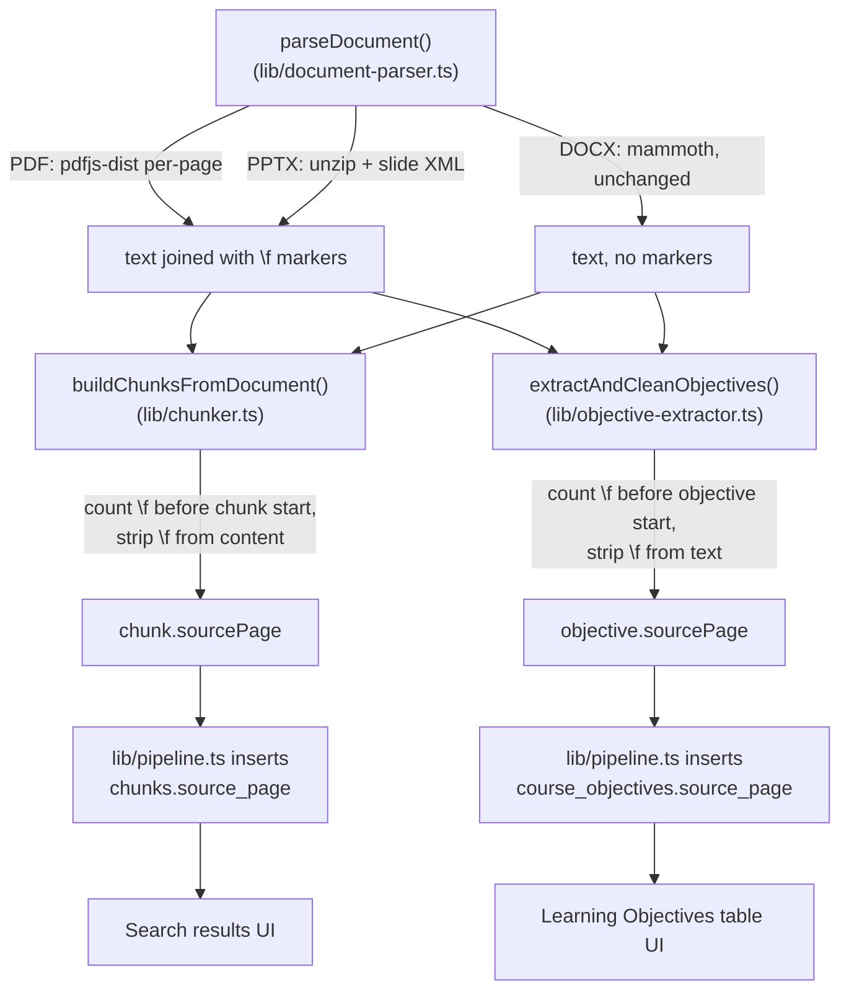

# Source Page/Slide Numbers for Objectives and Search - Plan

## Goal Capsule

- **Objective:** let faculty trace a learning objective or a search result back to the exact page (PDF) or slide (PPTX) it came from, without adding risk to the pipeline or the demo course's existing data.
- **Product authority:** `docs/plans/2026-07-05-004-feat-source-page-numbers-plan.md` (this file — `ce-brainstorm` origin, enriched in place). Product Contract unchanged from the brainstorm; this pass adds the Planning Contract, Implementation Units, Verification Contract, and Definition of Done below.
- **Open blockers:** none. DOCX is explicitly out of scope, and backfilling existing documents is explicitly deferred past the demo.
- **Execution profile:** `execution: code`, `artifact_readiness: implementation-ready`. Standard depth — bounded scope, real technical decisions, no launch-blocking questions.

## Product Contract

### Summary

Show a source page number (PDF) or slide number (PPTX) next to each learning objective in the Learning Objectives table and next to each search result excerpt, so faculty can jump straight to the original location to verify an AI-suggested alignment or find where related content already lives. Documents parsed from DOCX show no page number — current behavior, not a regression.

### Problem Frame

Faculty reviewing an AI-suggested alignment, or searching for where a topic is already covered, currently see only an excerpt of text with no indication of where in the source document it lives. Confirming or acting on that excerpt means manually reopening the original file and searching it by hand. This matters for both major uses of the data: verifying an AI alignment against its source, and locating existing content while editing curriculum — faculty do both regularly, and neither is served today.

### Requirements

- R1. A learning objective sourced from a PDF document shows its page number in the Learning Objectives table.
- R2. A learning objective sourced from a PPTX document shows its slide number in the Learning Objectives table.
- R3. A search result excerpt sourced from a PDF or PPTX document shows its page/slide number.
- R4. Objectives and chunks sourced from a DOCX document show no page/slide number — matching current behavior exactly, not a new gap.
- R5. A document not yet reprocessed after this feature ships shows no page/slide number, regardless of format, until it is deliberately reprocessed.
- R6. Reprocessing existing documents to backfill page/slide numbers happens only as a separate, deliberate operation after the demo — shipping this feature does not itself trigger any reprocessing.

### Scope Boundaries

Deferred for later:
- Surfacing page/slide number on the dashboard's Recent Alignments table and the Curriculum Map drawer.
- Reprocessing/backfilling already-uploaded documents (a separate, deliberate post-demo operation, not part of this feature's shipment).
- Any DOCX page-break detection.

### Acceptance Examples

- AE1. A PDF-sourced objective whose text originates on page 4 → the Learning Objectives table shows "Page 4" on that row.
- AE2. A PPTX-sourced objective whose text originates on slide 7 → the table shows "Slide 7" on that row.
- AE3. A DOCX-sourced objective → no page/slide value shown, same as today.
- AE4. A document already processed before this feature ships, not yet reprocessed → shows no page/slide number even if it's a PDF, until a deliberate reprocess.
- AE5. A search result excerpt from a PDF-sourced chunk → the result shows the page number alongside the excerpt.

### Dependencies / Assumptions

- Assumes a new nullable `source_page` column can be added to the `chunks` and `course_objectives` tables without conflicting with other in-flight schema work (recent PRs added new tables/columns for figure captions to the same schema file). Verified during planning: no current in-flight conflict.
- `pdfjs-dist` is confirmed sufficient for per-page text extraction (verified during planning — see Sources below), resolving the assumption flagged at brainstorm time.

### Sources / Research

- `lib/document-parser.ts:10-35` — `parseDocument()`'s current shape: `{ text: string; fileType: "pdf"|"docx"|"pptx" }`. All three format branches collapse to one flat string; page/slide boundaries are discarded today.
- `lib/pdf-figure-images.ts:72-85` — existing `pdfjs-dist/legacy/build/pdf.js` usage (pinned to 3.11.174; 5.x renders blank under node-canvas per the comment there). `getDocument({data}).promise` → `doc.numPages` → `doc.getPage(n)` → `page.getTextContent()` is the confirmed, typed per-page text API (`node_modules/pdfjs-dist/types/src/display/api.d.ts:1285`).
- `node_modules/officeparser/officeParser.js:106-165` — confirms `officeparser` extracts PPTX per-slide *internally* (`ppt/slides/slideN.xml`, sorted via `slideNumberRegex`) but joins all slides into one string before returning; no public option exposes slide boundaries. Getting a slide number means bypassing officeparser's public API for a direct unzip + slide-XML text extraction, mirroring its own internal approach.
- `lib/chunker.ts:266-305` — `buildChunksFromDocument(text, caseTitle?)` returns `{section, content, embedText, chunkIndex, blockIndex}[]`, operating on one flat string with no offset tracking today.
- `lib/objective-extractor.ts:312` (`extractObjectivesFromText`) and `lib/objective-cleanup.ts:117` (`extractAndCleanObjectives`) — operate on `parsed.text` independently of the chunker, called separately at `lib/pipeline.ts:189`. Whatever page-boundary mechanism is chosen must work for both, since they consume the same raw text at different pipeline stages without sharing state.
- `drizzle/schema.ts:50-62` (`chunks`) and `:150-161` (`course_objectives`) — neither has a page field today. `usmle_domains`/`aamc_competencies` already use `source_page` (`scripts/db-init.ts:50,72`) — reuse this exact name.
- `lib/pipeline.ts:194-203` (objective insert) and `:251-259` (chunk insert) — exact call sites where `sourcePage` needs to be threaded into the `db.insert(...).values(...)` payload.
- `scripts/db-init.ts` — schema changes here are raw idempotent SQL (`CREATE TABLE IF NOT EXISTS`, and `ALTER TABLE ... ADD COLUMN IF NOT EXISTS` appended at the bottom for existing tables — see line 152's `chunks.aligned_at` precedent). No `drizzle-kit generate` migration-file workflow is in use; new columns follow the `ALTER TABLE ... ADD COLUMN IF NOT EXISTS` pattern.

---

## Planning Contract

### Key Technical Decisions

- **KTD1 — Page boundaries travel as an in-band sentinel, not a side channel.** `parseDocument()` joins per-page/per-slide text with an internal marker character (a form-feed, `\f`) instead of returning a separate offset-to-page map. Both the chunker and the objective extractor — which run independently, at different pipeline stages, over the same flat string — count markers up to their own position to compute their page number, then strip the marker before the text is stored. This avoids restructuring either consumer's function signature or threading a parallel data structure through the whole pipeline; the page information rides with the text itself.
- **KTD2 — PDF: `pdfjs-dist` per-page extraction, already a dependency.** Confirmed via `lib/pdf-figure-images.ts` that `pdfjs-dist`'s `getPage(n).getTextContent()` is a real, typed API already in use for a different purpose (figure extraction). No new library needed; `pdf-parse`'s flat-text call is replaced by a per-page loop.
- **KTD3 — PPTX: bypass `officeparser`'s public API.** `officeparser` extracts per-slide internally but never exposes the boundary — it joins slides into one string before returning. Getting a slide number means unzipping the `.pptx` directly and parsing `ppt/slides/slideN.xml` text runs, sorted numerically (mirroring `officeparser`'s own internal `slideNumberRegex` approach). This is more work than a config option but a bounded, well-understood technique (standard OOXML text extraction) — confirmed in scope after flagging the added complexity.
- **KTD4 — Schema: reuse the `source_page` name.** New nullable integer `source_page` column on `chunks` and `course_objectives`, matching the name and type already used on `usmle_domains`/`aamc_competencies`. Added via the repo's existing `ALTER TABLE ... ADD COLUMN IF NOT EXISTS` convention in `scripts/db-init.ts`, not a `drizzle-kit` migration file.
- **KTD5 — DOCX is untouched.** `mammoth`'s raw-text extraction gains no sentinel — DOCX has no page concept to mark. Every DOCX-sourced chunk/objective has `source_page = null`, identical to today's behavior (R4).
- **KTD6 — No backfill in this feature.** `source_page` is `null` for every already-processed document until a separate, deliberate reprocess runs — this feature ships parser/schema/UI changes only, never triggering reprocessing itself (R5, R6).

### High-Level Technical Design

Both consumers (chunker, objective extractor) apply the same marker-counting logic independently — neither depends on the other's output, matching how they already run today.

### Implementation Constraints

- The sentinel character must never leak into stored `content`/`text`/`embedText` fields or into embeddings — strip it at the same point each consumer computes its page number.
- Every existing call site that constructs a chunk or objective row without a `sourcePage` (there are none expected after this change, but any future/test fixture path) must default to `null`, not `0` or `1` — a real page/slide is always ≥ 1, so `null` is the only valid "unknown" sentinel value.

---

## Implementation Units

### U1. Page-aware PDF text extraction

- **Goal:** the PDF branch of `parseDocument()` returns `\f`-joined per-page text using `pdfjs-dist` instead of `pdf-parse`'s flat text.
- **Requirements:** R1, R3
- **Dependencies:** none
- **Files:**
  - Modify: `lib/document-parser.ts`
  - Test: `__tests__/lib/document-parser.test.ts` (new file)
- **Approach:** Replace the `pdf-parse` call in the PDF branch with the `getDocument`/`getPage`/`getTextContent` loop already used in `lib/pdf-figure-images.ts:72-85`. Join each page's `textContent.items.map(i => i.str)` into that page's text, then join pages with `\f`.
- **Patterns to follow:** `lib/pdf-figure-images.ts`'s existing `pdfjs-dist` import and page-loop shape.
- **Test scenarios:**
  - Single-page PDF → returned text contains zero `\f` characters.
  - Multi-page PDF (e.g. 3 pages) → returned text contains exactly 2 `\f` characters, at the correct page boundaries.
  - A page with no extractable text (e.g. image-only) → still produces an (empty) page slot and the correct total marker count — a blank page must not be skipped or collapse the count.
- **Verification:** unit test asserts marker count and position for a small fixture PDF with known page breaks.

### U2. Page-aware PPTX text extraction

- **Goal:** the PPTX branch of `parseDocument()` returns `\f`-joined per-slide text via direct `.pptx` unzip and slide-XML parsing, bypassing `officeparser`.
- **Requirements:** R2, R3
- **Dependencies:** none
- **Files:**
  - Modify: `lib/document-parser.ts`
  - Test: `__tests__/lib/document-parser.test.ts` (same file as U1)
- **Approach:** Unzip the `.pptx` archive (a zip lib is already an implicit dependency of `officeparser`'s own unzip step — confirm and reuse rather than adding a new one), enumerate `ppt/slides/slideN.xml` entries, sort numerically by `N` (not lexically — `slide10.xml` must sort after `slide2.xml`), extract text from each slide's `<a:t>` text runs, join per-slide text, then join slides with `\f`.
- **Patterns to follow:** `node_modules/officeparser/officeParser.js:106-165`'s own internal slide-discovery and `slideNumberRegex` sorting approach.
- **Test scenarios:**
  - Multi-slide PPTX → correct slide count and order, verified via marker count and content order.
  - A slide with no text runs → still counted as an (empty) slide, not skipped.
  - Slide filenames that would sort incorrectly lexically (e.g. 10+ slides) → verify numeric, not string, sort.
- **Verification:** unit test asserts marker count/order for a small fixture `.pptx` with known slide content.

### U3. Schema: add `source_page` to `chunks` and `course_objectives`

- **Goal:** both tables gain a nullable `source_page` integer column, reusing the existing naming/type convention.
- **Requirements:** R1, R2, R3, R4, R5
- **Dependencies:** none
- **Files:**
  - Modify: `drizzle/schema.ts` (add `sourcePage: integer("source_page")` to both table definitions)
  - Modify: `scripts/db-init.ts` (append `ALTER TABLE chunks ADD COLUMN IF NOT EXISTS source_page integer` and the equivalent for `course_objectives`, following the `chunks.aligned_at` precedent at line 152)
- **Approach:** No default value — absence means `null`, which is the correct "not yet computed / DOCX / not reprocessed" state (R4, R5).
- **Test scenarios:** `Test expectation: none -- pure schema addition; correctness is verified through U4-U8's tests and the Definition of Done's end-to-end check.`
- **Verification:** `npm run db:push` (or the repo's existing bootstrap path) applies cleanly against the live schema with no error, and existing queries against both tables are unaffected (nullable column, no `NOT NULL` constraint to violate).

### U4. Thread page number into the chunker

- **Goal:** `buildChunksFromDocument` computes each chunk's `sourcePage` from `\f` markers and strips markers from stored content.
- **Requirements:** R3, R4
- **Dependencies:** U1, U2, U3
- **Files:**
  - Modify: `lib/chunker.ts`
  - Test: `__tests__/lib/chunker.test.ts`
- **Approach:** Track a running count of `\f` occurrences as chunking walks through the text; a chunk's `sourcePage` is `1 + (marker count before its start offset)`. A chunk whose text spans a page boundary is assigned the page it **starts** on. Strip all `\f` characters from `content`/`embedText` before they're returned.
- **Test scenarios:**
  - A chunk built entirely from page-1 text → `sourcePage === 1`.
  - A chunk whose source text spans a `\f` boundary → `sourcePage` equals the page the chunk **starts** on, not the page it ends on.
  - Text with no `\f` markers at all (DOCX path) → every chunk's `sourcePage` is `null`, not `1`.
  - Stored `content`/`embedText` never contains a raw `\f` character, even when the input did.

### U5. Thread page number into objective extraction

- **Goal:** `extractObjectivesFromText`/`extractAndCleanObjectives` compute each objective's `sourcePage` the same way, independent of the chunker.
- **Requirements:** R1, R2, R4
- **Dependencies:** U1, U2, U3
- **Files:**
  - Modify: `lib/objective-extractor.ts`, `lib/objective-cleanup.ts`
  - Test: existing objective-extractor/cleanup test files
- **Approach:** Same marker-counting logic as U4, applied at each objective's own source position (wherever `sourceLineStart`/`sourceExcerpt` is currently computed). Strip `\f` from any text captured into `sourceExcerpt`.
- **Test scenarios:**
  - Objective sourced from page/slide 1 → `sourcePage === 1`.
  - Objective sourced from a later page/slide → correct count.
  - DOCX-sourced objective (no markers present) → `sourcePage === null`.
  - `sourceExcerpt` never contains a raw `\f` character.

### U6. Wire `sourcePage` through the pipeline inserts

- **Goal:** `lib/pipeline.ts`'s chunk and objective insert calls persist `sourcePage` to the database.
- **Requirements:** R1, R2, R3, R4, R5
- **Dependencies:** U3, U4, U5
- **Files:** `lib/pipeline.ts`
- **Approach:** Add `sourcePage: chunk.sourcePage` / `sourcePage: obj.sourcePage` to the existing `.values({...})` payloads at the insert call sites (`lib/pipeline.ts:194-203`, `:251-259`) — no logic change beyond passing the field the upstream units now produce.
- **Test scenarios:** `Test expectation: none beyond existing pipeline test coverage -- this unit only passes an already-computed field through; verify existing pipeline tests (__tests__/lib/pipeline-*.test.ts) still pass unmodified with the new field present in insert payloads.`

### U7. Show page/slide number in the Learning Objectives table

- **Goal:** `ObjectivesExplorer`'s table gains a Page/Slide column; a `null` value renders nothing, matching the table's existing null-value convention.
- **Requirements:** R1, R2, R4
- **Dependencies:** U6
- **Files:**
  - Modify: `lib/queries.ts` (the objectives query selects `sourcePage` and enough of `documents.filename`/a format indicator to label "Page" vs "Slide")
  - Modify: `components/objectives/ObjectivesExplorer.tsx`
  - Modify: `app/courses/[courseId]/objectives/page.tsx` (thread the new field through)
- **Approach:** Label `"Page N"` when the source document's extension is `.pdf`, `"Slide N"` when `.pptx`; render nothing (matching the existing `"—"` convention already used for a missing EO Code in this table) when `sourcePage` is `null`.
- **Test scenarios:**
  - A row with `sourcePage` set and a `.pdf` filename → renders `"Page N"`.
  - A row with `sourcePage` set and a `.pptx` filename → renders `"Slide N"`.
  - A row with `sourcePage === null` → renders the same empty/dash treatment as the existing EO Code column, not a placeholder like "N/A".
  - Both hardcoded `colSpan={6}` occurrences in `ObjectivesExplorer.tsx` (the expanded objective-detail row and the "No objectives match the current filters" empty-state row) are updated to `colSpan={7}` to match the new 7th column — otherwise both rows misalign (ce-doc-review finding).
- **Verification:** live screenshot check (desktop + mobile) of the Learning Objectives page against seeded RMD 563 data, per this session's established visual-QA practice.

### U8. Show page/slide number in Search results

- **Goal:** search result excerpts show the same Page/Slide label as U7.
- **Requirements:** R3
- **Dependencies:** U6
- **Files:**
  - Modify: `lib/queries.ts` (the search query selects `sourcePage` alongside its existing excerpt fields)
  - Modify: `components/search/SearchResult.tsx` (the component that actually renders each result card — `page.tsx` only fetches data and holds a separate `Result` type; threading `sourcePage` through `page.tsx` alone would satisfy the type check without the label ever reaching the screen)
- **Approach:** Same `"Page N"`/`"Slide N"` labeling rule as U7, appended to the existing `{filename} › {section}` metadata line (e.g. `{filename} › {section} · Page 4`). Unlike U7's table (a dash preserves column alignment), this is an inline metadata line, so a `null` `sourcePage` omits the `· Page N` segment entirely rather than showing a placeholder — a deliberate difference from U7's dash, not an inconsistency with it.
- **Test scenarios:**
  - Search result from a PDF-sourced chunk with `sourcePage` set → shows `"Page N"` alongside the excerpt.
  - Search result from a PPTX-sourced chunk → shows `"Slide N"`.
  - Search result from a DOCX-sourced or not-yet-reprocessed chunk → the `· Page N` segment is omitted; the metadata line renders exactly as it does today.
- **Verification:** live screenshot check (desktop + mobile, matching U7's standard) of the Search page with a representative query against seeded data.

---

## Verification Contract

| Command | Applies to | Notes |
|---|---|---|
| `npx tsc --noEmit` | All units | Must stay clean throughout. |
| `npx vitest run` | U1, U2, U4, U5 | New/updated unit tests for parser, chunker, objective-extractor, cleanup. U3 and U6 add no new tests of their own (verified via `db:push` and existing pipeline tests respectively). |
| `npm run lint` | All units | No new warnings beyond the pre-existing unrelated `` warning. |
| `npx playwright test` | U7, U8 | Full e2e suite; regenerate any visual-regression baselines the new column/label changes (`course-objectives`, `course-search` routes). |
| `npm run db:push` (or repo's bootstrap path) | U3 | Confirms the `ALTER TABLE ... ADD COLUMN IF NOT EXISTS` runs cleanly against the live schema. |

## Definition of Done

- All 8 units implemented, tests passing, `tsc`/`vitest`/`lint`/`playwright` all green.
- A PDF and a PPTX test document processed end-to-end (through the real pipeline, not just unit tests) show correct page/slide numbers in both the Learning Objectives table and Search results.
- A DOCX document processed the same way shows no page/slide number anywhere (AE3).
- An already-processed, not-reprocessed document shows no page/slide number even if it's a PDF (AE4) — confirms R5/R6 hold without any reprocessing having been triggered.
- No `\f` sentinel character ever appears in stored `content`, `embedText`, `sourceExcerpt`, or in the UI.
- Visual-regression baselines updated for any route whose rendered output changed (`course-objectives`, `course-search`), verified stable on a clean re-run.
- Cleanup: any abandoned extraction approach tried during implementation (e.g. an alternate PPTX library spike) is removed, not left in the diff.
