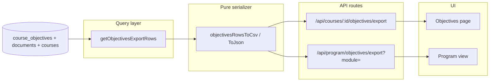

# feat: Learning objectives CSV/JSON export

## Summary

Add **downloadable CSV and JSON datasets** for extracted learning objectives — per course and at program scope filtered by **curricular module (M1/M2)** or **entire curriculum**. Exports mirror the existing coverage export stack: deterministic query → pure serializer with method-note row, formula-safe cells, and self-describing JSON. The Objectives page and Program view gain download links. Rows include full audit provenance (`source_excerpt`, `source_page` when populated).

**Why:** Curriculum committees need objectives outside the app — for accreditation binders, cross-course audits, and spreadsheet analysis. The Objectives explorer already surfaces the data; export closes the loop the coverage model established in R11 without inventing a second data path.

---

## Problem Frame

- **Objectives are visible but not portable.** `/courses/1/objectives` lists regex-first extracted objectives with case, section, EO/TO codes, and extraction method — but there is no download.
- **Program rollups lack an objectives dataset.** Coverage export exists at `/api/program/export`; objectives have no program-level equivalent with module filtering.
- **Trust requires provenance.** Objectives marked `llm_cleanup` must be identifiable in export; `source_excerpt` supports accreditor audit without opening the app.
- **Pattern exists.** `lib/coverage-export.ts` + thin API routes + UI links on ProgramView and gaps page — objectives export should extend that doctrine, not fork it.

---

## Product Contract

### Summary

Faculty and curriculum staff can download learning objectives as a spreadsheet-ready CSV or structured JSON, scoped to one course or to the full program (optionally filtered by module). Files are self-describing and deterministic.

### Requirements

- **R1** **Per-course export.** A course's objectives download as CSV or JSON from the Objectives page, containing every objective row the on-screen table shows (plus audit columns).
- **R2** **Program export with module filter.** A program endpoint exports objectives for **entire curriculum** or a single **module** (`M1`, `M2`, `Unassigned`) via query param, matching `courseModule()` in `lib/course-scope.ts`.
- **R3** **Nicely formatted CSV.** Leading quoted method-note row, header row, RFC-style quoted fields, comma/quote escaping, and formula-injection guard (cells starting with `=`, `+`, `-`, `@` prefixed with `'`).
- **R4** **Flat sorted table.** One row per objective, sorted `module → course_code → case_number → ordinal` (program scope); `case_number → ordinal` for single-course scope. No section headers inside the CSV body.
- **R5** **Deterministic only.** Export serializes DB rows — no LLM, no embedding, no recomputation of objectives at export time (AGENTS.md doctrine).
- **R6** **Self-describing JSON.** JSON includes `method`, `scope`, `summary` (total, regexCount, llmCount, byCase), and `objectives` array — parallel to coverage JSON shape.
- **R7** **Provenance columns.** Export includes `source_excerpt` and `source_page` (nullable until pipeline populates page numbers per plan 004).
- **R8** **UI download links.** Objectives page and Program view expose CSV and JSON download links (same-origin cookie auth pattern as existing exports).
- **R9** **Route clarity.** Objectives export uses dedicated routes — do **not** overload `/api/courses/[courseId]/export` (gap/coverage report).

### Scope Boundaries

**In scope**

- `lib/objectives-export.ts` pure serializer
- `getObjectivesExportRows()` query helper in `lib/queries.ts`
- `GET /api/courses/[courseId]/objectives/export?format=csv|json`
- `GET /api/program/objectives/export?format=csv|json&module=all|M1|M2|Unassigned`
- Download UI on Objectives page and Program view
- Unit tests for serializer; e2e smoke for course CSV

**Deferred to Follow-Up Work**

- Extracting shared `csvCell()` into `lib/csv-utils.ts` (optional refactor; duplicate small helper is acceptable for minimal diff)
- XLSX format
- `source_page` pipeline population (owned by plan 004 — export column ships ready)
- Program coverage export `?scope=` param (planned in coverage plan U11, not built)

**Out of scope**

- Exporting objectives filtered by framework alignment or coverage level
- LLM-generated summaries in export files
- Faculty-guide objectives (faculty guides intentionally have zero objectives; only self-study rows appear)

### Acceptance Examples

- **AE1** From `/courses/1/objectives`, clicking "CSV" downloads a file whose first row is a quoted method note explaining regex-first extraction and LLM-cleanup labeling; subsequent rows include Case 1–7 objectives with EO/TO codes where present.
- **AE2** `GET /api/program/objectives/export?format=csv&module=M1` returns only objectives from courses mapped to M1 in `lib/course-scope.ts` (today: RMD 563).
- **AE3** An objective whose text begins with `=` is exported with a leading `'` so Excel does not evaluate it.
- **AE4** JSON export `summary.regexCount` + `summary.llmCount` equals `summary.total` for the exported scope.
- **AE5** Program view shows "Download objectives" CSV/JSON links alongside existing coverage export links.

---

## Planning Contract

### Key Technical Decisions

- **KTD1 — Mirror coverage export architecture.** Query layer returns flat `ObjectivesExportRow[]`; `lib/objectives-export.ts` owns CSV/JSON serialization only. No DB access in the serializer (same as `lib/coverage-export.ts`).
- **KTD2 — One query helper, two route surfaces.** `getObjectivesExportRows({ courseId?, module? })` serves both course and program routes. `courseId` set → single course; `module` set (and no courseId) → filter by `courseModule(courses.code)`; both omitted on program route → entire curriculum.
- **KTD3 — Reuse summary aggregation.** Course JSON `summary` reuses logic from `getCourseObjectivesSummary`. Program/module summary computed from the same row set the serializer receives — counts must match row length.
- **KTD4 — Column set is stable and documented.** Fixed column order in CSV header; JSON uses camelCase keys matching export row type. UI table columns are a subset; export adds audit fields.
- **KTD5 — Method note is static prose.** A constant `OBJECTIVES_METHOD_NOTE` in the serializer (not LLM-generated) states regex-first extraction, LLM-cleanup-only-on-miss, and that faculty guides typically have no objectives.
- **KTD6 — Auth inherits middleware.** No per-route auth logic; same-origin `<a href>` downloads work via session cookie when `API_SECRET` is set.
- **KTD7 — `csvCell` duplication over premature abstraction.** Copy the 5-line formula guard from `coverage-export.ts` into `objectives-export.ts` unless implementer prefers extracting `lib/csv-utils.ts` in the same PR (optional, not required).

### Assumptions

- Demo remains single-course (RMD 563 → M1); module filter is still valuable API surface before M2 courses exist.
- `source_page` may be null for most rows until plan 004 lands; column ships anyway.
- `source_excerpt` is stored truncated (500 chars at insert); export passes through as-is.

### High-Level Technical Design

**Join pattern:** `course_objectives` INNER JOIN `documents` ON `document_id` INNER JOIN `courses` ON `course_id`. Attach `module = courseModule(courses.code)` per row. Filter and order as R4 specifies.

**CSV columns (fixed order):**

| Column | Source |
|--------|--------|
| `module` | `courseModule(courses.code)` |
| `course_code` | `courses.code` |
| `course_title` | `courses.title` |
| `case_number` | `documents.case_number` |
| `case_title` | `documents.case_title` |
| `ordinal` | `course_objectives.ordinal` |
| `objective_code` | `course_objectives.eo_code` |
| `objective` | `course_objectives.text` |
| `section` | `course_objectives.section_heading` |
| `extraction_method` | `course_objectives.extraction_method` |
| `confidence` | `course_objectives.confidence` |
| `source_filename` | `documents.filename` |
| `source_page` | `course_objectives.source_page` |
| `source_excerpt` | `course_objectives.source_excerpt` |
| `objective_id` | `course_objectives.id` |
| `document_id` | `documents.id` |

For single-course export, `module`/`course_code`/`course_title` remain populated (consistent program subset).

---

## Implementation Units

### U1. Objectives export serializer

**Goal:** Pure CSV/JSON serialization for objectives rows with method note and formula-safe cells.

**Requirements:** R3, R5, R6, R7

**Dependencies:** None

**Files:**
- `lib/objectives-export.ts` (create)
- `__tests__/lib/objectives-export.test.ts` (create)

**Approach:** Define `ObjectivesExportRow` type matching KTD4 columns. Implement `objectivesRowsToCsv(rows)` with leading `"# {OBJECTIVES_METHOD_NOTE}"` row, header row, and `csvCell()` guard. Implement `objectivesRowsToJson(rows, scope, summary)` returning `{ method, scope, summary, objectives }`. Export `OBJECTIVES_METHOD_NOTE` constant for tests.

**Patterns to follow:** `lib/coverage-export.ts`

**Test scenarios:**
- CSV first line is a quoted method note mentioning regex-first extraction
- Header row matches fixed column order exactly
- Commas and double quotes in `objective` and `source_excerpt` are escaped
- Objective text starting with `=` is prefixed with `'` inside the quoted cell
- JSON includes `method`, `scope`, `summary`, and `objectives` with expected keys
- Empty row array produces method note + header only (no data lines)

**Verification:** `npm test -- __tests__/lib/objectives-export.test.ts` passes.

---

### U2. Objectives export query helper

**Goal:** Single deterministic query returning flat export rows for course, module, or entire curriculum.

**Requirements:** R1, R2, R4, R5, R7

**Dependencies:** U1 (type import optional; can define row shape in queries and re-export)

**Files:**
- `lib/queries.ts` (modify)
- `__tests__/lib/objectives-export-query.test.ts` (create)

**Approach:** Add `getObjectivesExportRows(opts: { courseId?: number; module?: string })`. Join `course_objectives`, `documents`, `courses`. When `courseId` provided, filter `documents.courseId`. When `module` provided (and no courseId), filter rows where `courseModule(courses.code) === module` (case-sensitive match to scope keys). Map to `ObjectivesExportRow[]`. Order by `courses.code`, `documents.caseNumber`, `course_objectives.ordinal`. Add `getObjectivesExportSummary(rows)` helper or inline aggregation for regex/llm/byCase counts (mirror `getCourseObjectivesSummary` loop).

**Execution note:** Prefer a focused unit test file that tests the mapping/sort/filter logic via exported pure helpers if full DB mocking is heavy; at minimum test module filter and sort order with vitest mocks consistent with `__tests__/lib/coverage-export.test.ts` style.

**Patterns to follow:** `getCourseObjectives` / `getCourseObjectivesSummary` in `lib/queries.ts`; module scoping from `getProgramSummary`

**Test scenarios:**
- Rows for `courseId=1` include only that course's objectives
- `module: "M1"` returns only courses where `courseModule(code) === "M1"`
- `module: "all"` or omitted on program route returns all courses with objectives
- Sort order: course code ascending, then case number, then ordinal
- Each row includes `source_excerpt` when present in DB
- Course with zero objectives returns empty array (not an error)

**Verification:** Query tests pass; manual spot-check against `getCourseObjectivesSummary(1)` row count.

---

### U3. API routes for objectives export

**Goal:** Thin GET handlers for course and program objectives download.

**Requirements:** R1, R2, R6, R9

**Dependencies:** U1, U2

**Files:**
- `app/api/courses/[courseId]/objectives/export/route.ts` (create)
- `app/api/program/objectives/export/route.ts` (create)

**Approach:** Course route: validate `courseId`, call `getObjectivesExportRows({ courseId })`, build summary, serialize. Filename: `objectives-course-{id}.csv`. Program route: read `module` query param (`all` or absent → no filter; `M1`/`M2`/`Unassigned` → filter). Set `dynamic = "force-dynamic"`. Return CSV with `Content-Type: text/csv; charset=utf-8` and `Content-Disposition: attachment`. JSON branch mirrors coverage routes. Scope string for JSON: `"Course {code}"`, `"Module M1"`, or `"Entire curriculum"`.

**Patterns to follow:** `app/api/program/export/route.ts`, `app/api/courses/[courseId]/export/route.ts`

**Test scenarios:**
- Invalid `courseId` returns 400 JSON error
- `format=json` returns JSON with correct content type
- `format=csv` (default) returns CSV with method-note first line
- Program route `module=M1` returns subset (integration or route-level test if feasible)
- Missing DB connection returns 500 (existing error pattern)

**Verification:** Manual `curl` or browser download from `/api/courses/1/objectives/export` succeeds when dev server running.

---

### U4. Download UI on Objectives and Program pages

**Goal:** Expose CSV/JSON download links where stakeholders already review objectives and program data.

**Requirements:** R8

**Dependencies:** U3

**Files:**
- `components/objectives/ObjectivesExplorer.tsx` (modify) OR `app/courses/[courseId]/objectives/page.tsx` (modify)
- `components/program/ProgramView.tsx` (modify)

**Approach:** On Objectives page header (near title or above table), add download links matching ProgramView style: `CSV (spreadsheet)` and `JSON` pointing to `/api/courses/{courseId}/objectives/export?format=csv|json`. Pass `courseId` from page into explorer or render links in page wrapper. On ProgramView, add a second download row: "Download objectives:" with links to `/api/program/objectives/export` and `?module={currentScope}` when scope is a module (not "Entire curriculum") — mirror how scope selector works for coverage metrics. For "Entire curriculum" scope, link without module param.

**Patterns to follow:** `components/program/ProgramView.tsx` coverage download block; gaps page export link

**Test scenarios:**
- Objectives page renders CSV link with correct `courseId` in href
- Program view renders objectives CSV link
- When program scope is `M1`, objectives download href includes `module=M1`

**Verification:** Visual check at `/courses/1/objectives` and `/program`; e2e in U5.

---

### U5. E2E and regression tests

**Goal:** Lock export contract in CI analogous to coverage export journey.

**Requirements:** AE1, AE3, AE5

**Dependencies:** U1–U4

**Files:**
- `e2e/journeys.spec.ts` (modify)

**Approach:** Add test block "objectives export": visit objectives page, expect CSV link visible; `request.get("/api/courses/1/objectives/export?format=csv")` returns ok body containing header columns and method note; optional program route smoke. Extend `coverage-export` tests with formula-injection case if not duplicated in U1.

**Test scenarios:**
- Course objectives CSV response contains `objective,section,extraction_method` header fragment
- Course objectives CSV leads with quoted method note
- Objectives page shows download link (role/link text match)

**Verification:** `npm test` and e2e journey spec pass.

---

## Verification Contract

- `npm test` — all unit tests pass, including new `objectives-export` tests
- `npm run lint` — no new lint errors
- Manual: download CSV from `/courses/1/objectives`, open in Excel/Numbers — readable columns, no formula execution on test data
- Manual: `GET /api/program/objectives/export?format=csv&module=M1` returns RMD 563 objectives only

---

## Definition of Done

- [ ] `lib/objectives-export.ts` serializes CSV and JSON with method note and formula guard
- [ ] `getObjectivesExportRows` supports course, module, and full-curriculum scopes
- [ ] Course and program API routes return downloadable attachments
- [ ] Objectives page and Program view show CSV/JSON links
- [ ] Unit tests cover serializer edge cases (quotes, commas, formula injection)
- [ ] E2E smoke confirms course CSV contract
- [ ] No LLM calls in export path; `llm_cleanup` rows labeled in `extraction_method` column
- [ ] Export row count matches on-screen objectives count for course 1

---

## System-Wide Impact

- **Education team:** Can audit objectives offline with provenance columns
- **Developers:** New export module follows established coverage pattern; future exports should reuse serializer/query split
- **Auth:** Inherits existing `API_SECRET` middleware — no new security surface

---

## Risks & Dependencies

| Risk | Mitigation |
|------|------------|
| `source_page` mostly null | Column ships; populates when plan 004 pipeline work lands |
| Sparse `courseModule` map | `Unassigned` is valid filter value; document in method note |
| Wide CSV from `source_excerpt` | Expected for audit; spreadsheet apps handle long cells |
| Query duplication vs summary | Accept near-term duplication (KTD8 debt from coverage plan); same row source for UI and export where possible |

**Prerequisite:** Objectives extracted in DB (`npm run db:bootstrap:smoke` or full bootstrap). Export on empty DB returns header-only CSV — not an error.

---

## Sources & Research

- `lib/coverage-export.ts` — canonical export serializer pattern
- `lib/queries.ts` — `getCourseObjectivesSummary`, `getProgramSummary` module scoping
- `components/objectives/ObjectivesExplorer.tsx` — on-screen column set
- `docs/plans/2026-07-05-002-feat-intensity-coverage-model-plan.md` — R11/R12 export doctrine
- `docs/plans/2026-07-05-004-feat-source-page-numbers-plan.md` — `source_page` column
- `docs/plans/2026-07-04-001-fix-objectives-extraction-coverage-plan.md` — extraction completeness gate
- User scope confirmation: flat table, include `source_excerpt`, both UI surfaces
