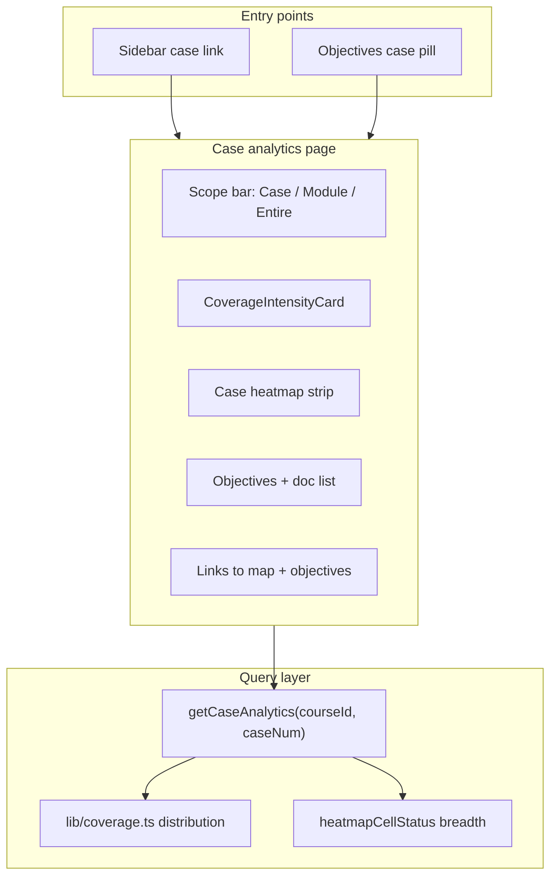

# feat: Case drill-down analytics with module and curriculum scope

## Goal Capsule

**Objective:** When a faculty member clicks a case (sidebar or Learning Objectives pills), open a dedicated case analytics view that shows how that case contributes to coverage at three altitudes — **this case**, **its curricular module (M1/M2)**, and the **entire program curriculum** — using the same intensity vocabulary and method transparency as the course dashboard and program view.

**Authority:** `AGENTS.md` coverage doctrine (deterministic counts, `lib/coverage.ts` single source, intensity not binary %), `lib/course-scope.ts` module map, plan `2026-07-05-002-feat-intensity-coverage-model-plan.md` hierarchy (chunk → document → course → module → program).

**Stop when:** Every case 1–7 is reachable by click from sidebar and Objectives pills; each case page renders honest metrics at all three scopes with drill-down to map/objectives; unit tests cover the new rollup helpers; `npm test` and `tsc` clean.

---

## Product Contract

### Summary

Today, case pills on Learning Objectives only filter the objectives table, and sidebar cases are static labels. Curriculum committees think in cases (David Tilo, Jessica Donner, …) and need to see what each case contributes — objectives extracted, framework topics touched, organ-system breadth — and how that case sits inside its module and the full curriculum. This plan adds a case analytics page with a three-level scope bar, reusing existing coverage components and query patterns.

### Requirements

- **R1** Clicking a case in the **sidebar** navigates to a case analytics page for that case.
- **R2** Clicking a case pill on **Learning Objectives** navigates to the same case analytics page (replacing the toggle-only filter behavior on pills; the table dropdown filter remains).
- **R3** The case page shows analytics at three scopes via a scope bar: **This case** (selected `case_number`), **Module** (e.g. M1 — all courses in that module; today only RMD 563), **Entire curriculum** (program-wide union).
- **R4** At every scope, show **both** addressed count and intensity spectrum for USMLE and AAMC (import `CoverageIntensityCard` / `CoverageSpectrum` from `lib/coverage.ts` — no inline redefinitions).
- **R5** **This case** scope includes: case title/diagnosis, document list (faculty + self-study), objective count, alignment confidence summary, USMLE organ-system **breadth strip** (one case's heatmap row), and top framework topics this case addresses.
- **R6** **Module** and **Entire curriculum** scopes reuse the same visual components as the course dashboard and program view respectively, with copy explaining the denominator (organ-scoped USMLE at course level inside module; full framework at program level per existing program view convention).
- **R7** Each scope provides **one-click drill-down** to Curriculum Map (pre-filtered to case) and Learning Objectives (pre-filtered to case).
- **R8** Sidebar case list is **deduped by `case_number`** (one row per case, faculty title preferred) — no duplicate "Case 1" entries for faculty vs self-study.
- **R9** All metrics are **deterministic** — SQL rollups + `lib/coverage.ts`; no new LLM or embedding paths.

### Actors

- **A1 Course director** — clicks a case to audit what it covers and how it fits the spiral before a committee meeting.
- **A2 Faculty reviewer** — jumps from case analytics to map drawer for a specific alignment.

### Acceptance Examples

- **AE1** Click "Case 2: Jessica Donner" in sidebar → `/courses/1/cases/2` loads with scope defaulting to **This case**; objectives count matches Objectives page filter for case 2 (17).
- **AE2** On case 2 page, switch scope to **Entire curriculum** → USMLE/AAMC spectra match `/program` for the same scope key.
- **AE3** Case page **This case** heatmap strip shows the same per-system colors as the corresponding row on the course dashboard heatmap for case 2.
- **AE4** Sidebar shows 7 cases, not 14 document rows.

### Scope Boundaries

**In scope:** case page, `getCaseSummary` query, scope bar, sidebar + objectives navigation, sidebar dedupe, pure rollup tests, optional API route mirroring course summary pattern.

### Deferred to Follow-Up Work

- Per-document (faculty vs self-study) sub-tabs on the case page — filename inference via `inferGuideKind` is ready but UI deferred unless implementer finds it low-cost during U3.
- Program-wide case comparison matrix (cases × systems across all future courses).
- DB `courses.module` column (curated map in `lib/course-scope.ts` suffices).
- Learning-spiral timeline (plan 002 U14) — case page can link to program "most covered" but does not build spiral UI here.
- Playwright e2e for case navigation (manual verification sufficient for this slice).

---

## Planning Contract

### Key Technical Decisions

- **KTD1 — Dedicated route, not inline panel.** `/courses/[courseId]/cases/[caseNumber]` keeps URLs shareable and matches sidebar deep-linking. Objectives pills become `Link` navigation; table filters stay client-side.
- **KTD2 — One query function, three scope filters.** Add `getCaseAnalytics(courseId, caseNumber)` returning case metadata plus pre-computed rollups for all three scopes in one server round-trip (parallel SQL like `getCourseSummary`). Avoid three separate page loads on scope toggle — data is small; client toggles like `ProgramView`.
- **KTD3 — Reuse `topicsInScope` pattern from `getProgramSummary`.** Extract or mirror a pure `rollupTopics(rows, inScopeFn)` helper that accepts per-(topic, document) rows and returns `CoverageDist` via `distribution()`. Case scope: `d.case_number = N`. Module scope: `courseModule(course.code) === module`. Entire scope: delegate to existing `getProgramSummary` slice or share SQL.
- **KTD4 — Case-level intensity is thin by design.** A case has at most two documents (faculty + self-study), so per-topic `docs` ∈ {0,1,2}. Show the spectrum honestly with a **case-scope method note** ("At case scope, topics show as Introduced or Reinforced at most — breadth and topic counts matter more than spectrum shape"). Do **not** change `lib/coverage.ts` thresholds.
- **KTD5 — Heatmap at case scope uses `heatmapCellStatus`, not `distribution()`.** Per plan 003 KTD1, the case row is a breadth question (domains touched per system), not the course-wide intensity engine. Reuse `buildCourseHeatmap` output filtered to one case.
- **KTD6 — USMLE organ scoping follows course context.** Module and Entire scopes on the case page use the same rules as today: course-scoped views respect `courseTargetSystems`; program Entire curriculum uses full framework denominator (see `ProgramView` module disclaimer).
- **KTD7 — Sidebar dedupe in layout.** `app/courses/[courseId]/layout.tsx` groups documents by `caseNumber`, prefers row where `filename` includes `FacultyGuide` for title.

### Assumptions

- Demo course id remains **1**; cases 1–7 all have processed alignments after bootstrap.
- Only **M1** module has data today; M2 scope renders empty/honest until more courses are seeded.

### High-Level Technical Design



**Data flow:** `getCaseAnalytics` runs one parallel batch: (a) case metadata + documents for `case_number`, (b) per-topic doc counts filtered per scope, (c) heatmap row for case, (d) objective count, (e) alignment stats. Client scope state picks which pre-fetched `CoverageDist` to render — no refetch on toggle.

---

## Implementation Units

### U1. Pure rollup helpers + `getCaseAnalytics` query

**Goal:** Deterministic case/module/entire rollups in `lib/queries.ts`, testable without DB.

**Requirements:** R3, R4, R5, R9

**Dependencies:** none

**Files:** `lib/queries.ts`, `__tests__/lib/case-analytics.test.ts`

**Approach:** Extract `rollupCoverageDist(topicDocCounts, frameworkTotal)` if not already shareable from `getProgramSummary` internals. Add `buildCaseScopeRows(rows, caseNumber)` pure function. `getCaseAnalytics(courseId, caseNumber)` returns:

```text
{
  case: { number, title, diagnosis, module },
  documents: [{ id, filename, guideKind }],
  objectives: { total, regex, llm },
  alignments: { total, reviewed, avgConfidence },
  scopes: {
    case: { usmle: CoverageDist, aamc: CoverageDist, topTopics: [...] },
    module: { label: "M1", usmle, aamc },
    entire: { usmle, aamc }  // from program rollup
  },
  heatmap: { system, status }[]  // one case row
}
```

Filter alignments with `d.case_number = $n AND d.course_id = $id`. Module scope uses `courseModule(course.code)`. Entire scope reuses `getProgramSummary` keys `"Entire curriculum"` and module key.

**Patterns to follow:** `getProgramSummary` `topicsInScope` + `distFor`; `getCourseSummary` parallel `Promise.all`; `buildCourseHeatmap` for heatmap slice.

**Test scenarios:**
- Happy path: fixture rows for case 2 → case scope `distribution` matches hand-counted distinct docs per topic.
- Edge: case with zero alignments → all-gap spectrum, not an error.
- Edge: invalid `caseNumber` (99) → null or empty analytics object (page shows not-found).
- Integration shape: module scope for RMD 563 equals course scope today (single course in M1).

**Verification:** pure tests pass; manual `getCaseAnalytics(1, 2)` returns sensible counts vs DB.

---

### U2. Case analytics API route (optional mirror)

**Goal:** `GET /api/courses/[courseId]/cases/[caseNumber]/analytics` for client refresh and parity with other course APIs.

**Requirements:** R9

**Dependencies:** U1

**Files:** `app/api/courses/[courseId]/cases/[caseNumber]/analytics/route.ts`

**Approach:** Thin handler calling `getCaseAnalytics`; 404 when case not found; same auth pattern as `app/api/courses/[courseId]/summary/route.ts`.

**Test scenarios:**
- Happy path: returns JSON matching server component data shape.
- Error: non-numeric case → 400; unknown case → 404.

**Verification:** `curl` against dev server matches page props.

---

### U3. Case analytics page + scope bar UI

**Goal:** Render the three-scope analytics experience.

**Requirements:** R3, R4, R5, R6, R7

**Dependencies:** U1

**Files:** `app/courses/[courseId]/cases/[caseNumber]/page.tsx`, `components/cases/CaseAnalyticsView.tsx`, `components/cases/CaseScopeBar.tsx`

**Approach:** Server component fetches `getCaseAnalytics`; client `CaseAnalyticsView` holds scope state (`"case" | "module" | "entire"`). Reuse `CoverageIntensityCard`, `MethodExplainer`, `CoverageSpectrum`, `IntensityBar`. Add case-scope explainer line (KTD4). **This case** panel: document chips (faculty/self-study via `inferGuideKind`), objectives summary card, single-row heatmap (reuse `CoverageHeatmap` with `cases={[n]}` or a slim `CaseHeatmapStrip`). **Module/Entire:** swap pre-fetched spectra; show `ProgramView`-style disclaimer for module scope when not organ-scoped. Footer links: `/courses/{id}/map?case={n}`, `/courses/{id}/objectives?case={n}` (add query-param support in map/objectives if not present).

**Patterns to follow:** `components/program/ProgramView.tsx` scope pills; `app/courses/[courseId]/page.tsx` dashboard layout; `components/coverage/CoverageIntensityCard.tsx`.

**Test scenarios:**
- Covers AE1: case 2 page shows 17 objectives.
- Covers AE2: entire scope spectra match program page.
- Covers AE3: case heatmap strip matches dashboard row.
- Edge: case 7 with fewer objectives still renders.
- Error: `/courses/1/cases/99` → not-found UI.

**Verification:** visual check at desktop + mobile; scope toggle instant (no loading spinner).

---

### U4. Wire navigation — sidebar + objectives pills

**Goal:** Make cases clickable everywhere the user expects.

**Requirements:** R1, R2, R8

**Dependencies:** U3

**Files:** `components/layout/Sidebar.tsx`, `components/objectives/ObjectivesExplorer.tsx`, `app/courses/[courseId]/layout.tsx`, `app/courses/[courseId]/map/page.tsx`, `app/courses/[courseId]/objectives/page.tsx`

**Approach:** Sidebar: wrap each case in `Link` to `/courses/{courseId}/cases/{caseNumber}`; highlight active case when pathname matches. Layout: dedupe cases by `caseNumber` before passing to Sidebar (KTD7). ObjectivesExplorer: change case pill `onClick` to `Link` navigation (or `router.push`); remove toggle-to-clear on pill (dropdown still filters table). Map page (client component): `useSearchParams().get("case")` to initialize `caseFilter` on mount. Objectives page (server component): accept `searchParams.case` and pass `initialCaseFilter` prop into `ObjectivesExplorer`.

**Patterns to follow:** existing `navItems` active styling in Sidebar; ProgramView pill styling.

**Test scenarios:**
- Covers AE4: sidebar lists 7 cases.
- Happy path: objectives pill → case page → back → objectives still works.
- Happy path: map `?case=3` pre-selects case 3 filter.
- Edge: sidebar on case page highlights active case.

**Verification:** click-through all 7 cases from sidebar and from objectives.

---

### U5. Tests + method copy

**Goal:** Lock rollup logic and document case-scope semantics.

**Requirements:** R4, R9

**Dependencies:** U1

**Files:** `__tests__/lib/case-analytics.test.ts`, `lib/coverage.ts` (optional `CASE_SCOPE_NOTE` constant if cleaner than inline copy)

**Approach:** Characterization tests with fixture alignment rows (mirror `__tests__/lib/course-summary-heatmap.test.ts`). If adding `CASE_SCOPE_NOTE` to `lib/coverage.ts`, export one sentence for case pages; do not duplicate `METHOD_NOTE`.

**Test scenarios:**
- `rollupCoverageDist` with [0,1,2,5] doc counts → expected level keys.
- `buildCaseScopeRows` filters correct case_number only.
- Heatmap slice for case 2 equals `buildCourseHeatmap(full, ...).filter(caseNumber===2)`.

**Verification:** `npm test` green.

---

## Verification Contract

| Gate | Command / check | Expect |
|------|---------------|--------|
| Unit tests | `npm test` | All pass including new `case-analytics` tests |
| Types | `npx tsc --noEmit` | Clean |
| Lint | `npm run lint` | No new errors |
| Manual AE1–AE4 | Browser on `/courses/1` | Sidebar 7 cases; case 2 analytics; program parity; heatmap row match |
| Regression | Course dashboard + program view | Unchanged behavior |
| Auth | With `API_SECRET` set | New API route requires credentials |

---

## Definition of Done

- [ ] U1: `getCaseAnalytics` returns three-scope data; pure tests pass
- [ ] U2: API route returns same shape (if shipped)
- [ ] U3: Case page renders all scopes with coverage components + drill-down links
- [ ] U4: Sidebar (7 cases) and objectives pills navigate; map/objectives honor `?case=`
- [ ] U5: Rollup tests + case-scope method note visible on page
- [ ] AE1–AE4 verified manually
- [ ] `npm test` and `tsc` clean

---

## System-Wide Impact

- **Sidebar layout** — dedupe changes props shape (fewer items); visual regression on all course pages.
- **Objectives UX** — pills navigate away instead of toggling filter; users may need one click back for table-only view (dropdown filter unchanged).
- **Query layer** — new function alongside `getCourseSummary` / `getProgramSummary`; watch for duplicated SQL (acceptable per plan 003 KTD8).

---

## Risks & Dependencies

| Risk | Mitigation |
|------|------------|
| Thin intensity spectrum at case scope confuses educators | KTD4 method note + emphasize topic counts and heatmap breadth |
| SQL duplication drifts from program/course queries | Share pure rollup helper; test parity with AE2 |
| Sidebar dedupe picks wrong title | Prefer `FacultyGuide` filename; fall back to first row |
| Visual regression baselines | Re-run visual audit if project uses screenshot gates |

**Prerequisites:** Bootstrap complete for course 1; intensity model shipped (`lib/coverage.ts`, program view).

---

## Sources & Research

- User request + screenshot (Learning Objectives case pills, 2026-07-05).
- `lib/course-scope.ts` — module hierarchy and RMD 563 → M1.
- `docs/plans/2026-07-05-002-feat-intensity-coverage-model-plan.md` — intensity model, module scopes.
- `docs/plans/2026-07-05-003-fix-demo-readiness-coverage-visual-audit-plan.md` — heatmap KTD1 (breadth ≠ intensity).
- `components/program/ProgramView.tsx`, `components/objectives/ObjectivesExplorer.tsx` — UI patterns.
- `lib/queries.ts` — `getCourseSummary`, `getProgramSummary`, `getCourseObjectivesSummary`.
