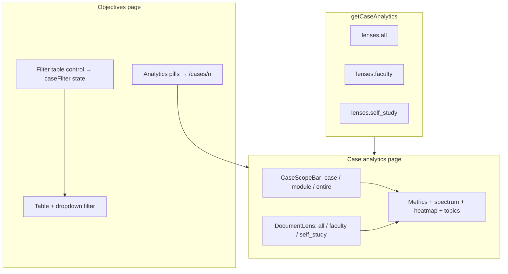

# feat: Complete case analytics without regressing course surfaces

## Goal Capsule

**Objective:** Finish the case analytics experience faculty asked for — click a case, see coverage at **this case → module → entire curriculum**, with an honest **faculty vs self-study** breakdown — while **not breaking** the Learning Objectives table filter, course dashboard, program view, map, gaps, or export flows.

**Authority:** Plan `2026-07-05-006-feat-case-analytics-drilldown-plan.md` (shipped in PR #40); `AGENTS.md` coverage doctrine (`lib/coverage.ts` single source, deterministic rollups, intensity not binary %).

**Stop when:** Case page supports a document lens on **This case** scope; objectives page offers both analytics navigation and in-page table filtering without conflicting affordances; characterization tests lock parity with dashboard/program; case-navigation e2e passes; `npm test`, `tsc`, journey + visual e2e green.

---

## Product Contract

**Product Contract preservation:** Extends plan 006 deferred item (faculty/self-study sub-tabs). Adds regression requirements not explicit in 006. All other 006 R1–R9 behavior preserved.

### Summary

Plan 006 delivered the three-level scope bar and navigation, but deferred per-document analytics and changed objectives pills from in-page filters to navigation links — a workable v1 that risks confusing faculty who still want to filter the objectives table in place. This plan completes the **document lens** on the case page and **separates navigation from filtering** on objectives, then adds **parity tests** so future changes cannot silently drift dashboard, program, or heatmap numbers.

### Requirements

- **R1** On the case analytics page, **This case** scope exposes a document lens: **All documents** (default), **Faculty guide**, **Self-study** — switching updates objectives count, alignment stats, coverage spectrum, heatmap strip, and top topics for that lens only. Module and Entire scopes are unchanged (case-aggregated only).
- **R2** Document lens uses `inferGuideKind` from `lib/media-types.ts` and `documents.id` — no filename heuristics duplicated in UI.
- **R3** All lens metrics remain **deterministic** SQL rollups + `distribution()` from `lib/coverage.ts`; no LLM or embedding paths.
- **R4** Learning Objectives **case pills** remain primary navigation to `/courses/[id]/cases/[n]` (006 R2).
- **R5** Learning Objectives adds an explicit **in-page filter** affordance (separate from analytics pills) so faculty can filter the table without leaving the page. The table dropdown filter continues to work; `?case=N` still pre-filters via `initialCaseFilter`.
- **R6** Case pills must **not** show a false “selected” state tied to `caseFilter` when the user is only filtering the table — visual state must match intent (link vs filter).
- **R7** **Regression contract:** course dashboard (`/courses/1`), program view (`/program`), gap analysis, map (including `?case=`), objectives CSV/JSON export, and search Page/Slide column behave as before this work. No changes to `lib/coverage.ts` thresholds.
- **R8** Add characterization tests proving: case heatmap strip = dashboard row (AE3); Entire scope on case page = program Entire curriculum spectra (AE2); objectives count on case page = objectives filter for that case (AE1).
- **R9** Add a journey e2e: sidebar case → case page → scope toggle → document lens → drill-down links to map and objectives with `?case=`.

### Actors

- **A1 Course director** — compares faculty vs self-study contribution within a case before a committee meeting.
- **A2 Faculty reviewer** — filters objectives in place, then jumps to case analytics when needed.

### Acceptance Examples

- **AE1** Case 2 page with lens **All** shows the same objective total as Objectives page filtered to case 2.
- **AE2** Case page scope **Entire curriculum** USMLE/AAMC addressed counts match `/program` Entire curriculum spectra.
- **AE3** Case 2 heatmap strip matches the Case 2 row on the course dashboard heatmap.
- **AE4** Objectives page: clicking **Filter table → Case 2** filters rows without navigation; clicking **Case 2** analytics pill navigates to `/courses/1/cases/2`.
- **AE5** Case 2 lens **Faculty** shows ≤ objectives and alignments vs **All**; **Self-study** shows the remainder honestly (may be zero for some cases).

### Scope Boundaries

**In scope:** document lens on case page, objectives dual affordance, parity tests, case-navigation e2e, visual baseline refresh only if objectives UI layout changes.

### Deferred to Follow-Up Work

- Program-wide case comparison matrix (cases × systems).
- DB `courses.module` column.
- Learning-spiral timeline (plan 002 U14).
- Re-splitting objectives by faculty vs self-study **table columns** (lens is case-page only for v1.1).

---

## Planning Contract

### Key Technical Decisions

- **KTD1 — Pre-fetch per-document rollups in one query round-trip.** Extend `getCaseAnalytics()` to return `lenses: { all, faculty, self_study }` each with `{ objectives, alignments, scopes.case.usmle/aamc, heatmap, topTopics }`. Client toggles lens like scope bar — no refetch. Matches 006 KTD2.
- **KTD2 — Lens applies only to “This case” panel data.** Module and Entire scopes always show pre-fetched program/course rollups; document lens UI hidden or disabled when scope ≠ `case`.
- **KTD3 — Objectives dual affordance via separate controls.** Keep “Objectives by Case” card links as analytics entry. Add a compact **“Filter table”** row (buttons or select) that only calls `setCaseFilter` — no `Link`. Remove `caseFilter`-based highlight from analytics pills.
- **KTD4 — Parity tests over live DB shape, fixtures for pure helpers.** Extend `__tests__/lib/case-analytics.test.ts` with fixture rows for `rollupByDocument` / lens aggregation. Add one integration-style test only if a thin mock of `getCaseAnalytics` shape is already established; prefer pure characterization over full DB e2e in Vitest.
- **KTD5 — Regression gate is the existing test matrix.** Any UI change runs `npm test`, `npx playwright test e2e/journeys.spec.ts e2e/visual.spec.ts` before merge. Update snapshots only when intentional.

### Assumptions

- PR #40 (plan 006) is merged or will merge before this work lands.
- Demo course id **1**; cases 1–7 have at least one document each; faculty + self-study pairs exist for most cases.
- `inferGuideKind` correctly classifies all 14 curriculum filenames (already covered by `__tests__/lib/media-types.test.ts`).

### High-Level Technical Design



**Data flow:** Server returns all lens slices once. `CaseAnalyticsView` holds `scope` and `documentLens` state; when `scope !== "case"`, lens UI is inactive. Objectives page keeps two independent interaction paths.

---

## Implementation Units

### U1. Per-document rollup helpers and `getCaseAnalytics` lenses

**Goal:** Deterministic faculty/self-study/all metrics inside `getCaseAnalytics`.

**Requirements:** R1, R2, R3, R8 (AE1, AE5)

**Dependencies:** none (builds on shipped 006 query)

**Files:** `lib/queries.ts`, `__tests__/lib/case-analytics.test.ts`

**Approach:** Add pure `aggregateCaseLens(rows, documentIds: number[] | null)` that filters alignment/objective rows by document id set. In `getCaseAnalytics`, compute `facultyDocIds` and `selfStudyDocIds` from `caseDocs` + `inferGuideKind`. Run parallel SQL for per-document alignment counts (or one query grouped by `document_id` filtered in TS). Return:

```text
lenses: {
  all: CaseLensMetrics,
  faculty: CaseLensMetrics,
  self_study: CaseLensMetrics,
}
```

where `CaseLensMetrics` mirrors the current case-scope fields (objectives, alignments, usmle/aamc dist, heatmap slice, topTopics). Heatmap per lens: filter chunks/alignments to documents in lens before `buildCourseHeatmap` slice, or filter heatmap input rows by document — pick whichever matches dashboard row semantics for “all” lens (must equal current behavior).

**Patterns to follow:** `getCaseAnalytics` parallel `Promise.all`; `distribution()` from `lib/coverage.ts`; `filterHeatmapForCase`.

**Test scenarios:**
- Happy path: fixture with 2 documents (faculty + self-study) — `all` counts = sum of parts; faculty + self-study partition objectives.
- Edge: case with only faculty document — self-study lens shows zeros, not error.
- Edge: single document case — faculty and all lenses equal.
- Covers AE1 shape: objective total for `all` lens matches hand-counted case objectives.

**Verification:** `npm test __tests__/lib/case-analytics.test.ts` green; manual `getCaseAnalytics(1, 2)` faculty vs all totals sensible.

---

### U2. Document lens UI on case page

**Goal:** Faculty can switch All / Faculty / Self-study on **This case** scope.

**Requirements:** R1, R2

**Dependencies:** U1

**Files:** `components/cases/CaseDocumentLens.tsx`, `components/cases/CaseAnalyticsView.tsx`, `lib/queries.ts` (type export)

**Approach:** New `CaseDocumentLens` pill bar (mirror `CaseScopeBar` styling). State `documentLens: "all" | "faculty" | "self_study"`. When `scope === "case"`, render metrics from `data.lenses[documentLens]`; hide lens bar for module/entire. Add one-line method note: “Faculty guide = in-class case materials; self-study = pre-session guides.”

**Patterns to follow:** `components/cases/CaseScopeBar.tsx`, `components/program/ProgramView.tsx` scope pills.

**Test scenarios:**
- Covers AE5: switching lens updates objective card count (manual or component test if harness exists).
- Edge: lens bar not visible when scope is module or entire.

**Verification:** Visual check `/courses/1/cases/2`; lens toggle instant, no loading spinner.

---

### U3. Objectives dual affordance (analytics vs table filter)

**Goal:** Restore in-page filtering without removing case analytics navigation.

**Requirements:** R4, R5, R6

**Dependencies:** none (can land parallel to U1–U2)

**Files:** `components/objectives/ObjectivesExplorer.tsx`, `e2e/journeys.spec.ts` (extend A5 or new A6)

**Approach:** Split the “Objectives by Case” card:
1. **View analytics** — existing `Link` pills to `/courses/{id}/cases/{n}`; remove `caseFilter` conditional styling from pills.
2. **Filter table** — new row of buttons (or reuse styled buttons, not links) that call `setCaseFilter(String(n))` and scroll/focus table; include “All cases” reset.

Keep table `<select>` filter. When `initialCaseFilter` from `?case=N`, both filter row and dropdown reflect case N.

**Patterns to follow:** Existing dropdown filter; sidebar active link styling only on true navigation targets.

**Test scenarios:**
- Covers AE4: filter button sets table rows; analytics link navigates away.
- Happy path: `?case=3` loads with table pre-filtered and no false pill highlight on analytics links.
- Regression: CSV download links still visible; heading `exact: true` assertion unchanged.

**Verification:** Manual click-through; journey e2e updated in U5.

---

### U4. Parity characterization tests

**Goal:** Lock AE1–AE3 so dashboard/program/case numbers cannot drift silently.

**Requirements:** R7, R8

**Dependencies:** U1

**Files:** `__tests__/lib/case-analytics.test.ts`, optionally `__tests__/lib/course-summary-heatmap.test.ts`

**Approach:** Pure tests:
- `filterHeatmapForCase(buildCourseHeatmap(...), n)` equals hand-built case row (AE3).
- `getCaseAnalytics` mock shape: `scopes.entire.usmle.addressed` equals fixture program Entire curriculum slice (AE2) — use exported types and static fixture, not live Neon in CI.
- Document that AE1/AE2 integration checks are manual in Verification Contract unless seed data is stable in CI.

**Execution note:** Prefer extending existing case-analytics tests over new files.

**Test scenarios:**
- Covers AE3: heatmap strip parity with `buildCourseHeatmap` output.
- Covers AE2: entire-scope spectrum keys match program fixture rollup.
- Error: empty alignments → gap spectrum, not throw.

**Verification:** `npm test` full suite green.

---

### U5. Case navigation e2e and visual baselines

**Goal:** Automated guard against navigation and layout regressions.

**Requirements:** R9, R7

**Dependencies:** U2, U3

**Files:** `e2e/journeys.spec.ts`, `e2e/visual.spec.ts-snapshots/*` (only if objectives layout changes)

**Approach:** New describe block **A6 — case analytics drill-down**:
1. Goto `/courses/1`, click sidebar Case 2 link.
2. Expect case title and scope bar.
3. Toggle scope to Entire curriculum — spectrum visible.
4. Toggle document lens to Faculty (if present).
5. Click link to objectives with `?case=2` — table shows case 2 rows.

Use `getByRole` with `exact` where duplicate headings exist (lesson from A5).

**Test scenarios:**
- Happy path: full A6 flow above.
- Regression: existing A1–A5 still pass without modification except objectives dual-affordance selectors.

**Verification:** `npx playwright test e2e/journeys.spec.ts`; update visual snapshots only if objectives card layout changed.

---

## Verification Contract

| Gate | Command / check | Expect |
|------|-----------------|--------|
| Unit tests | `npm test` | All pass including extended `case-analytics` |
| Types | `npx tsc --noEmit` | Clean |
| Lint | `npm run lint` | No new errors |
| Journey e2e | `npx playwright test e2e/journeys.spec.ts` | A1–A6 pass |
| Visual e2e | `npx playwright test e2e/visual.spec.ts` | Pass (update baselines only if U3 changes layout) |
| Manual AE1–AE5 | Browser | Document lens, dual affordance, parity spot-checks |
| Regression | Dashboard, program, gaps, map, exports | Unchanged metrics and navigation |

---

## Definition of Done

- [ ] U1: `getCaseAnalytics` returns `lenses.all|faculty|self_study`; pure tests pass
- [ ] U2: Document lens UI on case page for **This case** scope only
- [ ] U3: Objectives analytics links + separate table filter; no false pill selection state
- [ ] U4: Parity characterization tests for heatmap and entire-scope shape
- [ ] U5: Case navigation e2e; journeys + visual green
- [ ] AE1–AE5 verified manually
- [ ] No regressions to coverage thresholds or export APIs

---

## System-Wide Impact

- **Case page** — additional client state; slightly larger server payload (three lens slices). Acceptable per 006 KTD2 pattern.
- **Objectives page** — layout gains a filter row; pills become unambiguous navigation. Visual snapshot may need refresh.
- **Query layer** — more SQL or post-group filtering in `getCaseAnalytics`; watch query time on case page (still small vs map payload).

---

## Risks & Dependencies

| Risk | Mitigation |
|------|------------|
| Per-lens heatmap diverges from dashboard row | U4 AE3 test; “all” lens must match pre-006 case heatmap |
| Objectives UI feels crowded | Keep filter row compact; dropdown remains for power users |
| Faculty/self-study misclassified filename | Reuse `inferGuideKind`; already tested in media-types |
| Larger `getCaseAnalytics` payload | Pre-compute in one SQL batch; no per-lens API round-trips |

**Prerequisites:** Plan 006 merged; bootstrap complete for course 1.

---

## Sources & Research

- Origin: `docs/plans/2026-07-05-006-feat-case-analytics-drilldown-plan.md` (deferred faculty/self-study UI, objectives pill behavior).
- Shipped implementation: `lib/queries.ts` (`getCaseAnalytics`), `components/cases/CaseAnalyticsView.tsx`, PR #40.
- `lib/media-types.ts` (`inferGuideKind`).
- E2e lessons: strict mode on duplicate headings/CSV links (`e2e/journeys.spec.ts`).
