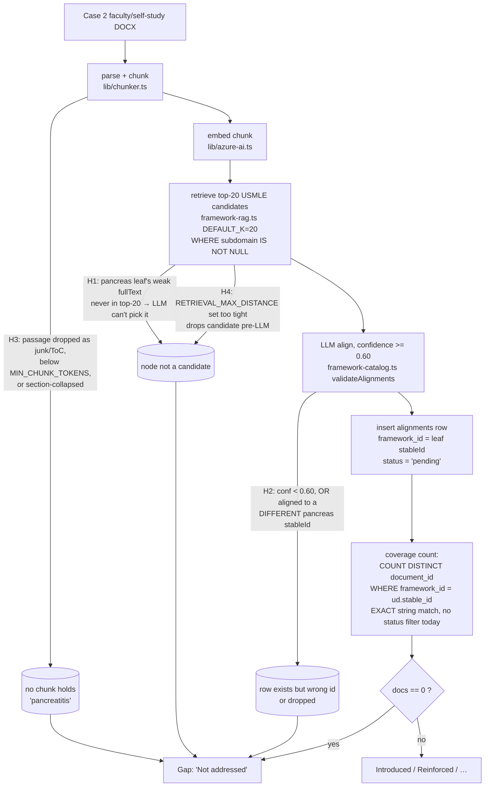

# fix: Demo-feedback corrections, gap-label accuracy, and activity mapping

**Origin:** Early faculty demo feedback (Katie, course director; Brett) on the RushMap AI demo at `/courses/1`. This plan turns that feedback into concrete changes and — per the user's direction — fixes the root causes, audits for the *similar* issues faculty will flag next, and includes Brett's activity-mapping idea.

**Product Contract preservation:** No upstream brainstorm — solo-sourced (`ce-plan-bootstrap`). Requirements below are derived directly from the feedback and the scoping decisions confirmed with the user.

---

## Summary

Katie's feedback contains one hard data bug, two "it *is* covered — just not where the tool is looking" observations, a feature idea, and a note about documents she still owes us. Investigation shows:

1. **Case 3 is mislabeled** "Bacterial meningitis" — it is **glutaric acidemia** (an organic acidemia; fits a Food-to-Fuel metabolism course, a CNS infection does not). The string is hardcoded in `scripts/seed.ts` and reaches the live case page from the database.
2. **The same data path hides similar latent errors:** Cases 2, 5, 6, 7 carry generic *placeholder* diagnoses ("Cardiovascular case", "Renal/urinary case", …) that a faculty reviewer will flag next.
3. **MEN1/MEN2 shows as a USMLE gap** because it genuinely isn't taught in RMD 563 — it's taught in the M2 Heme/Onc course. The gap is *technically correct for a single-course tool* but reads as a curriculum failure. The fix is an honest "covered in another course" annotation, not de-scoping.
4. **GI—pancreas shows as "not addressed"** even though Case 2 covers pancreatitis (its self-study doc mentions "pancreatitis" ~56 times). This is **likely** a false negative rather than a real gap — but the exact cause must be confirmed, because there are two distinct failure shapes: either no `alignments` row was produced for the topic at all (a true detection miss), **or** the pancreatitis content was aligned to a *sibling* pancreas node (`usmle:gastrointestinal-system:pancreas`, the endocrine-pancreas nodes) so `disorders-of-the-pancreas` reads 0 while the topic is substantively covered (a node-labeling artifact). The fix differs by shape. The same class of false negative plausibly affects other nodes.
5. A **separate correctness bug** surfaced during the audit: coverage counting never excludes faculty-**rejected** alignments, so a rejected alignment still inflates coverage — the opposite of the "faculty review is authoritative" doctrine.
6. **Activities already exist** as `chunks.section` values ("Activity 1:", …) but are not a first-class mapping dimension. Brett's idea is buildable deterministically from data we already have.
7. The **Histology Lab and Role guides** Katie will send are net-new content; we can prepare ingestion and defer the actual processing until the files arrive.

The plan is organized in three phases: **Data corrections** (U1–U2), **Gap-label accuracy** (U3–U5), **New capability & inputs** (U6–U7).

---

## Problem Frame

The tool's value proposition is *auditable coverage a curriculum committee can defend to an accreditor* (AGENTS.md). Every item above is a threat to that credibility in a specific way:

- A wrong diagnosis on a case page is an obvious factual error that undermines trust in everything else.
- A gap that is really "covered elsewhere" or "we failed to detect it" makes the committee distrust the gap list — the tool's headline deliverable.
- Coverage that counts rejected alignments means the numbers don't honor faculty review, contradicting the stated method note.

Scope boundary: this plan corrects **what the tool reports about the 14 already-ingested RMD 563 documents** and adds the activity dimension over that same data. It does **not** ingest new documents (deferred to U7 pending files) and does not re-open the intensity-coverage model (`lib/coverage.ts` is canonical and unchanged).

---

## Requirements

| ID | Requirement | Source |
|----|-------------|--------|
| R1 | Case 3's diagnosis reads **glutaric acidemia** everywhere it is stored, and shows correctly on `/courses/1/cases/3`. | Katie |
| R2 | No case carries a generic placeholder diagnosis; placeholders are surfaced for faculty verification and corrected values applied. | Audit ("similar issues") |
| R3 | "Not addressed" gaps distinguish a **true gap** from a **false negative** (detection miss or sibling-node labeling); the Case 2 **pancreas topic** is confirmed covered under *some* GI pancreas node, and the same audit runs across all in-scope gap nodes. | Katie (pancreas) + user ("find similar") |
| R4 | An in-scope framework node that is covered in **another course** is annotated as such (e.g. "Covered in M2 Heme/Onc") rather than shown as a bare failure. | Katie (MEN) |
| R5 | Faculty-**rejected** alignments do **not** count toward coverage or gap computation. | Audit (latent bug) |
| R6 | Curricular **activities** are a first-class mapping dimension — coverage/alignments are viewable per activity. | Brett |
| R7 | The pipeline is ready to ingest the **Histology Lab** and **Role** guides when provided, without ad-hoc work. | Katie |

---

## Key Technical Decisions

- **KTD1 — Fix the diagnosis at the DB source, not the display.** The live case page reads `documents.diagnosis` from the database, populated only by `scripts/seed.ts` (the pipeline never sets it). A display-layer patch would be undone on the next read. Correct the seed strings and apply the value to the existing row via a targeted `UPDATE` (not a full reseed — that risks the documents→chunks→alignments FK chain). See U1.
- **KTD2 — The gap-detection audit is a deterministic *triage* list, not an authoritative classifier.** Per the "deterministic where possible / LLM only as a flagged backup" doctrine (AGENTS.md), the audit ranks *candidate* false-negative gaps by checking whether a gap node's distinctive keywords appear in any in-scope chunk. Lexical presence is a weak proxy — generic tokens ("cyst", "obstruction", "pain") over-match and semantic coverage without lexical overlap is missed — so the output is a human/LLM-review queue, never a verdict that a node *is* covered. It does **not** synthesize alignments; closing a confirmed miss still runs the LLM aligner and faculty review. This keeps the audit reproducible and honest about its own precision.
- **KTD3 — "Covered elsewhere" is a *dated, unverified* curated note, not a schema change and not a coverage claim.** A `stableId → { course/module, asserted_by, asserted_on }` map alongside `COURSE_TARGET_SYSTEMS` in `lib/course-scope.ts` mirrors the existing curation pattern and needs no migration. Because the single-course tool has **no live M2 data to verify it**, the UI must present it as a human-asserted note ("noted as taught in M2 Heme/Onc — not verified by this tool"), carry its source and date, and be governed by a review cadence — an unverified claim rendered as fact on an accreditor-facing surface would be *worse* for credibility than an honest bare gap. The curation is the honest interim mechanism precisely because it is labeled as unverified.
- **KTD4 — Exclude rejected alignments in *every* coverage-counting join.** Add `a.status IS DISTINCT FROM 'rejected'` (null-safe — pending/approved/NULL all still count; a bare `<> 'rejected'` would silently drop NULL-status rows) to all coverage/gap/heatmap joins, not just two of them. Coverage counting is duplicated across more sites than "one engine" implies: `getGapExportRows`, several `getCourseSummary` subqueries (`usmleDocRows`, `aamcDocRows`, `aamcCoverage`, **and** the `heatmapTouched` subquery), the `getCaseAnalytics` rollups (spectra **and** `heatmapFrameworkRows`), **and** `getProgramSummary`'s per-topic doc count. Missing any one lets a rejected alignment drop from the gap list yet still light up a heatmap cell or the program dashboard — the exact divergence the fix exists to prevent. Enumerate all sites in U5.
- **KTD5 — The activity dimension is derived from existing `chunks.section`, not new ingestion.** "Activity N:" is already captured as a section heading by the chunker. Rolling alignments up by a normalized activity key reuses committed data — no re-embed, no schema change for the read-only MVP.

---

## High-Level Technical Design

How a chunk becomes (or fails to become) coverage, with the four pancreas-miss failure points (H1–H4) and the exact-match count marked. This is the spine of U3.

Directional guidance for reviewers, not an implementation spec. Target for Case 2 is a GI pancreas node (leading candidate `usmle:gastrointestinal-system:disorders-of-the-pancreas`); H2 covers the case where a *sibling* pancreas node already carries the alignment.

---

## Implementation Units

### U1. Correct Case 3 diagnosis (glutaric acidemia)

- **Goal:** Case 3 no longer displays "Bacterial meningitis"; it displays the correct diagnosis, glutaric acidemia.
- **Requirements:** R1.
- **Dependencies:** none.
- **Files:**
  - `scripts/seed.ts` (lines 38 and 87 — faculty + self-study `diagnosis`)
  - `lib/demo-data.ts` (line 9 — `/upload` sample; not user-visible but kept consistent)
  - `scripts/` — a one-shot corrective `UPDATE documents SET diagnosis = 'Glutaric acidemia (glutaric aciduria type 1)' WHERE course_id = 1 AND case_number = 3` (or fold into an idempotent reseed helper if one already upserts safely)
  - `__tests__/lib/case-analytics.test.ts` (no diagnosis assertion today — add one guarding Case 3's diagnosis so a regression is caught)
- **Approach:** Confirm the exact clinical wording with Katie (glutaric acidemia vs. glutaric aciduria type 1). Fix the seed strings, then apply the value to the live row via targeted `UPDATE` — do **not** reseed the whole documents table (it would churn the FK chain to chunks/alignments). Verify the render at `components/cases/CaseAnalyticsView.tsx:57`.
- **Patterns to follow:** existing `scripts/seed.ts` metadata shape; existing corrective scripts under `scripts/`.
- **Test scenarios:**
  - Happy path: `getCaseAnalytics(1, 3)` returns `case.diagnosis === "Glutaric acidemia…"` (the agreed string). *Covers R1.*
  - Regression guard: no seed row (faculty or self-study) for case 3 contains the substring "meningitis".
  - Edge: the corrective UPDATE is idempotent (running twice leaves one correct value, no duplicate rows).
- **Verification:** `/courses/1/cases/3` header shows the corrected diagnosis; `npm test` green.

### U2. Faculty-verify and de-placeholder all case diagnoses

- **Goal:** Every case shows a real, faculty-verified diagnosis; the placeholder stubs are gone.
- **Requirements:** R2.
- **Dependencies:** U1 (same data path and corrective mechanism).
- **Files:**
  - `scripts/seed.ts` (diagnosis fields for cases 2, 5, 6, 7 — and 1, 4 confirmed)
  - `lib/demo-data.ts` (cases 1–4 mirror)
  - a short review artifact, e.g. `docs/DEMO_REVIEW.md` (append a "Case diagnoses — faculty verification" checklist) so Katie can confirm the correct strings in one place
- **Approach:** Cases 5 ("Endocrine/metabolic case"), 6 ("Cardiovascular case"), 7 ("Renal/urinary case"), and 2 ("Pediatric GI/nutrition case") are organ-system stubs, not diagnoses. **Do not invent clinical diagnoses** — that violates the source-traceability doctrine. Surface the current values + the case titles in the review checklist, obtain the verified diagnoses from Katie, then apply them exactly as in U1. Cases 1 and 4 already carry real diagnoses; confirm them too.
- **Execution note:** The specific corrected strings for cases 2/5/6/7 are an **Open Question** (faculty input) — see below. This unit's code is the mechanism + checklist; the string values land when Katie confirms.
- **Test scenarios:**
  - A placeholder detector over **both** `DEMO_DOCUMENTS` (seed) and `SAMPLE_CASES` (`lib/demo-data.ts`) flags known-placeholder shapes — trailing "case", a bare organ-system name, or a system/topic label like "Pediatric GI/nutrition" (note the demo-data mirror drops the trailing "case", so don't key the check on that word alone). *Covers R2.*
  - Each case_number 1–7 has a non-null, non-placeholder diagnosis after verified values are applied.
- **Verification:** every `/courses/1/cases/{1..7}` page shows a specific diagnosis; checklist in `docs/DEMO_REVIEW.md` is complete.

### U3a. Gap-detection audit + pancreas diagnosis (read-only, increment 1)

- **Goal:** Determine, for every in-scope "Not addressed" node, whether it is a genuine gap or a false negative, and diagnose the Case 2 pancreas report — **without any engine change or re-align**, so this lands in increment 1 with zero external gates.
- **Requirements:** R3 (diagnosis half).
- **Dependencies:** none — truly dependency-free (read-only SELECTs + a pure audit script).
- **Files:**
  - `scripts/audit-gap-detection.ts` (new) — deterministic false-negative triage detector (read-only)
  - `lib/gap-audit.ts` (new) — pure keyword-presence core
  - `scripts/audit-chunks.ts`, `scripts/calibrate-thresholds.ts` (existing — run-only diagnostics for H3/H4)
  - `__tests__/lib/gap-audit.test.ts` — the pure triage logic
- **Approach:** Reproduce the pancreas report with read-only diagnostics before touching any engine code. Ranked hypotheses: **H1** retrieval top-20 miss; **H2** confidence < 0.60 or aligned to a *sibling* pancreas node (labeling artifact, not a miss); **H3** content lost in chunking; **H4** a distance floor drops candidates pre-LLM.
  - **Confirmed outcome (this investigation):** the pancreatitis topic **is covered** — `disorders-of-the-pancreas` has 32 Case-2 alignments (conf 0.95) and 7 documents course-wide. What shows 0 docs is the *narrow* `usmle:gastrointestinal-system:pancreas` node (subdomain literally "pancreas", content "metastatic neoplasms"). So the pancreas report is a **node-label artifact (H2 shape), not a detection miss** — no re-align needed. Separately, **`RETRIEVAL_MAX_DISTANCE=0.88` is set locally**, so H4 is live in general (a distance floor is active) and should be checked in the deployed env; it did not affect the (already-covered) pancreas topic.
  - **Generalize (the "find similar" ask):** the audit iterates every in-scope gap node and emits a ranked *triage* list of candidate false negatives for human/LLM confirmation — never a verdict (KTD2). Its precision is honestly limited: most flags on the biostatistics nodes are generic-token noise, which is why the output is a review queue, not an answer.
- **Test scenarios:**
  - Audit logic (pure): a gap node whose keyword appears in a supplied chunk is flagged; a node with no match is not. *Covers R3.*
  - Edge: node with empty `fullText` still produces usable keywords from its `subdomain`.
  - Regression: the audit run is idempotent and side-effect-free (no writes).
- **Verification:** audit report lists likely false-negative candidates for faculty review; the pancreas conclusion (topic covered; 0-doc node is the metastatic-neoplasms label) is recorded.

### U3b. Realign hardening + optional re-align (gated — NOT increment 1)

- **Goal:** Make re-alignment safe to run, and close any *confirmed* real miss the U3a audit surfaces — explicitly gated on approval because the fix path may need Azure.
- **Requirements:** R3 (fix half), and a data-integrity prerequisite for R5.
- **Dependencies:** **U5 must land first** (rejected-is-authoritative semantics), so the review-preservation guard has a meaning to protect. Any re-embed/re-align is gated on explicit approval + cost (AGENTS.md).
- **Files:**
  - `scripts/realign.ts` — the review-preservation edit (below)
  - `lib/alignment-review.ts` (new) — pure `hasReviewedAlignment` / `countsTowardCoverage` seam
  - `__tests__/lib/alignment-review.test.ts` — the selection + coverage rules
  - `lib/framework-rag.ts` / `lib/framework-catalog.ts` (only if a confirmed miss needs a keyword-anchored candidate)
- **Approach — realign review-preservation (highest-risk item in the plan):** `scripts/realign.ts` as written **deletes every alignment for a chunk and re-inserts at default `status = 'pending'`**, silently discarding faculty `approved`/`rejected` decisions — erasing the exact signal U5 honors. Fix: skip any chunk that carries a reviewed alignment (`hasReviewedAlignment`), and delete-by-chunk only for unreviewed chunks (a `<>` status guard leaks NULL rows). This is a prerequisite edit, not an incidental run, and it must land **after** U5. For a confirmed real miss (none found for pancreas), prefer a keyword-anchored candidate over Azure re-embedding.
- **Execution note:** Gated. Do not run any re-align/re-embed without explicit approval; re-embedding all frameworks is Azure-gated and there is no single-node re-embed script today.
- **Test scenarios:**
  - Realign preservation (pure, via `hasReviewedAlignment`): a chunk with any approved/rejected alignment is skipped; a pending-only or NULL-only chunk is eligible for re-align. *Covers the R5 data-integrity prerequisite.*
  - Coverage rule (pure, `countsTowardCoverage`): only explicit `rejected` is excluded; pending/approved/NULL count.
  - Post-fix (only when a real miss is confirmed): after a review-preserving realign, the topic shows `docs >= 1` under *some* node; a reviewed chunk's decisions are unchanged.
- **Verification:** `hasReviewedAlignment`/`countsTowardCoverage` unit-tested; a dry-run of realign leaves reviewed chunks untouched.

### U4. "Covered in another course" annotation for in-scope gaps

- **Goal:** In-scope gap nodes that are covered elsewhere in the curriculum (e.g. MEN1/MEN2 → M2 Heme/Onc) are labeled as such instead of reading as bare failures.
- **Requirements:** R4.
- **Dependencies:** none (independent of U3, but both touch the gap surface — sequence after U3 to avoid churn).
- **Files:**
  - `lib/course-scope.ts` (add `COVERED_ELSEWHERE: Record<stableId, { note: string; assertedBy: string; assertedOn: string }>` + a `coveredElsewhere(stableId)` accessor, parallel to `COURSE_TARGET_SYSTEMS`)
  - `lib/coverage-export.ts` (add optional `stableId?: string` and `coveredElsewhere?: {...}` to `CoverageExportRow`)
  - `lib/queries.ts` (`getGapExportRows` — surface the `stable_id` it currently fetches-as-`id` but **discards** in the `.map()`; populate `coveredElsewhere`)
  - `app/courses/[courseId]/gaps/page.tsx` (`GapCard` — render the note as a subordinate line under the red pill, with an icon + text, not color alone)
  - `__tests__/lib/` — map lookup + row-decoration tests
- **Approach:** Seed the curated map with the MEN nodes (`usmle:endocrine-system:multiple-endocrine-neoplasia-men1-men2` → "M2 Heme/Onc"). The gap stays in the gap list (it *is* a gap for RMD 563), but the card gains a "Covered in M2 Heme/Onc" annotation so the committee reads it as a known cross-course topic, not a curriculum hole. Keying on `stableId` matches every existing join. Explicitly a curated assertion (KTD3) — document the source of each mapping in a comment.
- **Technical design (directional):** The red "Not addressed" pill stays the **primary** status (this *is* a gap for RMD 563). When `coveredElsewhere` is present, render a **subordinate** muted line directly beneath it — cross-reference icon + text, so it reads "gap for this course, but noted as taught elsewhere," not two competing statuses, and is distinguishable without relying on color. Example copy: "↪ Noted as taught in M2 Heme/Onc — not verified by this tool." The card keeps its "Not addressed" pill and search CTA.
- **Test scenarios:**
  - `coveredElsewhere('usmle:endocrine-system:multiple-endocrine-neoplasia-men1-men2')` returns the note with `assertedBy`/`assertedOn`; an unmapped stableId returns undefined. *Covers R4.*
  - `getGapExportRows` rows now carry `stableId`, and MEN's row carries `coveredElsewhere`.
  - Render: a gap with `coveredElsewhere` keeps the red "Not addressed" pill as primary and shows the subordinate note (icon + text) with the "not verified" qualifier and the search CTA.
  - Edge: a covered-elsewhere gap still counts in `metrics.usmleGaps` (annotation is presentational, not a re-scope).
- **Verification:** `/courses/1/gaps` MEN card shows the cross-course annotation; gap counts unchanged.

### U5. Exclude faculty-rejected alignments from coverage

- **Goal:** A rejected alignment no longer inflates coverage or masks a gap.
- **Requirements:** R5.
- **Dependencies:** none (but overlaps U3/U4 query edits — sequence together).
- **Files:**
  - `lib/queries.ts` — a single shared `NOT_REJECTED` SQL fragment (`a.status IS DISTINCT FROM 'rejected'`) applied to **every** coverage-counting join (KTD4). The full enumerated set: `getGapExportRows` (USMLE + AAMC subqueries); `getCourseSummary` `usmleDocRows`, `aamcDocRows`, `aamcCoverage`, `heatmapTouched`; `getCaseAnalytics` `usmleFrameworkRows`, `aamcFrameworkRows`, **`topTopicRows`** (top-topics-by-chunk *is* a counting site and is filtered — a rejected topic must not headline), and `heatmapFrameworkRows`; and `getProgramSummary`'s per-topic doc count. The **review-STAT** queries (`alignmentStats`, `alignByDocRows` — `avg_confidence`, `reviewed`) are intentionally **not** filtered; they report review progress over all alignments.
  - `lib/alignment-review.ts` (new) + `__tests__/lib/alignment-review.test.ts` — the pure `countsTowardCoverage(status)` rule that the SQL mirrors, unit-tested.
- **Approach:** Rejected means faculty said "this passage does not cover this topic" — it must not count. Single-source the predicate (`NOT_REJECTED`) so a new coverage query omitting it is a visible choice, not a silent miss. Null-safe so legacy NULL-status rows still count.
- **Testability (honest):** the exclusion lives in raw SQL inside DB-coupled functions, which Vitest cannot exercise without a live DB — **`npm test` does NOT gate the SQL predicate.** What is automated: the pure **rule** (`countsTowardCoverage`) is unit-tested. What is NOT unit-tested: that the gap list, heatmap, and program counts agree end-to-end — that is verified by a **live-DB smoke test** (run all coverage queries and confirm sane, consistent output) and the manual demo check below. Do not claim `npm test` proves U5's SQL.
- **Verification:** live smoke test — run `getGapExportRows`/`getCourseSummary`/`getCaseAnalytics`/`getProgramSummary` against the DB and confirm consistent counts; and seeding a rejected alignment then reloading `/courses/1/gaps` moves that node to the gap bucket with the CSV export agreeing.

### U6. Activity-level mapping dimension

- **Goal:** Faculty can see curriculum coverage/alignments grouped by **activity** (Brett's idea), built from data already ingested.
- **Requirements:** R6.
- **Dependencies:** U5 — but note `getActivityCoverage` is a **new** alignments query and does **not** inherit U5's rejected exclusion automatically. It must apply `NOT_REJECTED` itself (see the reminder comment in `lib/activities.ts`); otherwise a rejected alignment silently counts toward an activity, regressing the invariant U5 established.
- **Files:**
  - `lib/activities.ts` (new) — a pure `activityKeyOf(section: string)` normalizer ("Activity 3: Metabolism" → "Activity 3") and per-activity rollup helpers
  - `lib/queries.ts` (a `getActivityCoverage(courseId)` reading `chunks.section` + `alignments`, rolling up per activity — **apply `NOT_REJECTED`**)
  - `app/courses/[courseId]/` (a read-only activity view, or an activity lens on the existing map/case-analytics page — see Open Questions)
  - `components/` (activity list/coverage component)
  - `__tests__/lib/activities.test.ts`
- **Approach:** "Activity N:" is captured in `chunks.section` — but note the chunker opens a new section only on a heading with a **trailing colon** (`chunker.ts` `/^Activity\s+\d+[A-Z]?:.*$/`), stricter than the objective-extractor's `/^Activity\s+\d+/`. Guides whose activity headings lack the colon won't form distinct sections and fall to "Unassigned". **Before building the view, run `SELECT DISTINCT section` over the 14 documents** to confirm activities are actually captured (vs. the guides being case/objective-structured, which would make the feature near-empty). Normalize the captured section into a stable activity key, then reuse `distribution()`/`levelOf()` (`lib/coverage.ts`) for per-activity coverage — no re-ingestion (KTD5). Note the denominator: `distribution()` takes per-topic distinct-document counts, so the per-activity rollup shape must be defined (this is the one bit of new math). Start read-only: a table/list of activities per case with framework touch-counts and top topics.
- **Execution note:** MVP-scoped, data-layer first. Ship `lib/activities.ts` + the query (unambiguous) before the view. The view **surface** and its empty state are Open Questions — resolve before the view unit (see Open Questions).
- **Test scenarios:**
  - `activityKeyOf` normalizes "Activity 3: Foo", "Activity 3", "activity 3 — bar" to one key; returns null/"Unassigned" for non-activity sections. *Covers R6.*
  - Rollup: chunks across two activities produce two activity rows with correct distinct-topic counts.
  - Edge: a case whose sections carry no "Activity N" heading yields a single "Unassigned" bucket, and the view renders a **designed** inline note ("This case is not organized into activities") rather than a lone unlabeled row that reads as broken.
  - Integration: per-activity counts sum consistently with the case-level counts already shown on `/courses/1/cases/{n}`.
  - **Rejected-exclusion (guards the U5 invariant):** a faculty-rejected alignment does not count toward its activity's coverage — verifies `getActivityCoverage` carries `NOT_REJECTED`.
- **Verification:** an activity view renders per-activity coverage for at least one case, numbers reconcile with the case page.

### U7. Ingestion readiness for Histology Lab and Role guides

- **Goal:** When Katie sends the Histology Lab and Role guides, they ingest through the existing pipeline without ad-hoc work — and the manifest reflects the expected new documents.
- **Requirements:** R7.
- **Dependencies:** none (preparation only; actual ingestion is deferred — see Scope Boundaries).
- **Files:**
  - `docs/DEMO_REVIEW.md` or `docs/README.md` (write the "receive → place under `data/curriculum/` → process" runbook for the new doc types — the one genuinely knowable-now deliverable)
  - a curated *sources* manifest (e.g. `scripts/curriculum-sources.ts` / the bootstrap manifest that `db:audit-bootstrap` already reads) — **not** `scripts/seed.ts`'s live `DEMO_DOCUMENTS` insert. The `documents` table has no `status`/`enabled` column, so inserting "pending" rows there would create phantom broken cases on `/courses/1` and make `db:process` try to parse a non-existent file.
  - `lib/media-types.ts` / `lib/chunker.ts` (read-only spot-check that a figure-dense lab-guide shape is handled; note any parser gap — do not build against a shape we haven't seen)
- **Approach:** Scope this unit to what is knowable without the files: the runbook, and registering the expected documents in the curated manifest (not the live table). **Defer** the manifest *slot details* and any parser adjustment until the actual binaries arrive, since both depend on document shapes that don't yet exist — the plan already gates ingestion on the files and on the "don't run Azure-heavy scripts without asking" rule (AGENTS.md). If the readiness prep proves larger than the runbook, prefer deferring it wholesale rather than building against a guess.
- **Execution note:** Mostly configuration/documentation; prefer a dry-run/manifest-audit verification over new unit tests. Blocked on Katie's files for the ingestion step itself.
- **Test scenarios:**
  - `Test expectation: none for the readiness prep (manifest/docs)` — config + documentation, no behavioral change until files land.
  - When files arrive (deferred): a histology-lab DOCX/PDF parses to non-empty chunks with figures linked (reuse existing pipeline tests).
- **Verification:** `npm run db:audit-bootstrap` shows the expected new documents as pending; runbook present.

---

## Scope Boundaries

**In scope:** corrections to reported data over the 14 already-ingested RMD 563 documents (U1–U5), the activity dimension over that data (U6), and ingestion *readiness* for incoming docs (U7 prep).

### Deferred to Follow-Up Work

- **Actual ingestion of the Histology Lab / Role guides** — blocked on Katie sending the files; running the Azure-heavy pipeline is gated per AGENTS.md.
- **True cross-module (M1→M2) coverage** — a real "Introduced in M1 → Mastered in M2" rollup requires ingesting M2 course data. U4's curated annotation is the honest interim; full cross-module coverage is a separate brainstorm (the tool is single-course today).
- **Rich activity-mapping UX** — the interactive activity map / drag-map Brett may envision beyond the U6 read-only MVP. Scope once the MVP is in faculty hands.
- **Backfilling the AAMC side of pancreas** — the AAMC frameworks have no pancreas node; nothing to align there.

### Out of scope

- Changing the intensity-coverage model (`lib/coverage.ts` is canonical, unchanged).
- De-scoping endocrine neoplasia from the course — endocrine *is* in RMD 563's scope; MEN is a legitimate in-scope gap, annotated (U4), not hidden.

---

## Delivery Sequencing

The units are independently deliverable and should **not** ride one timeline. The trust-restoring corrections are dependency-free or nearly so; the additive capability (U6) and input-blocked prep (U7) are not. Ship in increments:

1. **Increment 1 — restore credibility now:** U1 (Case 3); **U3a** (read-only audit + pancreas diagnosis — dependency-free); **U5** (rejected exclusion); then **U3b's realign hardening** (which must follow U5, so "rejected is authoritative" has meaning to protect). U3b's *re-align/re-embed* stays out of increment 1 — it is Azure-gated and only runs for a confirmed miss (the pancreas turned out covered, so none is needed now). This ordering fixes the earlier "U1 then U3–U5" inversion, which put the realign fix before the U5 semantics it depends on.
2. **Increment 2 — faculty-blocked data:** U2 once Katie returns verified diagnoses; U4 once the covered-elsewhere assertions are confirmed.
3. **Increment 3 — new capability & inputs:** U6 (data layer first, view after Brett confirms the surface) and U7 (on file arrival).

The Definition of Done covers all increments; it does not imply a single PR.

---

## Open Questions

- **Case 3 exact wording (R1):** "Glutaric acidemia" vs "Glutaric aciduria type 1 (glutaric acidemia)"? Confirm with Katie. (Blocking for U1's final string; the fix mechanism is not blocked.)
- **Cases 2/5/6/7 verified diagnoses (R2):** the real diagnoses must come from faculty — do not invent. Provided via the U2 checklist.
- **Case 2's current pancreas alignment target (U3):** is the pancreatitis content already aligned to a *sibling* pancreas node (making `disorders-of-the-pancreas` a labeling artifact, not a true miss)? A one-query DB check answers it and determines which U3 fix path applies. Resolve first.
- **MEN: bare gap vs. unverified annotation (R4/U4):** does the committee prefer an honest unannotated gap over a "noted as taught in M2" note the tool cannot verify? Confirm the faculty preference before shipping U4.
- **Activity view surface + empty state (R6/U6):** standalone `/courses/1/activities` page vs. a lens on case analytics? Recommend a lens on case analytics (least new surface). Confirm with Brett before U6's view unit — and whether the activity view should expose per-activity gap annotations or only coverage counts.
- **`RETRIEVAL_MAX_DISTANCE` in the deployed env (U3 H4):** is any distance floor set in production? Cheap to check; determines whether H4 is live.
- **NULL-status alignment rows (U5):** do any legacy rows have NULL `status`? The `IS DISTINCT FROM` operator handles them safely, but confirm none exist before shipping so coverage isn't silently understated.

---

## Risks & Dependencies

- **Reseed vs. targeted UPDATE (U1):** a naive full reseed could churn the documents→chunks→alignments FK chain and orphan real content. Mitigation: targeted `UPDATE` by `case_number`; verify row counts before/after.
- **Query edits touch the one coverage engine (U3–U5):** the codebase deliberately keeps a single counting path; edits to `getGapExportRows`/`getCourseSummary` must keep cards, table, CSV, and spectra in agreement. Mitigation: the one-engine regression tests in each unit; run `npm test` after each.
- **Framework re-embed (U3 H1 fix):** enriching the pancreas node's embed text means regenerating framework embeddings — an Azure-gated step. Mitigation: prefer the narrowest fix; if re-embed is needed, gate it behind explicit approval and use the existing seed embedding cache.
- **U7 is input-blocked:** most value lands only when files arrive; keep the prep lightweight so it isn't wasted if the doc shape differs.

---

## Verification Contract

- `npm test` (Vitest) green after each unit; new tests per unit above. **Scope caveat:** Vitest covers pure logic only (gap-audit triage, activity rollup, the `alignment-review` rules, seed-data guards). It does **not** exercise the coverage SQL — U5's rejected-exclusion, the heatmap/program agreement, and any realign DB behavior are **not** gated by `npm test`. Do not read a green suite as proof of those.
- **Live-DB smoke test** (the actual gate for the SQL-level work): run `getGapExportRows`/`getCourseSummary`/`getCaseAnalytics`/`getProgramSummary` against the DB and confirm consistent, sane counts, and that the course JSON/CSV export shape carries only the canonical columns (no leaked UI fields).
- `npm run lint` clean.
- Manual demo checks: `/courses/1/cases/3` (U1), `/courses/1/cases/{1..7}` diagnoses (U2), `/courses/1/gaps` pancreas resolved + MEN annotated (U3a/U4), rejected-alignment gap behavior (U5), activity view reconciles with case page (U6), `npm run db:audit-bootstrap` shows pending new docs (U7).
- No new lone "% covered" figures introduced; intensity spectrum vocabulary preserved (AGENTS.md coverage doctrine).

## Definition of Done

Delivered in increments (see Delivery Sequencing). R1 and R3–R5 are implemented and verified over the current data first; R6 lands after; R2, R4, and R7 carry faculty-input / file-arrival portions that are clearly deferred and documented. The gaps page distinguishes true gaps, triaged false negatives, and covered-elsewhere topics (shown as dated, unverified notes); coverage honors faculty rejection consistently across every surface (course, case, heatmap, program); activities are a working mapping dimension over existing data; and the demo no longer contains the Case 3 factual error.

---

## Sources & Research

- Faculty demo feedback (Katie; Brett), 2026-07-07.
- Repo investigation (this session): case-metadata audit, gap/coverage pipeline map, and alignment-pipeline trace — file:line references embedded in the units above.
- Canonical docs: `AGENTS.md` (coverage doctrine, scope), `lib/coverage.ts` (intensity model), `lib/course-scope.ts` (organ scope), `lib/queries.ts` (coverage engine), `lib/framework-catalog.ts` / `lib/framework-rag.ts` / `lib/azure-ai.ts` (alignment engine).
