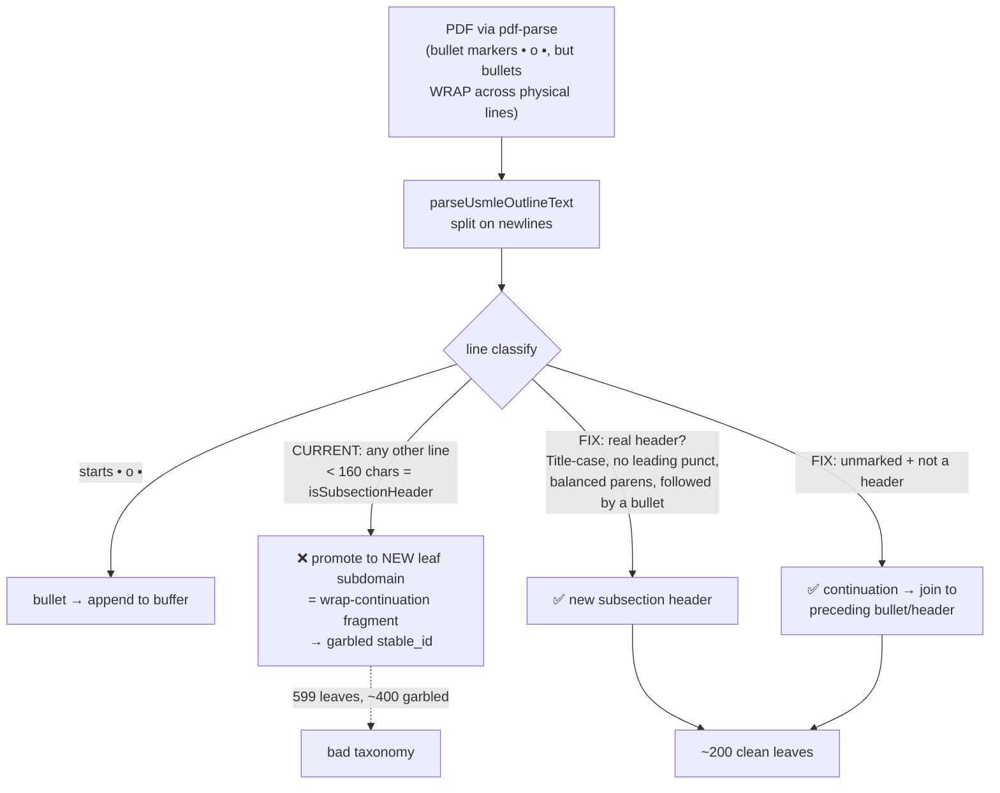
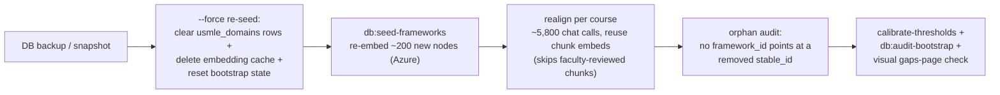

# fix: Repair USMLE outline parser and re-parse the framework taxonomy

**Origin:** Discovered during demo-feedback work (see `docs/plans/2026-07-07-001-fix-demo-feedback-corrections-and-activity-mapping-plan.md`). Katie flagged confusing "Not addressed" gap cards; investigation traced it to a parser defect, not a display bug.

**Chosen strategy (confirmed with user):** full re-parse + re-align — accept that the corrected taxonomy has ~3× fewer leaf nodes and all `stable_id`s regenerate, and re-align rebuilds `alignments` against it. Not a stableId remap (impractical when node count collapses) and not a display-only label patch (the source structure supports a correct parse).

---

## Summary

The USMLE 2025 content-outline parser mis-parses the source PDF: `pdf-parse` emits the outline with `•`/`o`/`▪` bullet markers, but long bullets **wrap across physical lines** and the continuation lines carry no marker. `parseUsmleOutlineText` has no notion of wrapped lines, so `isSubsectionHeader` promotes every unmarked continuation fragment to a **new leaf node** (`lib/framework-parsers.ts:223-226`, `:121-129`, `:78-81`). Result: `usmle_domains` has **599 leaves where ~200 are real** (so roughly 400 are wrap-fragment artifacts; garbled = 599 − real), each with a mid-phrase `subdomain` like `", niacin; vitamin B"` or `"(eg, thiazide diuretics)"`, and — because `stable_id` is a slug of that text — garbled stableIds too. A secondary `/^\d+$/` noise filter (`:90`) strips PDF subscript digits ("vitamin B₁" → "vitamin B").

This surfaces on `/courses/1/gaps` where ~8 of the top 12 "Not addressed" cards read as broken fragments, directly undermining the tool's value proposition — "auditable coverage a committee can defend to an accreditor" (AGENTS.md). AAMC is unaffected (it parses a structured spreadsheet + hand-authored JSON, never this PDF path).

The fix is two-part: **(A)** a deterministic parser repair — join continuation lines to their bullet, distinguish real subsection headers, preserve subscripts — landable and fully testable **offline** (no Azure); and **(B)** a **gated** operational re-seed + re-align that rebuilds the taxonomy and its alignments against Azure, with recalibration and full re-verification. Coverage numbers will re-baseline; that is the intended correction, not a regression.

---

## Problem Frame

Every coverage number, gap card, map-tree node, and alignment keys on `usmle_domains`. When ~70% of its leaves are parser garbage, the gap list — the tool's headline deliverable — reads as broken, and the taxonomy the committee is meant to audit against is not the real USMLE outline. The blast radius is wide but the root cause is narrow (one parser function), and the source data supports a correct parse. The cost is the re-embed + re-align, which is why the operational half is gated.

Scope boundary: this corrects the **USMLE taxonomy and everything that re-derives from it over the existing 14 documents**. It does not change the coverage model, the AAMC frameworks, or the alignment engine's logic.

---

## Requirements

| ID | Requirement | Source |
|----|-------------|--------|
| R1 | USMLE leaf nodes are clean, well-formed topic labels — no mid-phrase starts, no unbalanced parens, subscripts preserved — and the leaf count reflects the real outline (~180–230, not 599). | Root-cause analysis |
| R2 | The parser fix is deterministic (no LLM — AGENTS.md doctrine) and covered by tests that reproduce the wrapped-line defect and assert label well-formedness + leaf-count range. | Deterministic-first doctrine |
| R3 | `seed-frameworks` can genuinely re-seed the corrected taxonomy — clear stale rows, re-embed new labels (not skip them), and reset bootstrap state — via a working `--force` path. | Pipeline analysis |
| R4 | After re-seed + re-align, no `alignments.framework_id` is orphaned against the new taxonomy (with the faculty-reviewed-chunk edge explicitly handled), and an audit proves it. | Loose-join / orphan risk |
| R5 | Coverage, gaps (incl. the scope hint), the map tree, and alignment retrieval all reflect the corrected taxonomy; retrieval thresholds are recalibrated; the run has a runbook and a rollback. | Blast-radius re-verification |
| R6 | The coverage re-baseline is communicated as a defensible correction, not a silent change: a before/after coverage diff, a dated changelog explaining it (taxonomy corrected 599→~200 nodes, gap counts recomputed, why), the predicted shift direction, and a taxonomy version/timestamp so previously-cited numbers stay traceable; the run is scheduled off any active faculty review cycle. | Product / adversarial review |

---

## Key Technical Decisions

- **KTD1 — Fix the parser, honoring the source's real structure.** The PDF *does* carry topic boundaries — the `•`/`o`/`▪` bullet markers. The parser's error is ignoring line-wrapping, not a lack of structure. The fix joins each unmarked line to the preceding bullet/header until the next marker or a genuine subsection header, rather than post-hoc "cleaning" garbled strings (which is lossy and unreliable). This is why a display-only patch was rejected.
- **KTD2 — Deterministic, no LLM.** Parsing/extraction stays regex/rule-based per AGENTS.md ("never add LLM/embedding dependence to metadata, counts, extraction"). The header-vs-continuation decision is a heuristic over line shape (leading marker, capitalization, leading punctuation, balanced parens, trailing continuation delimiter, "followed by a bullet"), not a model call.
- **KTD3 — Full re-parse + re-align; no stableId remap.** The correct parse collapses ~599 → ~200 leaves, so old→new stableId is not a 1:1 mapping — a remap table would be guesswork. Re-align (which deletes and rewrites `alignments.framework_id` per chunk) is the clean way to re-establish coverage against the new taxonomy. Accept that coverage numbers shift.
- **KTD4 — A real re-seed must clear + invalidate, because the seed is skip-if-embedded.** `seed-frameworks` has `if (existing?.embedding) continue` and an embedding cache keyed by `stableId` (text changes don't invalidate it), so a naive re-run no-ops. The `--force` path must: delete `usmle_domains` rows (old stableIds included), delete/fingerprint-invalidate `data/frameworks/.embedding-cache.jsonl`, and reset `state.frameworks.usmle` in `data/bootstrap-state.json`.
- **KTD5 — Split deterministic (now) from Azure-gated (approval).** The parser repair + tests + `--force` plumbing + orphan-audit land with zero Azure spend and are fully unit-verifiable. The actual re-seed/re-align run is a separate gated increment (AGENTS.md: don't run Azure-heavy scripts without an explicit ask), with a DB backup taken first.

---

## High-Level Technical Design

**The parse defect and the fix** (why unmarked wrap-lines become bogus leaves):

**The gated migration pipeline** (Phase B):

---

## Implementation Units

### Phase A — Deterministic parser repair (no Azure; lands now)

### U1. Repair `parseUsmleOutlineText` continuation + header handling

- **Goal:** The parser produces clean, correctly-bounded leaf nodes from the real PDF: continuation lines join their bullet, only genuine subsection headers start new leaves, and subscript digits survive.
- **Requirements:** R1, R2.
- **Dependencies:** none.
- **Files:**
  - `lib/framework-parsers.ts` (`parseUsmleOutlineText`, `isSubsectionHeader`, `isBulletLine`, `isNoiseLine`)
  - `__tests__/lib/framework-parsers.test.ts` (the well-formedness + leaf-count guards live here permanently — the pre-existing tests only checked parenting and a couple of regex matches and let ~400 garbled leaves through)
  - `__tests__/fixtures/frameworks/` (new fixture with wrapped continuation lines)
  - `data/frameworks/parsed/usmle-2025.json` (regenerate + commit the corrected dump — a single parse, no Azure)
- **Approach:**
  - **Continuation joining:** track whether we're mid-bullet; an unmarked line that is *not* a genuine subsection header appends to the current bullet/subBuffer instead of starting a leaf. The bullet markers (`•`/`o`/`▪`) are the real topic boundaries (KTD1).
  - **Genuine-header heuristic (deterministic, KTD2):** a real subsection header is Title-Case-ish (starts uppercase, not punctuation/lowercase), has balanced parentheses, does not end with a continuation delimiter (`,` `;` open-paren), and is typically immediately followed by a bullet line. Continuation fragments fail these (start lowercase/punct, unbalanced parens, trailing comma). Tune the heuristic against the real PDF, not just the toy fixtures.
  - **Subscript fix:** the `/^\d+$/` noise filter (`:90`) drops standalone subscript digits; narrow it so it doesn't corrupt "vitamin B₁/B₃/B₆" (e.g. only treat a lone digit as noise when it's a page-number context, or restore the subscript into the adjacent token).
  - Preserve what already works: 15 system parents via the `USMLE_SYSTEMS` allow-list, correct GI parenting, `fullText` carrying the bullet detail.
- **Execution note:** Characterization-first. Before changing logic, snapshot the current parser output over the real PDF and the true-header list, so the fix is measured against a known target (~200 leaves) rather than guessed.
- **Test scenarios:**
  - Wrapped-line fixture (Shigella/thiazide-shaped blocks) parses to the *bullet* as one leaf's content, NOT separate leaves for each wrap line. *Covers R1.*
  - No emitted `subdomain` starts with lowercase or punctuation, and all have balanced parentheses. **Test seam:** `parseUsmleOutlinePdf` is module-private and only `parseUsmleOutlineText(text)` is exported — assert primarily over the regenerated `data/frameworks/parsed/usmle-2025.json` (fast, no in-test PDF read), plus one end-to-end guard that runs `pdf-parse` on the committed 679 KB PDF and feeds its text to `parseUsmleOutlineText` (all offline, no Azure).
  - Leaf count falls within R1's target range (~180–230), and is far below the current ~599 — a guard against regressing to over-split. (Use the same range in R1 and this assertion; the ~200 target is grounded in the ~210-of-630 true-header estimate from the source analysis.)
  - Known-good headers are present as leaves ("Neoplasms", "Thyroid disorders", "Prenatal care", "Disorders of the pancreas") with sensible `fullText`.
  - Subscript preserved: a "vitamin B₁" line does not yield a bare "vitamin B" leaf.
  - Regression: GI subdomains stay parented under `usmle:gastrointestinal-system` (existing assertion holds).
- **Verification:** `npm test` green (well-formedness + leaf-count guards); regenerate and commit `data/frameworks/parsed/usmle-2025.json` — the committed dump shows clean labels and ~200 leaves, and CI fails if the parser regresses. (This unit also owns the dump refresh — folded in rather than a separate unit, since the CI guards already live in U1's test file.)

### U3. Make `seed-frameworks` genuinely re-seedable (`--force`)

- **Goal:** Re-seeding writes the corrected taxonomy and re-embeds the new labels instead of silently skipping them.
- **Requirements:** R3.
- **Dependencies:** U1 (needs the corrected parse to seed).
- **Files:**
  - `scripts/seed-frameworks.ts` (implement the `--force` flag `main()` currently ignores; the skip-if-embedded and cache logic)
  - `lib/embedding-cache.ts` (invalidation path)
  - `lib/bootstrap-state.ts` (reset `state.frameworks.usmle`)
  - `__tests__/scripts/seed-frameworks.test.ts`
- **Approach:** Implement `--force` to: (1) **delete existing `usmle_domains` rows** — the *operative* fix, since it defeats the `if (existing?.embedding) continue` skip and removes old stableIds so they don't linger as orphan targets; (2) reset `state.frameworks.usmle` (`embedded/total/complete`) — but note `seedFrameworks` only touches bootstrap state when `trackBootstrap` is set (`const state = options?.trackBootstrap ? … : undefined`), so `--force` must reset the state **unconditionally** (load/patch/save), decoupled from `--track-bootstrap`, or `db:audit-bootstrap`/verify reads stale "complete"; (3) delete `data/frameworks/.embedding-cache.jsonl` USMLE entries as **belt-and-suspenders** — not strictly required (new clean labels get new stableIds absent from the cache, so they re-embed; a reused stableId carries identical text, so a cache hit is correct), but safe. Keep the non-force path unchanged (idempotent upsert).
- **Execution note:** The Azure re-embed itself is deferred to U5 (gated). This unit is the plumbing + a `--skip-embeddings` dry-run that proves rows are cleared and re-inserted with clean text, no Azure call.
- **Test scenarios:**
  - `--force --skip-embeddings` over a seeded fixture DB clears old USMLE rows and inserts the new (clean) set; old garbled stableIds are gone. *Covers R3.*
  - Cache invalidation: after `--force`, a USMLE stableId that changed is not served a stale cached vector.
  - Bootstrap state: `--force` resets `state.frameworks.usmle.complete` to false so a later verify/audit doesn't report stale "complete".
  - Non-force path unchanged: a plain re-run still skips embedded rows (no accidental wipe).
- **Verification:** a `--force --skip-embeddings` dry-run shows the corrected taxonomy in `usmle_domains` with no leftover garbled rows.

### U4. Orphan audit + faculty-reviewed-chunk handling

- **Goal:** Prove (and, where needed, repair) that no alignment points at a removed taxonomy node after the migration — including the faculty-reviewed chunks re-align skips.
- **Requirements:** R4.
- **Dependencies:** U3.
- **Files:**
  - `scripts/audit-framework-orphans.ts` (new, read-only): report `alignments` whose `framework='USMLE'` `framework_id` has no matching `usmle_domains.stable_id`
  - `scripts/realign.ts` (the reviewed-chunk edge)
  - `__tests__/lib/` (pure orphan-detection logic if extracted)
- **Approach:** `realign` skips chunks carrying an approved/rejected decision, so those chunks' alignments keep their old `framework_id` — which, after re-seed, points at a **deleted** stableId. There's no FK, and coverage's `LEFT JOIN`/`INNER JOIN` on `framework_id = stable_id` yields NULL, so a faculty-**approved** alignment silently contributes **zero** coverage — the migration would drop the one decision it exists to preserve. **Surfacing is not fixing:** the old node is gone, so there is no automatic re-map target. Concrete remediation for each reviewed-chunk orphan: **re-run `alignToFramework` on that single chunk against the new taxonomy and re-present the result to faculty for re-approval** (keeps review authoritative), OR run a gated migration-only `realign --include-reviewed` if faculty accept a bulk re-baseline of their prior decisions. The plan must pick one before the run, not leave "manual re-review" as an undefined list. R4 gate (hard): the audit returns zero orphans on non-reviewed chunks **AND** the reviewed-orphan list is empty (each re-aligned + re-approved) before the migration is "done".
- **Test scenarios:**
  - Orphan detection (pure): given alignments referencing a stableId absent from the taxonomy set, they are flagged; matching ones are not. *Covers R4.*
  - Reviewed-chunk edge: a reviewed chunk whose alignment references a removed node is flagged for re-alignment + re-approval (not silently dropped, and not merely listed).
  - Post-remediation: after re-aligning + re-approving a reviewed orphan, its coverage contribution is restored (joins to a live node).
- **Verification:** post-migration audit returns zero non-reviewed orphans, and every reviewed-chunk orphan has been re-aligned + re-approved (empty reviewed-orphan list gates "done").

### Phase B — Gated operational migration (needs explicit approval + Azure)

### U5. Execute re-seed + re-align + recalibrate + re-verify (gated)

- **Goal:** Rebuild the live taxonomy and its alignments against the corrected parse, recalibrate retrieval, and confirm every dependent surface is correct.
- **Requirements:** R5, R6 (and completes R1/R3/R4 over live data).
- **Dependencies:** U1, U3, U4. **Gated on explicit user approval** (Azure cost + runtime; AGENTS.md).
- **Files:**
  - `docs/DEMO_REVIEW.md` / `docs/README.md` (the runbook + rollback)
  - operational only — runs `db:seed-frameworks --force`, `scripts/realign.ts`, `scripts/calibrate-thresholds.ts`, `scripts/audit-framework-orphans.ts`, `db:audit-bootstrap`
- **Approach (runbook):** (0) **Backup — restore-verified, not assumed.** Capture a full snapshot before any destructive step (Neon branch/PITR snapshot or `pg_dump` of `usmle_domains` + `alignments` at minimum), record who took it and where it lives, and do a test-restore into a throwaway DB to prove it restores. Rollback is **not** DB-only: `--force` also deletes `data/frameworks/.embedding-cache.jsonl` and mutates `data/bootstrap-state.json`, so a rollback must restore/regenerate those two files too, or `db:audit-bootstrap` will report false inconsistency against a "restored" system. (1) `db:seed-frameworks --force` — re-embed the ~200 corrected nodes (Azure embeddings, cache-served on retry). (2) `realign` per course — ~5,800 chat calls, reuses chunk embeddings, skips reviewed chunks. (3) `audit-framework-orphans` (U4) — expect zero non-reviewed orphans; remediate reviewed orphans (U4). (4) `calibrate-thresholds` — re-tune `RETRIEVAL_MAX_DISTANCE` against the new embedding distribution. (5) `db:audit-bootstrap` + a visual `/courses/1/gaps` check + the faculty coverage before/after diff (R6).
- **Execution note:** Smoke-first — after step 1, verify the corrected taxonomy is in `usmle_domains` before spending the ~5,800 re-align calls. Do not run any step without the explicit go-ahead.
- **Test scenarios:** operational, not unit. Post-run checks: gaps page shows clean labels (no mid-phrase cards); `metrics.usmleGaps` and the intensity spectrum recompute to sane values against ~200 in-scope nodes; the map framework tree renders the new nodes; `frameworkScopeDetail` still produces scope hints from the new `fullText`; alignment retrieval returns clean candidate labels.
- **Verification:** the demo `/courses/1/gaps` is clean end-to-end; orphan audit passes; coverage numbers are internally consistent across gaps/table/CSV/program.

---

## Scope Boundaries

**In scope:** the USMLE parser, the re-seedable seed path, the orphan audit, and the gated migration over the existing 14 documents.

### Deferred to Follow-Up Work
- **Decouple `stable_id` from label text (root-fragility hardening).** `stable_id` is a slug of the subdomain, so *this* migration is forced by the node collapse — a decoupled id would NOT avoid it (adversarial confirmed the cardinality change defeats any remap). But going forward, a stable surrogate id + a separate mutable label column would stop future **label-only** edits (a one-word rename, next year's "USMLE 2026" revision) from re-orphaning alignments and forcing another re-embed + re-align. Scope this as the durable fix after the migration lands.
- Re-chunking / re-embedding the source *documents* — not needed for a taxonomy-only change (chunk embeddings are unchanged; re-align reuses them). Only revisit if chunking itself changes.
- A general PDF-outline parser hardening beyond USMLE (the AAMC path is already structured and clean).

### Out of scope
- The coverage/intensity model (`lib/coverage.ts`), the alignment engine's logic, and the AAMC frameworks.
- The activity view / ingestion items from the demo-feedback plan.

---

## Risks & Dependencies

- **Coverage re-baselines — predict the direction, don't just "capture" it (R6).** Collapsing 599→~200 nodes shrinks the coverage **denominator** and makes each broader real leaf more likely to catch an aligned chunk, so USMLE coverage % will very likely **rise** (e.g. a jump from ~40% toward ~70%). For an accreditation tool whose value is defensible numbers, a committee that sees coverage jump overnight with zero curriculum change may read it as *inflation* unless it is pre-briefed as a correction to prior over-fragmentation. Mitigation (R6): predict the direction/magnitude before the run, produce a before/after diff + dated changelog, version/timestamp the taxonomy, and do not run mid-review-cycle. This is a trust risk, not just a numbers-change.
- **Header heuristic imperfection.** A deterministic Title-Case/followed-by-bullet heuristic may misclassify an unusual real header. Mitigation: U1's leaf-count-range + known-good-header assertions over the *real* PDF, and manual eyeball of the ~200-node dump before the gated run.
- **Reviewed-chunk orphans.** Re-align skips faculty-reviewed chunks, leaving their alignments pointing at removed nodes. Mitigation: U4 surfaces them; tiny count today (~1 approved).
- **Re-seed no-op trap.** Without clearing rows + cache + state, a re-seed silently does nothing (KTD4) — the most likely execution mistake. U3's `--force` encapsulates all three; the runbook makes it a single gated step.
- **No rollback without a backup.** The migration is destructive to `usmle_domains` and `alignments`. Mitigation: U5 step 0 takes a snapshot; rollback = restore.
- **Azure cost/runtime.** ~200 embeddings + ~5,800 chat completions. Gated on explicit approval.

---

## Verification Contract

- **Phase A (unit-gated, no Azure):** `npm test` green including U1's well-formedness + leaf-count assertions over the real PDF; `npm run lint` clean; a `--force --skip-embeddings` dry-run shows the corrected taxonomy with no garbled rows.
- **Phase B (operational, gated):** post-migration orphan audit returns zero non-reviewed orphans; `/courses/1/gaps` shows clean labels; coverage numbers are internally consistent across gaps/table/CSV/program; retrieval recalibrated. Capture before/after gap counts.
- Deterministic-first preserved: no LLM/embedding added to parsing or metadata (AGENTS.md).

## Definition of Done

Phase A is landable independently: the parser produces ~200 clean, well-formed USMLE leaves, guarded by tests that reproduce the wrapped-line defect, and `seed-frameworks --force` + the orphan audit are implemented and dry-run-verified — all with zero Azure spend. **Phase A delivers no user-visible gaps-page improvement**: the live DB still holds the 599 garbled nodes until Phase B runs, so the committed code (~200 nodes) and live data (599) are intentionally divergent in between, and the demo is only fixed by the gated Phase B — do not read Phase A landing as resolving the visible issue, and schedule Phase B against the demo/review calendar. Phase B, on explicit approval, rebuilds the live taxonomy and alignments, recalibrates retrieval, passes the orphan audit (including reviewed-orphan remediation), communicates the coverage re-baseline (R6), and leaves `/courses/1/gaps` reading as a clean, defensible USMLE outline with internally consistent coverage numbers.

---

## Sources & Research

- Root-cause investigation (this session): parser trace (`lib/framework-parsers.ts` `parseUsmleOutlineText`/`isSubsectionHeader`/`isBulletLine`, the `pdf-parse` wrapped-line source samples for Shigella/thiazide, stableId slug derivation) and the re-seed/re-align pipeline trace (`scripts/seed-frameworks.ts` skip-if-embedded + stableId-keyed cache, no-FK loose join, ~5,800-call re-align cost, bootstrap-state reset).
- Origin: `docs/plans/2026-07-07-001-fix-demo-feedback-corrections-and-activity-mapping-plan.md` (the demo-feedback pass that surfaced this, incl. the `frameworkScopeDetail` scope hint that depends on clean `fullText`).
- `AGENTS.md` — deterministic-first doctrine, Azure-heavy-script gate, framework authority conventions.
